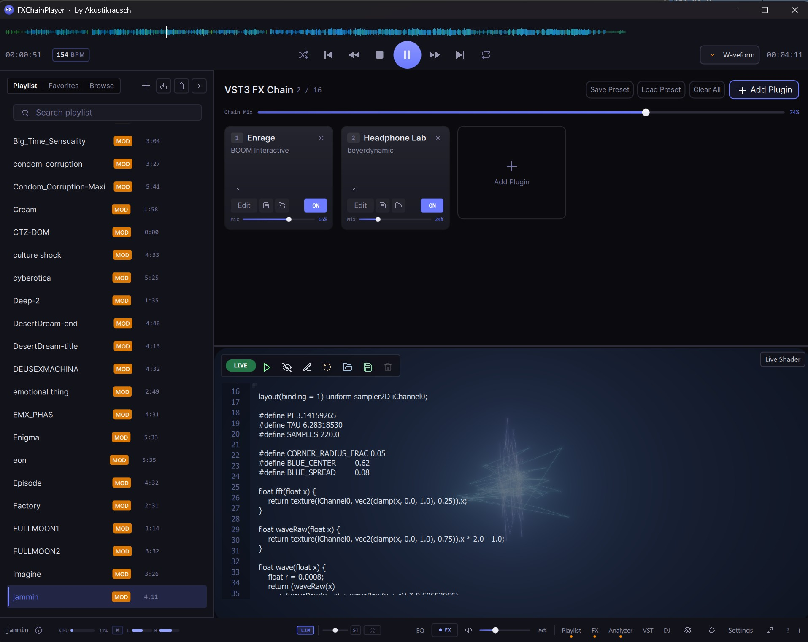
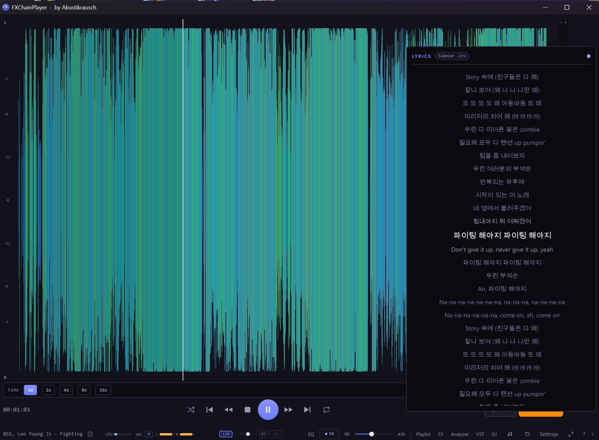

<h1 align="center">FXChainPlayer</h1>

<strong>A desktop audio player for Windows and macOS that plays nearly every audio format, with a full real-time effect chain built into the playback engine (VST3 on Windows, VST3 and Audio Units on macOS) and a complete dual deck DJ Mode.</strong>

  
  
  
  
  
  
  
  
  
  
  

<em>Load your favorite plugins, EQs, compressors, reverbs, spatial processors, headphone correction, directly into the signal path and hear them in real time while you listen to music. Pitch records like vinyl. Mix tracks across two decks with sync, hot cues, loops and Pioneer-DJM-style filter. No DAW required.</em>

<a href="https://github.com/akustikrausch/FXChainPlayer-Releases/releases/download/v1.3.6/FXChainPlayer-Setup-1.3.6.exe"><strong>⬇ Windows: FXChainPlayer-Setup-1.3.6.exe</strong></a> 
<a href="https://github.com/akustikrausch/FXChainPlayer-Releases/releases/download/v1.3.11/FXChainPlayer-1.3.11-macos.pkg"><strong>⬇ macOS (Apple Silicon): FXChainPlayer-1.3.11-macos.pkg</strong></a>

  

<a href="https://www.youtube.com/watch?v=a2XQ1KDnYSk"><strong>▶ Watch the demo on YouTube</strong></a>

  

---

## Why VST3 and Audio Unit effects in an audio player?

More reasons than you would expect.

- **🎧 Headphone surround & spatial audio**: Run binauralizers like **dearVR MONITOR**, **Waves Nx**, or **Dolby Atmos Production Suite** to turn stereo into a full spatial soundstage on any pair of headphones. No system-wide wrapper, no virtual audio cable.
- **🎚️ Headphone calibration & correction**: Use frequency-response plugins like **Sonarworks SoundID Reference**, **Beyerdynamic Headphone Lab**, **Waves Nx Virtual Mix Room**, or **Morphit** to flatten your specific headphone model to a neutral reference.
- **📻 Internet radio & streaming cleanup**: Load a compressor, EQ, de-esser, or multiband processor on poorly-mastered streams or dynamic-range-compressed "loudness war" tracks to tame them while you listen.
- **🔌 Plugin auditioning**: Want to hear how that new reverb, saturator, or tape emulation sounds on real music? Drop it in. No DAW boot-up, no empty session, no audio import.
- **🔊 Loudness normalization & limiting**: Keep playback levels consistent across tracks from wildly different sources (old CDs vs. modern streaming).
- **🏠 Room correction**: Apply convolution IRs or parametric EQ profiles to compensate for your listening room and speaker setup.
- **🅰️🅱️ A/B plugin comparison**: Quickly toggle effects in and out on familiar reference tracks to hear exactly how they color the sound.
- **♿ Accessibility**: Hearing aid profiles, frequency boosting, dynamic range compression, or custom EQ curves for listeners who need tailored audio processing.
- **🎛️ Mix referencing**: Drop your mix in, compare A/B against a reference master, hear your monitor chain on someone else's material.
- **🎚️ Per-channel chains for trackers, SIDs, multi-channel chiptunes**: Each channel of a `.mod` / `.xm` / `.it` / SID / NSF file gets its OWN VST3 chain. Reverb only on channel 1, LP filter only on the bass channel, distortion only on the lead. Configure once per file (auto-loaded on track-change), bake into the export.
- **💾 Bake the effect chain into a file**: render any track or the whole playlist through the VST chain to WAV / MP3 / FLAC / OGG, faster than real-time. Take your processed audio anywhere. [Details below](#export-through-your-vst3-chain).

Up to **16 VST3 plugins in a serial chain**. Drag-and-drop reorder. Per-slot bypass and dry/wet. Smooth global chain mix. Native plugin GUIs. Everything runs at **64-bit double precision** end-to-end.

On macOS the same chain also hosts **Audio Units** (AUv2 and AUv3) alongside VST3, so the effect plugins you already use in Logic Pro or GarageBand load right in.

---

## FXChainPlayer on macOS

The complete player now runs natively on Apple Silicon Macs (macOS 26 or newer). Same engine, same features, same design as the Windows version, plus the pieces a Mac player should have:

- **Audio Units and VST3 side by side**: the effect chain hosts AUv2 and AUv3 effects in addition to VST3, in the same browser, the same slots, and the same per-channel chains. Your Logic Pro and GarageBand plugins just work, each opening its own native editor window.
- **CoreAudio output**: Shared mode by default, Exclusive (hog) mode for the bit-perfect path, mirroring WASAPI Shared and Exclusive on Windows.
- **Native Apple decoders**: AAC, ALAC and Apple CAF Loops decode through AudioToolbox, and MIDI files play through the built-in Apple synth with no SoundFont needed.
- **A good Mac citizen**: media keys and Now Playing integration, a Dock menu with transport controls, Finder "Open With" for every supported format, and audio CD playback through the macOS mount.

---

## Plays pretty much everything

FXChainPlayer is built for music listeners who do not want format juggling. Drop a folder with mixed MP3, FLAC, DSD, tracker modules, C64 SIDs, Game Boy chiptunes, console-game dumps, it just plays. Searchable Format Library panel built in.

### Lossless & Hi-Res

**FLAC**, **WAV**, **WavPack** `.wv`, **ALAC** (Apple Lossless), **APE** (Monkey's Audio), **TTA** (True Audio), **AIFF**, **Opus**, **W64** (Sony Wave64), **DSD** `.dsf` / `.dff` (DSD64/128/256/512, including DST-compressed `.dff`).

### Lossy

**MP3**, **AAC**, **M4A** / **MP4** audio, **OGG Vorbis**, **WMA**, **MPC** (Musepack SV8), **AC-3**.

### Tracker modules

**MOD** (ProTracker), **XM** (FastTracker 2), **S3M** (ScreamTracker 3), **IT** (Impulse Tracker), **MPTM** (OpenMPT), **Digibooster Pro**, **Imago Orpheus**, **Graoumf Tracker**, **Liquid Tracker**, **Octalyser**, **PolyTracker**, **UltraTracker**, **Digitrakker**, **OctaMED**, **Farandole Composer**, **Epic MegaGames MASI**, **MadTracker 2**, **Galaxy Sound System**, **X-Tracker**, **NoiseTracker**, **Ice Tracker**, **Composer 670** + 667, **SoundFX 1/2**, **Davey Taylor's Tracker**, **DSMI/Asylum AMF**, plus fallbacks for Funktracker (`.fnk`), Liquid Tracker (`.liq`), Magnetic Fields Packer (`.mfp`), AMOS Banks (`.abk`), Soundtracker 2.6 (`.st26`), Ice Tracker (`.ice`) and many more.

### Console chiptunes

- **GBS**: Nintendo Game Boy
- **SPC**: Super Nintendo (SPC700)
- **VGM / VGZ**: Sega Megadrive · 32X · Master System · Game Gear · Mega CD · SG-1000 · SC-3000 · BBC Micro · ColecoVision
- **AY**: ZX Spectrum · Amstrad CPC (AY-3-8910)
- **NSF / NSFE**: Nintendo Entertainment System
- **KSS**: MSX
- **HES**: PC Engine / TurboGrafx-16
- **SAP**: Atari 8-bit
- **GYM**: Sega Genesis / Mega Drive

### Atari ST & YM2149 chiptunes (`.sndh` / `.snd` / `.ym`)

Native **YM2149** sound-chip emulation with full **Motorola 68000** support (Timer-C, DigiDrum, STE DMA samples), Atari ST and STE chiptunes (**SNDH** / **SND**) and standalone **YM** register-dump tunes (**`.ym`**, including the LHA- and ICE-packed files that fill the YM and modland archives) play **start to finish, out of the box, with no plugins and no setup.** Most players on Windows can't touch these without a separate add-on; here they just play, accurately, across the entire ~25,000-file sndh.atari.org archive.

And then they do what no chiptune add-on does: run a 1985 Atari demo tune **through your VST3 reverb, EQ or mastering chain in real time, and export it to WAV / MP3 / FLAC.** A piece of demoscene history, baked through modern studio effects into a file that plays anywhere.

### Amiga PreTracker (`.prt`), full support, including 1.5

**PreTracker** (**`.prt`**), the modern Amiga demoscene tracker by Pink / Abyss, heard in productions such as *Coda* and *Preschool*, plays **start to finish, out of the box, with no plugins**, and every song sounds exactly the way its author wrote it. That now includes the latest **PreTracker 1.5** productions from the current demoscene. Almost no player on Windows can open a `.prt` at all, here it just plays, and like every other format it runs **through your VST3 chain and exports to WAV / MP3 / FLAC.** (PreTracker 2.0 productions distributed as Amiga executables play too, see below.)

### Amiga executable music

A huge amount of Amiga **demoscene and game music ships as a raw Amiga program**, not a song file, and FXChainPlayer plays these executables **directly**. This includes the many that carry **no file extension at all** (the way the Amiga filesystem stores them): just drop them in and they play. It covers native exe-tunes and **AmigaKlang** productions, plus the path by which **PreTracker 2.0** productions play, and File Info identifies them on sight.

### PSF1 family (PlayStation OST)

PSF1 audio playback via a built-in MIPS R3000A + PS1 SPU-1 emulator.

### Amiga composer-named players (12 formats)

**Hippel COSO** (`.hip` `.coso`), **Hippel-7V**, **Ben Daglish** (Last Ninja / Trap / Deflektor / Speedball), **David Whittaker** (Speedball / Lazy Jones / Glider Rider), **Fred Editor** (Frank Bros), **Ron Klaren / SoundFX-RK**, **Symphonie Pro 32-voice**, **Quartet Microdeal** (Atari ST 4-voice PCM), **SoundFactory**, **Mark II**, **Audio Sculpture**, **Digital Mugician 7-voice** (Pete Cooke). Plus **AMOS Music Bank** (every AMOS BASIC game 1990-95), **DeltaMusic 1+2**, **Art Of Noise**, **JamCracker**, **SoundFX v1+v2** (Saint Cinemaware), **BP SoundMon v2+v3** (Brian Postma), **Sidmon 1+2** (Tim Wright / Jeroen Tel), **Sonic Arranger** (Tower of Souls / Ambermoon / Albion), **MaxTrax** (LucasArts Indy/Monkey-Island), **TFMX** (Hülsbeck, Turrican / Apidya / Monkey Island Amiga), **RJP** (Bitmap Brothers, Chaos Engine / Cannon Fodder / Speedball 2 / Gods).

### Demoscene + retro synths

**MusicLine Editor** (`.ml`), **AHX / HVL / THX** (Hively Tracker, plus the Abyss THX precursor), **`.v2m`** (Farbrausch V2, `.kkrieger` / `.fr-08`), **TIATracker** (Atari 2600), **Organya** (Cave Story), **GoatTracker** (C64), **SAP** (Atari 8-bit), **ZxTracker** (Vortex Tracker II / Pro Tracker 3 / Sound Tracker), **MED Advanced** (OctaMED MMD0/1/2/3), **FutureComposer** (`.fc` / `.fc13` / `.fc14`), **MDX** (Sharp X68000, YM2151 OPM + MSM6258 ADPCM), **Euphony** (FM-TOWNS, YM2612 OPN2), **Yamaha SMAF** (`.mmf`, late-1990s/2000s feature-phone ringtones, MA-3/MA-5 FM synthesis).

### MIDI / SoundFont

`.mid` / `.midi` / `.rmi` via TinySoundFont. Configurable SoundFont (drop a `.sf2` file in *Settings → Audio → MIDI SoundFont*; live `.sf2` audition by dragging the file onto the player).

### TFMX / RJP / TFE / PMD / FMP

**TFMX**: full Hülsbeck macro-engine support (4-voice MDAT/SMPL pairs).
**RJP**: Bitmap Brothers RDAT/RSMP pairs.
**TFE** (TFM Music Maker), dual YM2203 OPN-FM playback.
**PMD / FMP**: PC-98 (Touhou-pre-Windows / Falcom / Compile).
**MSX** `.kss`.
**SMS / PC-Engine / RGBDS Game Boy** `.sgc` / `.nsd` / `.gbr`.

### DOS Adlib

`.imf` / `.hsc` / `.rad` / `.d00` / `.dro` / `.rix` / `.rol` / `.mus` and ~50 more DOS / Sound Blaster / Adlib / OPL2/3 formats.

### Apple CAF + Sample-pack formats

**Apple CAF** dedicated decoder (PCM 8/16/24/32-bit BE/LE int/float, IMA4, AAC + ALAC, FLAC). Surfaces Logic-Pro Apple-Loops BPM tags.
**REX / RX2 / RCY** sliced-loop sample-pack format (requires user-side Reason Studios REX SDK).

### Game music & sample-pack (~700 formats)

- **Apple `.caf`**: Logic Pro / GarageBand **Apple Loops** library
- **Nintendo**: BRSTM · BCSTM · BFSTM · BFWAV · DSP-ADPCM family · NUS3AUDIO · Switch Opus
- **Sony**: VAG · HPS · NUB · ATRAC3 / ATRAC9 · AT3 / AT9
- **Microsoft**: XMA · XWMA
- **CRI**: ADX · HCA · ACB / AWB containers
- **FMOD**: FSB (Multiple, including Vorbis + CELT)
- **Square Enix**: SCD
- **Wwise**: WEM
- **`.txtp`** text-playlists with effects
- **Multi-subsong navigation** for game-OST archives

### Furnace + IFF SMUS

**Furnace `.fur` / `.dmf`** multi-chip tracker.
**IFF SMUS** Amiga MIDI-style score with INS1 + 8SVX sample resolution.

---

## DJ Mode

  

Press `D` (or click the DJ button in the status bar) to switch to a **dual-deck DJ console** built into the player. Drop tracks on Deck A and Deck B, mix with a real crossfader, and use everything you would expect from a DJ rig.

- **Two decks side by side**, each with: per-deck waveform (overview + 10-second close-up), title / artist / BPM / Key / Camelot, 8 hot cues (numbered, persisted across sessions, set / clear / colour-coded), click-free, sample-accurate gapless Loop In/Out + Reloop, auto-loop chips (1/8 1/4 1/2 1 2 4 8 beats) that snap to the beat grid, beat-jump (`<<` `<` `>` `>>`), 3-band EQ (LO / MID / HI knobs, ±12 dB), gain knob, Play / Cue / Sync, SLIP / QUANT / BRAKE, and a **Pioneer-DJM-style filter knob** (sweep LP from 20 kHz down to 70 Hz on the left half, sweep HP from 20 Hz up to 17 kHz on the right half, magnetic dead-zone at the centre).
- **Crossfader**: four industry-standard curves (Linear / Smooth / Sharp / Hamster), per-sample smoothing (no zipper noise), right-click snaps to centre.
- **Instant sync lock, Mixxx-style phase-lock.** Single-click SYNC snaps tempo immediately (no drifting into place) and holds beat phase to master with a bounded, click-free phase servo. Right-click SYNC = make THIS deck master. Octave-fold so 175 BPM follower against 87 BPM leader stays at perceived-equal speed.
- **Vinyl scratch on the waveform.** Click + drag the close-up OR overview waveform like a Pioneer-CDJ jog wheel. Newtonian-physics platter integrator with viscous + Coulomb friction. Forward + reverse. Release lets the slipmat catch the platter back to slider rate. Works in single-track mode AND DJ mode with the same physics.
- **Vinyl-spin while paused.** Even when audio is paused or stopped, dragging the waveform spins the platter in the dragged direction. Friction decays the platter back to 0. Like spinning a turntable when the motor is off.
- **Per-deck Pitch ⇄ Stretch toggle.** Disc icon = Pitch (vinyl turntable, pitch + tempo move together). Gauge icon = Stretch (phase-vocoder, pitch stays constant while tempo varies).
- **Per-deck Echo + Gater FX.** Tempo-locked beat-rate chips (1/4, 1/2, 1, 2, 4 beats). Auto-syncs to deck BPM × pitch ratio in real time.
- **Your own VST3 effects on the decks.** DJ Mode taps the same per-channel VST3 chains as the main player, drop your favourite filters, delays, reverbs or saturators straight onto a deck and make them part of your mix, not just the master out. The exact plugins you already use everywhere else in FXChainPlayer, now in the booth.
- **Saved Loops + Smart Cueing.** Per-track named loop slots persisted across sessions. First-time-load auto-creates hot-cue 1 at the detected first downbeat. Quantize-seek snaps hot-cue jumps to the nearest beat.
- **Camelot wheel + harmonic-mix hint (experimental).** Per-deck Camelot key chip derived from a background key-detection pass or the file's existing key tag, with a colour-coded cross-deck compatibility hint (Match / Relative / Adjacent / EnergyLift / Discord). Treat the suggestions as a starting point, real-world key detection is imperfect across genres. Trust your ears.
- **Dual audio output.** Three modes: single device (DJ Mode runs without cue), dual WASAPI device (Main + Cue on independent endpoints, works with any USB DAC + Bluetooth combo), or ASIO channel-pair (Main on 1+2, Cue on 3+4 of the same multi-out interface). Pre-listen cue mix balance knob.
- **Tracker DJing, unique to FXChainPlayer.** Drop a `.mod` onto Deck A, an MP3 onto Deck B, hit SYNC. The tracker-tempo engine + offline beat-detector consensus matches Protracker / Fasttracker / Impulse Tracker and other tracker formats against modern dance productions accurately enough to mix demoscene tracks alongside MP3s on the same crossfader. **No other DJ tool can do this.**
- **MIDI controller support.** Hardware-detected mappings for Pioneer DDJ-FLX series, KORG nanoKONTROL2, Akai LPD8, Behringer X-Touch Mini, Mackie-Control, General MIDI. Ableton-style Learn Mode (`Ctrl+Shift+M`) for any other controller. Pitch / EQ / hot-cues / scratch jog-wheel / play / cue / sync / filter all mappable.

> **Beta status.** DJ Mode is feature-complete and stable for production use. A few rough edges are still being polished, per-channel VST chain audio routing has a small delay before plugins become audible (~5-30 sec depending on track length), and some scratch-ergonomics edge cases are still being refined. The DJ MODE pill in the header carries a small "beta" marker so you can calibrate expectations vs the rock-solid single-track player.

---

## Audio engine

### WASAPI Shared / Exclusive + ASIO 2.3

**WASAPI** Shared and Exclusive modes are the default Audio Mode. The player picks the device's native sample rate, no system-wide resampling. **WASAPI Exclusive** bypasses the Windows audio engine for the bit-for-bit path; works on any USB DAC, built-in sound, or HDMI output, no ASIO driver required.

**On macOS** the same Audio Mode picker drives **CoreAudio**: Shared mode by default, and Exclusive mode takes the device over (hog mode) for the bit-perfect, lowest-latency path.

**ASIO 2.3** is also supported on Windows (Steinberg-licensed) for users with a compliant audio interface. Pick **ASIO** in *Settings → Audio → Audio Mode*. Round-trip latency depends on your audio interface and the buffer size the driver supports, see *Settings → Audio → Latency* for the driver's live in/out frame counts and total ms.

- **Output Pair routing** for multi-output interfaces, route the player's stereo to any pair (1-2, 3-4, …) up to the driver's reported total. Persisted across sessions.
- **Configure Driver button** opens the driver's hardware panel directly (e.g. RME TotalMix, MOTU CueMix, Apollo Console, ASIO4ALL settings).
- **Driver-reported latency readout**: in N / out N frames + total ms, refreshed live.
- **Sample-accurate visual playhead**: the waveform playhead accounts for the audio backend's queued frames so what you see is what you hear, not what was written to the buffer 10-42 ms ago.
- **Output stage**: TPDF dither on every integer path, full coverage of common ASIO sample formats.
- **Safe driver panel calls**: a misbehaving control panel cannot take out the host.

### Per-Channel VST Chains

For every multi-channel format (tracker `.mod` / `.xm` / `.it` / `.s3m`, SID, NSF, SPC, GBS, every chip-emulator format), each separable channel can carry its **own dedicated VST3 chain** of up to 16 plugins.

- **Channel-tab navigation**: pick which channel you are editing
- **Per-channel chain editor**: full slot grid with plugin name, vendor, bypass, mix slider, edit (open VST3 GUI), move-left / move-right, remove
- **Auto-load presets**: chain configurations auto-load on track-change for matching files
- **Manual save / load**: save the per-channel chain layout as a named preset
- **Real-time playback**: pre-renders per-channel audio into a memory-budgeted cache, then routes through the per-channel chains live (cache build takes ~5-30 sec on first plugin add)
- **Export-path integration**: multi-track export renders each channel through its own chain to a separate file (filename template `<title> - <channelName>.<ext>`; e.g. `MyTrack - Voice 1.wav`)
- **4 FX modes for export**: Master chain only / Per-channel chains only / Per-channel → master cascade / No FX

### Vinyl Scratch, Newtonian platter physics

Click + drag the waveform like a Pioneer-CDJ jog wheel. The mouse becomes your *fingertip* and applies torque proportional to slip; the platter has **real inertia** (calibrated to feel like a Technics SL-1200GR with felt slipmat) and accelerates / decelerates accordingly.

- **Fully bidirectional**: forward drag = audio plays at drag velocity; backward drag = audio plays in reverse at drag velocity (up to 8 s into the past via a rolling output-history buffer)
- **All techniques emerge from real physics**: baby / forward / chirp / tear / spinback
- **Inertia-aware release ramp**: calibrated against the SL-1200's 0→33⅓ RPM spin-up
- **Spin while paused**: flick the waveform on a paused track; the platter spins in the dragged direction and friction decays back to 0 (like spinning a turntable with the motor off)
- **Same physics in single-track AND DJ mode** for both the close-up scrolling waveform and the full-song overview strip

### Turntable Pitch Slider (Technics-style)

A vertical pitch fader on the right edge of the expanded waveform AND DJ-mode view. Selectable range (**±8 % / ±16 % / ±50 %**), **0 % center detent** (snaps to neutral within ±0.3 %), **33 ⇄ 45 RPM toggle**, and a per-deck **Pitch ⇄ Stretch toggle** (disc icon = vinyl-style pitch+tempo move together; gauge icon = phase-vocoder time-stretch with constant pitch).

**At 0 % the slider is bit-exact pass-through**: the resampler is bypassed entirely. Auto-resets to neutral on every track change.

### 64-bit double-precision signal path

Internal audio path is `double` end-to-end. Sample-rate conversion (when needed) uses a linear-phase resampler with ~260 dB SNR.

### BPM consensus + Camelot key detection

A multi-source BPM aggregator ranks candidates from up to eight signals (manual tap-to-confirm, embedded MIDI/CAF tempo, tracker-engine static tempo, ID3v2/Vorbis/APEv2/MP4 tag, CUE `REM BPM`, offline beat-detector, filename regex) with octave-fold corroboration and a contradiction cap. The badge tier reflects confidence, high confidence shows the value directly, lower confidence dims to `~XXX`, and uncertain results stay hidden so you never see a guess shown as if verified. Click the BPM pill to verify by tap-along.

**Key detection** runs in the background scan thread for every file, using profiles tuned for electronic dance music alongside the classical reference set for more reliable Camelot wheel matches. It is tuning-compensated and segment-voted, so an off-A440 rip or a track that modulates still resolves cleanly, in line with professional DJ software. Results are persisted so they do not need to be recomputed. Every analysed file gets a Camelot wheel chip in the deck header AND in the playlist's Key column.

### Studio loudness & quality metering

A live **EBU R128 / ITU-R BS.1770** loudness meter, one click from the status bar. Momentary and Short-term bars, the **Integrated LUFS** headline with streaming (−14) and broadcast (−23) targets, **loudness range (LRA)**, and a **True-Peak** readout that flags anything above −1 dBTP. It measures only while open, so it costs nothing when closed. In *File Info*, **Analyze** gives a per-track quality report: the **DR** dynamic-range value plus a spectrum check that warns when a file looks like a lossy transcode dressed up as lossless. Standards-verified against the EBU Tech 3341/3342 test vectors.

### MIDI controller input

Industry-standard MIDI input with Mackie-Control + General-MIDI defaults, plus built-in profiles for **KORG nanoKONTROL2**, **Akai LPD8**, **Behringer X-Touch Mini**, **Pioneer DDJ-FLX series**. Hot-plug auto-config matches known controller name fragments. Ableton-style Learn Mode (`Ctrl+Shift+M`) for any other controller. Mappings persist across sessions.

50+ DJ-specific trigger targets mappable: pause / stop / toggle / exitLoop / unsync / tempoLock / pitchRange × 2 decks, hot-cue Set 1-8 × 2 decks, hot-cue Clear 1-8 × 2 decks, scratch start/end + scratch velocity × 2 decks (jog-wheel rotation), filter, echo/gater amount + beats, autoloop halve/double.

### Format Library, every supported format, in-app

A collapsible **Format Info** card in *File Info* (origin, era, codec, decoder library) for every track, and a full **Formats Library** modal panel with a per-category sidebar, search across name / extensions / platform / developer / decoder, and click-to-expand cards with the complete catalogue entry. The redesigned **Settings → File Associations** uses the same source-of-truth.

### 3-Band EQ (built-in modal dialog)

Low Shelf / Mid Bell / High Shelf with two draggable crossover-frequency handles on a live FFT spectrum and three Low/Mid/High gain knobs. Smooth coefficient ramping. Soft 0 dB detent on bipolar knobs. Toggle with `Q`.

### Real-time visualization (9 modes)

- **FFT Spectrum**: log-scale frequency analyzer with Hz axis labels and a peak-hold trail
- **Spectrogram**: scrolling waterfall
- **Stereo Phase Scope**: Lissajous / goniometer with amplitude-brightening
- **VU Meter**: classic PPM L/R
- **LED HiFi**: 32-band segmented display
- **Frequency Landscape**: 3D waterfall with cubic depth fog
- **Pulse Thread** (default), multi-octave audio-warped spine with audio-reactive starfield (GPU shader)
- **Chroma Drift**: 6 ribbons at parallax depths riding FBM flow fields with audio-driven domain warp (GPU shader)
- **Studio LED**: smooth HSV-interpolated 3-zone gradient with per-LED diffuser/die rendering (GPU shader)

Plus dedicated **Channel Scopes** (per-channel oscilloscopes for trackers up to 4 channels) and one unified live **Pattern View** shared across tracker modules, Commodore 64 SID tunes and AY-3-8910 chiptunes (ZX Spectrum / Amstrad CPC / Atari ST), with a clickable order list, a Compact / Detailed density toggle, effect-command tooltips and a one-click Properties copy panel.

### 🎨 Live Shader Editor

Write your own audio-reactive visualisation directly inside the player. A GLSL fragment-shader editor sits next to a live preview, press **Ctrl+Enter** and your shader recompiles and hot-swaps in a fraction of a second, no app restart. Audio reaches the shader as a texture (FFT spectrum + raw waveform), alongside built-in `iTime` / `iResolution` uniforms. Ships with a template library, and your own templates save as portable plain-text `.glsl` files you can share or keep under version control. One compile runs on every graphics backend (D3D11 / D3D12 / Vulkan / Metal / OpenGL).

### Studio Compare (A/B)

Dual-decoder synchronized A/B playback, load two files and switch between them sample-accurately with a short crossfade. Compare masters, codecs, headphones, plugin chains.

### Built-in Bauer-style crossfeed

Smooth your stereo on headphones without a plugin slot. Continuous blend slider, proper gain + delay + lowpass filtering.

### Gapless playback

Next track is pre-loaded and swapped in sample-accurately across formats that allow it (FLAC→MP3, MOD→XM, cross-format, all work).

### Integrated file browser & smart-scan

Point it at your music library, a local folder **or a NAS / network share** by UNC path (`\\server\share`) or a mapped drive, pinned in the browser with its own server icon. Background cache for VBR durations, bitrates, cover art, **BPM, Key, Camelot**, and (when a track has no embedded art) a `cover.jpg` / `folder.jpg` / `front.*` from the album folder. Scanning runs in the background so even a huge share never freezes the player, and an offline share no longer hangs startup. Instant playlist building. Breadcrumb navigation, library roots, "Play / Add All" context actions, Favorites tab.

### Export through your VST3 chain

Route **any file or whole playlist** through your VST3 effect chain and render the result to disk. Faster-than-real-time, offline, sample-accurate. Right-click a track in the playlist → **Export to format…** for a single file, or **Ctrl+E** for the full batch dialog.

Output formats:

- **WAV**: 16-bit, 24-bit PCM, 32-bit float
- **MP3**: 128 / 192 / 320 kbps CBR
- **FLAC**: 16-bit and 24-bit lossless (compression level 5)
- **OGG Vorbis**: q3 / q5 / q7 (≈ 112 / 160 / 224 kbps VBR)

Multi-tune containers (NSF / NSFE / SAP, multi-tune SIDs from HVSC, multi-subsong game-OST archives) can optionally expand into one file per subsong via the **Export all subsongs** checkbox. **Multi-selection** support, Shift-click a range, Ctrl-click individual rows, then export only the selected subset. **Per-row subsong picker** for choosing exactly which tune from a multi-tune file. **4-mode FX-chain selector**: Master / Per-channel / Both (cascade) / None.

**Turn a C64 SID into an editable tracker project.** Pick the *Tracker* format family and rip a Commodore-64 SID tune into a **GoatTracker 2** `.sng`, a **SID-Wizard** `.swm`, a **MIDI** transcription, or per-instrument files. The MIDI transcription is musical, not a note-per-frame dump: notes come from the real gate edges, vibrato and slides become pitch-bend, arpeggios fold back into chords, noise hits go to drums, and the true tempo is detected. FXChainPlayer also plays GoatTracker `.sng` tunes directly and recognises SID-Wizard `.swm`.

Export is included in every build, no separate "Pro" tier.

### Plugin crash protection

Plugin process calls are wrapped to contain crashes, with automatic crash journaling, safe-mode after repeated failures, and per-`(path, classID)` blacklist so a single crashing plugin in a multi-class shell (e.g. Waves WaveShell with 600+ effects) does not take out the rest. An auto-restart watchdog subprocess recovers the host if something goes seriously wrong.

### Code-signed installer + DLLs

Every Windows release is signed via Azure Trusted Signing, both the installer AND every shipped DLL (Qt, audio decoders, codec libraries, …) carry a counter-signature. Windows SmartScreen reputation builds quickly, and enterprise WDAC + AppLocker DLL rules allow the player without exception.

On macOS every release ships as a Developer ID signed, Apple-notarized and stapled .pkg, with every embedded framework and helper signed under the Hardened Runtime.

### Full keyboard accessibility

Every audio control reachable via Tab + Space / Enter / arrow keys. Output-pair, mode chips, device list all wired as standard radio groups. Settings panel, transport bar, file browser, FX-chain bypass, and playlist tabs all wired for keyboard navigation.

### Synced lyrics

Open the lyrics panel with **`Ctrl+L`** and the currently-playing track's lyrics scroll in time with the music, active line bold + centred, surrounding lines faded out, smooth auto-scroll on every line change.

Three sources, tried in priority order:

- **Sidecar `.lrc`** next to the audio file (community-distributed synced lyrics from lrclib.net etc.)
- **Embedded `SYLT`**: ID3v2 synchronized-lyrics frame
- **Embedded `USLT`**: ID3v2 unsynchronized-lyrics frame; the player still re-parses the payload for LRC-format timestamps because many taggers store synced lyrics in the USLT slot

A small badge at the top of the panel tells you which source was used. UTF-8 throughout, Asian scripts, Cyrillic, RTL text all render correctly. When a track has no lyrics from any source, the *Lyrics* entry in the status bar hides itself so the bar stays compact.

### Performance

Native C++20, lock-free audio thread, GPU-accelerated rendering throughout. Idle RAM ~50 MB, cold startup under 2 s on typical hardware.

---

## What's new in v1.3.6

A big update on top of 1.2: DJ Mode's sync and loop engine rebuilt from the ground up, one unified Pattern view across every tracker and chip format, deeper Commodore 64 SID support, and a brand new playable format.

### 🎚️ DJ Mode: sync and loops rebuilt from the ground up

The biggest DJ Mode update yet, built from a close study of how Traktor, Serato, Rekordbox and Pioneer CDJ hardware handle sync and loops.

- **Instant beat sync.** Press SYNC and the tempo locks immediately, matching professional DJ hardware, instead of drifting into place over a couple of seconds. Once two tracks lock, they stay locked.
- **Click-free, gapless loops.** Loops wrap sample-accurately with no audible gap or click, and they hold their exact musical length no matter how far you push the pitch fader.
- **Sharper beat matching.** Auto-loops, beat-jump and quantized hot-cues land precisely on the beat, even on tracks recorded at a different sample rate than your audio device.
- **More accurate BPM and beat grids.** The tempo detector resolves conflicting readings with one confident decision instead of guessing, and the beat grid locks onto the track's actual downbeat.
- **Better key detection for harmonic mixing.** Musical key analysis now uses profiles tuned for electronic dance music, giving more reliable Camelot wheel matches.

### 🎹 One Pattern view for every format

Tracker modules, Commodore 64 SID tunes and AY-3-8910 chiptunes (ZX Spectrum, Amstrad CPC, Atari ST) now share a single live Pattern view instead of several separate, differently shaped ones.

- **A clickable order list** for tracker files, so you can jump straight to any position in the song instead of stepping through it one pattern at a time.
- **A Compact / Detailed toggle.** Detailed view shows the note, instrument, volume and effect columns side by side, with a hover tooltip that explains what each effect command does.
- **A Properties panel** with a one-click copy button for the song title, format, channel count and the full instrument list, so you can paste everything straight into a forum post or a notes file.
- AY-3-8910 chiptunes (ZX Spectrum / Amstrad CPC / Atari ST) now scroll through their note history the same way SID and tracker files always did.
- A SID tune written for two or three SID chips shows a Pattern View column for every voice the tune actually uses, six columns for a 2-SID tune, nine for a 3-SID tune, instead of always showing three; each column is labelled by chip and voice.

### 🔬 Deeper Commodore 64 SID support

- **Digi sample detection.** The SID chip view now flags when a tune is playing sampled drums or speech through the sound chip's volume register, a trick many C64 musicians used to squeeze extra sounds out of the hardware.
- **Multi-SID stereo.** Tunes written for two or three SID chips now show the chip count and play with a genuine stereo spread instead of collapsing everything onto a single voice.
- **SID-Wizard modules play.** `.swm` files used to be recognised with metadata only. They now convert on the fly and play through the same engine as GoatTracker tunes, no extra step needed.

### 📱 New format: Yamaha SMAF mobile ringtones

Old-school Japanese feature-phone ringtones (`.mmf`, Yamaha MA-3 / MA-5 sound chips) now play through an in-house FM synthesis engine built from scratch, the polyphonic ringtones that shipped on Yamaha-powered Samsung, LG, Sharp, Panasonic and Motorola handsets in the late 1990s and 2000s.

### 🌍 Setup

- **Language auto-detect.** A fresh install now picks your Windows display language automatically if it's one of the app's supported languages, falling back to English otherwise, instead of always starting in English.

---

## What's new in v1.2

A big update on top of 1.1: studio-grade loudness and quality metering, a way to turn C64 SID tunes into editable tracker projects, MIDI mapping for any controller, DJ headphone cueing on a second device, NAS libraries, and five new languages.

### 🎚️ Studio loudness & quality metering

A live **EBU R128 / ITU-R BS.1770** meter: Momentary / Short-term / Integrated **LUFS**, loudness range, and a **True-Peak** readout with a −1 dBTP over-flag, one click from the status bar. In *File Info*, **Analyze** reports a track's **DR** dynamic range and warns when a file looks like a lossy transcode in disguise. **Key and BPM detection are more accurate** too: tuning-compensated, segment-voted key detection and a refined beat grid, in line with pro DJ software.

### 🎹 Turn a C64 SID into music you can edit

Rip a Commodore-64 SID into an editable project: a **GoatTracker 2** `.sng`, a **SID-Wizard** `.swm`, a musical **MIDI** transcription, or per-instrument files. FXChainPlayer now plays GoatTracker `.sng` directly and recognises SID-Wizard `.swm`. A new opt-in **SID chip inspector** shows the C64 sound chip live, register table, per-voice activity, voice-routing timeline, a patch card on hover, and a patch library that spots the same sound across different tunes.

### 🎛️ Map any MIDI controller

**MIDI Learn** that actually learns: switch it on (`Ctrl+Shift+M`), pick an action from a searchable list, move a knob or pad, bound. Save your setup as a **named profile** and recall it in one click; a recognised controller offers a matching profile automatically, and your mappings survive a restart. Jog wheels, endless encoders, control inversion and **soft-takeover** are all supported, and the panel shows the incoming MIDI message live while you learn.

### 🎧 DJ headphone cueing on a second device

Send the master to your speakers and the cue (pre-listen) bus to a second device, a USB headphone for cueing, and press the headphone button on a deck to pre-listen just that deck while the room keeps hearing the mix. A central **CUE MIX** knob blends to taste, and a **cue buffering** control trades added latency against glitch-safety.

### 🌐 Your music, wherever it lives

**Network drive (NAS) support**: point straight at a library on a share by UNC path or mapped drive, scanned in the background. **Folder cover art** fills in a missing embedded cover from the album folder, and an opt-in lookup can **fetch a missing cover or lyrics online**.

### 🎵 Compare, navigate & tag

**Instant A/B comparison**: drop a second track onto the **Set as B** zone to line it up against what's playing, with a proper **ABX blind test**. **`name?<n>` sub-song selection** in the filename, **Tap BPM** in the playlist menu, the vinyl-scratch toggle next to the loop button, a **settings search** that finds any setting across every tab, **adjustable waveform colours**, a **richer tag editor** (cover, online metadata, musical Key field), and a right-click **Convert to format** entry in Explorer.

### 🌍 Five new languages

Spanish, French, Italian, Polish and Japanese join German and English. Pick your language in Settings; English stays the default.

---

## What's new in v1.1.0

Building on 1.0, this release lets you shape the playlist exactly how you like it, view scene release art the way it was meant to look, and brings more music to life.

### 🎚️ A playlist you can shape

Configure what every column shows. Reorder, show or hide, resize and rename columns, or apply a ready preset (Default, Minimal, DJ, Technical). Text columns use a flexible title format syntax with fields like artist, album, year, BPM, key, genre and bitrate, with a live preview as you type. Click a header to sort, drag its right edge to resize, and on narrow windows the least important columns tuck into a "+N" chip.

### 📄 Scene NFO viewer

Right click a track from a scene release folder and read the group's `.nfo` art with crisp CP437 and ANSI rendering, SAUCE metadata, zoom and copy.

### 🎵 More music plays

Standalone **Opus** `.opus` files play natively now, the Amiga **Abyss THX** `.thx` synth format joins AHX and HVL, and **OctaMED** songs saved with the `.mmd0` to `.mmd3` extensions are recognized alongside `.med`.

### 📥 Drop files anywhere

Drag and drop audio files, folders or archives onto any part of the window. The Append, Group and Replace zones light up to guide you.

---

## What's new in v1.0.0

FXChainPlayer reaches **1.0**. Everything new since v0.65.4, headlined by streaming your processed audio to almost any device on your network, and a real DJ headphone cue on a second output.

### 📡 Stream and cast everywhere

Send the player's **full output, through your VST3 effect chain**: to almost anything on your network:

- **AirPlay 2** to a modern **Apple TV 4K**, a **HomePod**, or a **MacBook / iMac**. Pair once (the on-screen PIN on an Apple TV), then stream encrypted, lossless audio with seamless track changes; the device's own volume controls the player.
- **Chromecast / Google Cast** speakers and displays, auto-discovered on your network.
- **DLNA / UPnP** renderers, AV receivers, smart TVs, network speakers. Pick a device and the music follows, effects and all.

### 🎧 A real DJ headphone cue

Master mix to the speakers, **cue/PFL to your headphones on a second device**: a USB headphone DAC, a second interface, or a spare pair of outputs. Pre-listen and beat-match the next track while the room hears the master mix uninterrupted. Pick your main and cue devices in DJ settings; ASIO interfaces can route the cue to a channel pair (3/4, 5/6, 7/8).

### 💿 Play and rip Audio CDs

Drop in a Red-Book CD to play it, or rip it into your library, track names, album info and cover art filled in automatically from MusicBrainz.

### 📤 More export formats, a smarter dialog, and stems

- **AAC, AIFF, WavPack, Opus and Apple Lossless (ALAC)** join WAV, MP3, FLAC and OGG. ALAC renders to a lossless `.m4a` that plays in Apple Music, iTunes and QuickTime, and re-imports here bit-for-bit.
- A **redesigned export dialog** with format families and a **filename-template engine**, so batch renders land with exactly the names you want.
- **Per-voice stem export**: one WAV per voice across SID, trackers, TFMX, RJP, MusicLine, AY and more, with silent voices skipped automatically and a live preview.

### 🌊 Pro waveforms and a cohesive look

Loudness-coloured waveforms with a deep peak hull, a bright RMS core and a clear playhead, on the scrubber, the analyzer and both DJ decks, sharp at every zoom. The whole interface now draws from one shared style scale, with a single indigo accent used the same way everywhere.

### 🎮 More formats

**ZX-Spectrum AY trackers** (ProTracker 2, Sound Tracker, Sound Tracker Pro, Vortex) and **Atari-2600 `.tia`** tunes play, with a live ProTracker-style pattern view for the ZX family. **XSPF playlists** load and save alongside `.m3u`.

---

## What's new in v0.65.4

Everything new since v0.62.4, a big expansion of the Amiga and demoscene catalogue, plus a sharper DJ booth, smarter tempo detection and a full metadata editor.

### 🎶 Full PreTracker support, including PreTracker 1.5

Every **PreTracker** (`.prt`) song now plays exactly the way its author intended, including the modern **PreTracker 1.5** productions coming out of the current Amiga demoscene. The whole PreTracker catalogue, old and new, plays in tune and on time.

### 💾 Native Amiga executable music, a whole catalogue unlocked

A massive amount of Amiga **demoscene and game music ships as a raw Amiga program** rather than a song file. FXChainPlayer plays them **directly**: including the many that carry **no file extension at all** (the way the Amiga filesystem stores them). Just drop them in. This also covers **AmigaKlang** productions and is the path by which **PreTracker 2.0** productions play. A piece of Amiga history that most players simply can't open now sits in your playlist like any other track.

### 🎹 MusicLine Editor, TFMX and RJP, fully supported

- **MusicLine Editor** (`.ml`), full synth playback: envelopes, arpeggio, sample loops, **multi-tune songbooks with every subsong selectable** from the transport bar, and the full **8-channel** productions alongside 4-, 5- and 7-channel tunes. The **entire demo catalogue published on musicline.org plays**: verified song by song.
- **TFMX** (Chris Hülsbeck, *Turrican*, *Apidya*, *Monkey Island* Amiga), accurate, full playback.
- **RJP** (Bitmap Brothers, *Chaos Engine*, *Cannon Fodder*, *Speedball 2*, *Gods*), plays.
- **AHX / Hively** and **AY** (ZX Spectrum / Amstrad CPC) chiptunes.

### 📼 Even more of the catalogue

Packed and crunched **ProTracker variants** (the ProWizard family, The Player, Promizer, NoisePacker, ProRunner and ~40 more), Amiga **LZX archives** (`.lzx`, Aminet), more game-music containers, and broader drag-and-drop so library-playable files are never turned away at the door.

### 🎛️ A sharper DJ booth

- **Pro beat-grid** on the deck waveform, beat ticks top and bottom, red markers on every downbeat, so beat-matching by eye is instant.
- **Scratch that moves the waveform**: the display tracks the platter: backward when you pull back, frozen on a vinyl-stop, snapping back to the groove when you let go (DJ decks **and** the normal player).
- **Fixed-size, readable console** on a 1080p screen, controls keep a legible size; tighter space steps whole rows aside instead of shrinking everything.
- **Mix two synth/tracker tunes at once**: SID, PreTracker, MusicLine Editor and TFMX all load onto the decks.

### 🎯 Tempo you can trust

A **third independent beat detector** now cross-checks every track against the other two. When all three agree, the tempo badge locks in solid, and the whole "another tool says 140, this says 70/280" class of octave mistakes is dramatically reduced. Your library re-analyses itself automatically.

### 🏷️ A full metadata editor

The in-app tag editor grew into a complete metadata editor: Album Artist, Composer, Lyricist, Conductor, Arranger, Label, Copyright, URL, Compilation, track and disc as *n/m*, a **0-5 star rating**, and **embedded cover art** you can preview, change or remove. Plus a sortable **Genre column** in the expanded playlist and a **manual BPM** field.

---

## What's new in v0.62.4

The Amiga demoscene's modern tracker and the Atari's YM chiptunes now play **natively**: reproduced by emulating the **Motorola 68000 CPU** together with the **Amiga Paula** and **Atari YM2149** sound chips, so they sound exactly as they did on the original hardware, then run through your VST3 chain like anything else.

### Amiga PreTracker (`.prt`) plays, on Windows, with no plugins

**PreTracker** (`.prt`), the modern Amiga demoscene tracker (Pink / Abyss, heard in *Coda* and *Preschool*), now plays start to finish in FXChainPlayer. These are tiny Amiga programs, not audio files, FXChainPlayer emulates the **68000 CPU and the Paula sound chip** to play them note-for-note as on a real Amiga. Almost nothing on Windows can open a `.prt`; here you just drop the folder and listen, through your effect chain, and out to WAV / MP3 / FLAC.

### Atari YM chiptunes (`.ym`) play

Standalone **YM** tunes (`.ym`, direct YM2149 / AY register dumps, including the LHA- and ICE-packed files that fill the YM and modland archives) now play natively alongside the SNDH / SND Atari catalogue, same **68000 + YM2149** engine, same out-of-the-box, no-plugin experience.

### Audition any one-shot, however short

Building a drum kit? The shortest one-shots, single kicks, snares, hats, stabs of a second or less, now play in full straight from the library, whatever your output device's sample rate.

---

## What's new in v0.61.6

Everything new since v0.55.2, focused on real new capabilities: Atari chiptunes that run through your effect chain, VST3 plugins in the DJ booth, a DJ console that fits any screen, and sharper tempo detection.

### Atari ST music, played right, and now inside your effect chain

Atari ST / STE chiptunes (**SNDH** / **SND**) play start-to-finish, cleanly and accurately, **out of the box, no plugins, no setup.** These aren't ordinary audio files; they're tiny programs that drive the Atari's sound chip, and most Windows players can't touch them without a separate add-on. Here they just play. And then they do what no chiptune add-on does: **run a 1985 demo tune through your VST3 reverb, EQ or mastering chain in real time, and export it to WAV / MP3 / FLAC.**

### Your VST3 effects, now on the DJ decks

DJ Mode now lets you run **VST3 effect chains on the decks**, not just on the main player. Drop your favourite filters, delays, reverbs or saturators straight into your mix, the same plugins you already use everywhere else in FXChainPlayer, now part of your DJ set.

### A DJ console built for any screen

The two-deck console **scales from a 1080p laptop to a native 4K monitor**: knobs, hot-cue pads, loop and beat-jump buttons, faders, the mixer column and every label grow with the space you give them, and DJ Mode **opens fullscreen automatically** so nothing feels cramped. The key / harmonic-mixing chips, the beat-phase indicator and the BPM read-outs stay crisp and readable, and a loading indicator now shows when a track is being prepared.

### Mix two Commodore 64 SID tunes at once

Load and blend **two C64 SID tunes (`.sid` / `.psid` / `.rsid`) across both decks**: mix the Commodore 64 the way you'd mix records.

### Tempo you can trust

Every track is now analysed by **two independent beat detectors**. When they agree, the tempo badge locks in at full confidence; when a track is genuinely tricky, it tells you honestly instead of guessing, so the BPM you see is one you can actually mix to.

### Even more of the retro & demoscene catalogue

More vintage music plays natively, no conversion needed, including **NEC PC-98** game tunes, **classic DOS AdLib** game music, **high-resolution DSD** (including DST-compressed `.dff`), and a long tail of tracker and chiptune formats. The Nectarine demoscene web-radio stream even shows its own logo now.

### Smoother and lighter

The whole experience is steadier and easier on your machine, visualisers and analyzers go quiet when the window is minimised, big libraries import smoothly in one drop, and the player runs lighter when it's just playing in the background.

---

## What was new in v0.59.9

Headline features since the last public release: a way to write your own visualisation shaders, in-app tag editing, synced lyrics, listening-history tracking, the kind of social-presence integrations modern players ship with, and a smarter way to manage your own internet-radio stations. Everything that touches the network is default-OFF and opt-in, privacy first.

### 🎨 Live Shader Editor

Write your own audio-reactive visualisation directly inside the player. A GLSL fragment-shader editor sits next to a live preview. Press **Ctrl+Enter** (or the ▶ button) and your shader recompiles and hot-swaps in 50-200 ms, no app restart, no external tooling.

- **Three overlay states:** hidden (just the visualisation), peek (semi-transparent code over the effect), edit (opaque editor with a TextArea that takes focus).
- **Audio inputs as a texture:** `iChannel0` carries a 512×2 texture, FFT at `y = 0.25`, raw waveform at `y = 0.75`. Sample with `texture(iChannel0, vec2(x, 0.25)).x` for spectrum, `vec2(x, 0.75)` for wave.
- **Built-in uniforms:** `iTime` (seconds since shader load), `iResolution` (pixel dims), `qt_TexCoord0` (0..1 UV), `qt_Opacity`.
- **Template library:** built-in examples ship as `.glsl` resources; your own templates save to `%APPDATA%\Akustikrausch\FXChainPlayer\shader_templates\` as portable plain text, copy them between machines, share, version-control. Built-ins are write-protected; user templates managed by a Lucide-icon toolbar (save / load / delete / reset).
- **One compile, every backend:** Qt's `QShaderBaker` produces a single QSB containing SPIR-V + HLSL + MSL + GLSL ES 320, so the same shader runs on every Qt RHI backend (D3D11 / D3D12 / Vulkan / Metal / OpenGL). Compiled QSBs land atomically via `QSaveFile` rename, no torn-write window if you crash mid-compile.
- **Calm-on-silence convention:** the default `audio_trace.glsl` template gates motion magnitude on smoothed amplitude, when there's no audio the visualisation freezes (only a slow heartbeat drift remains). Your own shaders are encouraged to follow the same pattern so the screen doesn't look broken in a quiet section.
- **Inline error reporting:** GLSL compile errors surface in a red footer with the offending line numbers; click a line to scroll the editor to it. Red highlight on the failing line. Line gutter on the left for quick navigation.

### 🏷️ Tag Editor, fix metadata without leaving the player

Right-click any playlist row → **Edit Tags…**. Modal dialog with eight fields (Title, Artist, Album, Album Artist, Year, Track #, Genre, Comment). Saves back to the file in the right frame format for the container, works across MP3 (ID3v2), FLAC + OGG + Opus (Vorbis comments), M4A (iTunes atoms), APE, WavPack, Musepack, True Audio. Playlist row updates within milliseconds, no library re-scan needed. Empty fields leave existing tags alone, the "I only want to change Year" workflow people actually use.

### 📝 Synced lyrics, Ctrl+L

Press **Ctrl+L** (or open the **Lyrics** panel from the StatusBar) to see scrolling karaoke-style lyrics for the currently playing track. Three sources, in priority order: (1) a `.lrc` sidecar file next to the audio, (2) embedded ID3v2 SYLT synchronized-lyrics frames, (3) embedded plain unsynchronized lyrics. Auto-scrolls the active line into centre view, fades adjacent lines. Supports LRC's standard meta-tags (`[ti:]`, `[ar:]`, `[al:]`, `[by:]`, `[length:]`, `[offset:]` for global time-shift) and multi-timestamp lines for repeating choruses. Source badge in the panel header tells you which kind of lyrics you're reading.

### 💬 Discord Rich Presence

Show your currently-playing track on your Discord profile. Settings → Integrations → toggle on. **Default OFF.** Optional: hide the elapsed timer while paused (so the status doesn't broadcast "stepped away"). Connects via Discord's named-pipe IPC against your local Discord desktop client, your tracks never go to Discord's servers via us; only Discord itself sees the data via your own client. Auto-reconnects if Discord launches after the player.

### 🎵 Last.fm scrobbling

Connect your Last.fm account from Settings → Integrations → **Connect**. Browser opens, you authorise, the player picks up the session key. From there, every track that plays past the **50%-or-4-minutes** industry-standard threshold scrobbles automatically. The Now Playing badge updates the moment a track starts. Offline scrobbles are queued locally (up to 200) and flushed when you reconnect. **Default OFF.** Disconnect button to revoke. Per-track scrobble rules respect the Spotify / Apple Music / Audacious / foobar2000 convention.

### ⭐ Play count + 5-star ratings

Per-track listening history: play counter (increments at the same 50%/4-min threshold as Last.fm), last-played timestamp, first-played timestamp. Plus a 5-star rating widget, click stars to rate, click the current rating to clear. Playlist columns for Plays and Rating (toggleable in Settings → Integrations). **Data lives entirely on your machine** in the local SQLite cache next to your library scan, nothing leaves. Reset-all-stats button in Settings if you want a clean slate.

### 📺 CUE sheet splitting

FLAC + CUE album files automatically split into one playlist row per track. Per-track Title, Performer, BPM, Key, and start/end markers picked up from the sheet. The big "single 60-minute FLAC plus a `.cue`" archive format your audiophile friends use just works. UTF-8 BOM tolerated; foobar2000 + EAC-exported sheets parse cleanly. Seek and skip between sub-tracks like any other playlist row.

### 📡 Custom radio stream channel

The built-in stream-station directory (Demoscene, Classical, Electronic & Ambient, Jazz, BBC, Deutschlandfunk, …) ships locked, we curate, we update with each release, you get new stations automatically. To add your own stations: Settings → Streams → **Edit JSON**. Opens `stream_directory_custom.json` with a one-line example you can copy and edit. Save, click **Reload**, and your stations appear as the **Custom** channel at the bottom of the directory. Schema is a plain JSON array of station objects, five fields per entry, two of them required (name + url).

### 🎛️ Settings reorganised

Settings tabs are now sorted by frequency-of-use: Audio · Playback · Display (everyday) → Library (where your music lives) → Shortcuts · MIDI (input controls) → DJ · Integrations (optional feature subsystems) → Advanced (reset / danger zone, last). "Advanced" no longer sits in the middle of the tab list tempting accidental clicks.

### 🎚️ Visualisation polish

- **RGB Split Wave** redesigned as a true 3-channel chromatic-split waveform with calmer background and louder amplitude response on peaks.
- **Pulse Thread** is the new default analyzer for non-tracker formats (tracker formats still auto-pick Pattern View, SID files still auto-pick SID Voices).
- **Audio Trace** (the default Live Shader template), clean blue-tinted Lissajous-style curve with rounded corners and calm-on-silence gating so it doesn't strobe during quiet passages.

## What was new in v0.55.2

Nine major game-music codec families became playable out of the box.

- **Sony ATRAC3, ATRAC3plus, ATRAC9**: PSP / PS3 / PS4 / Vita game soundtracks (`.at3`, `.at9`, `.aa3`).
- **Microsoft XMA1 and XMA2**: Xbox 360 and Xbox One game soundtracks (`.xma`, `.xma2`).
- **Microsoft xWMA**: XAudio2 streaming WMA-Pro.
- **FMOD FSB with Vorbis and CELT payloads**: used by roughly 1000+ game titles via FMOD audio middleware (`.fsb`, `.fsb5`).
- **Nintendo Switch NUS3-Opus**: Super Smash Bros. Ultimate, Splatoon 2 / 3, Super Mario Odyssey, Animal Crossing: New Horizons and many other Switch titles (`.nus3audio`).
- **Older Bink Audio (Speex variant).**
- **Ericsson G.719**: used by some reference video-conferencing recordings.

The bundled FFmpeg quartet is dynamically linked under LGPL-2.1+; the exact FFmpeg n5.1.2 source we use is bundled alongside the installer in the GitHub Release.

Plus DJ Mode highlights: **mix two C64 SID tunes at once** (load one onto Deck A, another onto Deck B, crossfade), and **waveform overviews for every chiptune format** in both DJ decks and the standard player transport bar, SID, GameBoy `.gbs`, NES `.nsf` / `.nsfe`, SNES `.spc`, Sega `.gym` / `.vgm` / `.vgz`, MSX `.kss`, ZX-Spectrum AY `.ay`, Atari `.sap`, PC-Engine `.hes`, plus every clean-room composer-named Amiga, Sharp X68000 and FM-TOWNS player.

## What was new in v0.49.0

The focus of that release was new functionality for C64 SID music, far wider DJ-controller support, and per-channel effects.

### C64 SID tunes

- **Per-voice VST effects for SID tunes.** A Commodore-64 SID tune is built from three independent chip voices. You can load a separate VST3 effect chain onto each voice and hear the result live, put a reverb on the lead, a filter sweep on the bassline, leave the third voice clean.
- **SID tunes on the DJ decks.** Load a `.sid` file straight onto a DJ deck and mix it like any other track.

### Per-channel VST effects

- **Live per-channel effects for tracker modules.** Apply a separate VST3 effect chain to each individual channel of a MOD / XM / IT tracker module and hear it during normal playback, not only when exporting.

### DJ controllers & MIDI

- **61 built-in DJ controller profiles.** Plug in a supported controller and it works straight away, full Pioneer DDJ family (DDJ-400, FLX4, FLX6, FLX10, REV1, DDJ-1000, DDJ-800, SB2, SB3, SX, 200), Native Instruments Traktor Kontrol S4 + Z1, plus a wide range of Numark, Denon, Hercules, Rane, Roland, Vestax and Reloop models.
- **Any USB MIDI controller works out of the box.** Even with no built-in profile, transport and mixer controls respond immediately. Anything the player can't guess is one click away in MIDI Learn Mode.
- **Searchable controller picker.** Type the first letters of your controller's name to jump straight to its profile.

### Playlist & export

- **Drag-and-drop M3U playlists.** Drop an `.m3u` or `.m3u8` file onto the playlist to load it.
- **Jump straight to your exports.** When a batch export finishes, "Open folder" and "Show file" buttons take you directly to the rendered files.

### Display

- **Plugin editors follow your monitors.** Drag the app between a 4K and an HD screen with a VST3 plugin editor open and the plugin re-renders crisply at the new monitor's resolution.

## Highlights since v0.37.2

A condensed summary of the bigger user-facing additions across the v0.38 → v0.46 cycle:

- **DJ Mode** (v0.39), Dual-deck console, crossfader, sync engine, hot cues, loops, beat-jump, per-deck 3-band EQ, dual audio output, MIDI controller support, **tracker DJing** unique to FXChainPlayer.
- **Per-Channel VST Chains** (v0.45), Each separable channel of trackers, SIDs, NSFs and other multi-channel formats carries its own dedicated VST3 chain up to 16 plugins. Real-time playback and export-path integration. VST3 chain limit lifted from 8 to 16 slots.
- **Format coverage**: Major expansion across the catalogue: Atari ST native (`.sndh`), PSF1 PlayStation OST, TFE TFM Music Maker, MDX Sharp X68000, Euphony FM-TOWNS, MSX `.kss`, 12 Amiga composer-named players (Hippel / Daglish / Whittaker / Symphonie / TFMX / RJP / many more), demoscene + retro synths (TIATracker / Organya / GoatTracker / SAP / ZxTracker / FutureComposer / Farbrausch V2), DOS Adlib, broader game-music coverage (ATRAC9 / XMA / FSB-Vorbis / Switch Opus), Apple CAF dedicated decoder, DST-compressed `.dff` DSD.
- **Vinyl Scratch, Newtonian physics** (v0.38), Full platter physics for click-and-drag waveform scratching, forward + reverse, with Technics SL-1200 inertia and slipmat-friction restore. Works in single-track AND DJ mode. Even works while paused.
- **GPU shader visualisers** (v0.39), Pulse Thread (new default), Chroma Drift, Studio LED.
- **BPM consensus + Camelot key detection** (v0.38 / v0.43), Multi-source BPM aggregation with confidence tiers, offline key detection, Camelot wheel chips per track AND per deck, cross-deck harmonic-mix hint (experimental, treat as a starting point).
- **MIDI controller input** (v0.38), Hardware-detected mappings, Learn Mode, 50+ DJ-specific trigger targets.
- **Sample-accurate visual playhead**: The waveform position matches what is being heard, not what was written to the buffer 10-42 ms ago.
- **Code-signed installer AND DLLs**: Every release is now signed end-to-end (relevant for enterprise WDAC / AppLocker deployments).
- Many stability improvements: mid-track playback recovery on transient decoder errors, concurrency hardening for bulk-add, gapless-transition fixes, DJ-Mode auto-recovery on tracker EOF, scratch-while-pitched safety, and dozens of smaller bug fixes across the v0.38 → v0.46 cycle.

For per-release detail, see the individual release pages on the GitHub Releases tab.

---

## Download

**[⬇ Latest installer on GitHub](https://github.com/akustikrausch/FXChainPlayer-Releases/releases/latest)**

One installer, one click: `FXChainPlayer-Setup-X.Y.Z.exe` (Inno Setup). Full install with file associations, Start menu entries, uninstaller. All required Qt DLLs and the VST3 host process are included. **Both the installer and every shipped DLL are signed via Azure Trusted Signing.**

### Auto-update

FXChainPlayer checks GitHub Releases for new versions and offers one-click install with SHA-256 verification. Toggle in *Settings → Updates*.

---

## System Requirements

- **Windows 10** or **Windows 11**, 64-bit
- ~100 MB disk space
- An audio output device (WASAPI, any built-in sound, USB DAC, or HDMI audio works; ASIO 2.3 supported on any compliant interface)
- Optionally: a VST3 plugin folder with your favorite effects

---

## Supported plugins

FXChainPlayer is a **VST3 host** (not VST2). Any 64-bit VST3 effect plugin should work.

There is no compatibility list, no certification, no allowlist. Any well-behaved 64-bit VST3 effect should load. Tested heavily with **FabFilter**, **Waves**, **iZotope**, **Sonarworks**, **Tokyo Dawn Labs**, **Valhalla DSP**, **Acon Digital**, **Softube**, **Kirchhoff-EQ**, **Pro-MB**, **Dear Reality dearVR**, **Beyerdynamic Headphone Lab** and many others. Multi-class plugin shells (e.g. Waves WaveShell with 600+ effects) are crash-isolated per `(path, classID)` so a single misbehaving effect cannot take out the rest.

Instruments (VSTi) are filtered out automatically, FXChainPlayer is a playback tool, not a DAW.

---

## License

FXChainPlayer is proprietary software by **Andreas Wendorf (Akustikrausch)**.

The binaries use and statically/dynamically link a number of open-source components, full LGPL / BSD / MIT attribution is shown in the About dialog inside the app.

ASIO is a trademark and software of Steinberg Media Technologies GmbH. FXChainPlayer uses the Steinberg ASIO Interface Technology under license. The Steinberg ASIO SDK source code is NOT redistributed with this product.

---

## Community

Join the FXChainPlayer Discord for questions, feedback, plugin recommendations, and bug reports: **<https://discord.gg/sfHBZFhG>**

## Links

- **Latest release:** https://github.com/akustikrausch/FXChainPlayer-Releases/releases/latest
- **Discord:** https://discord.gg/sfHBZFhG
- **Author:** [Andreas Wendorf / Akustikrausch](https://github.com/akustikrausch)

---

<em>Tools disappear. Music remains.</em>

