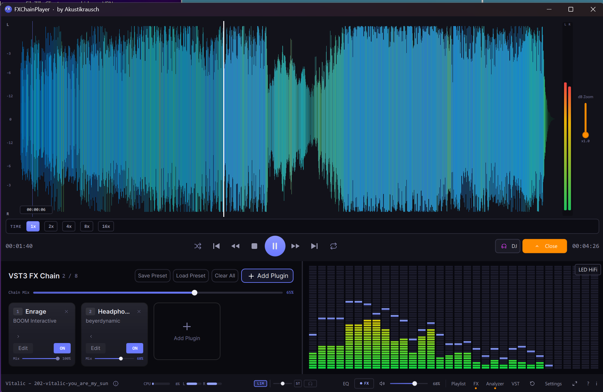
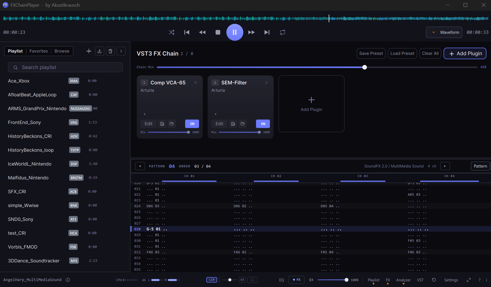
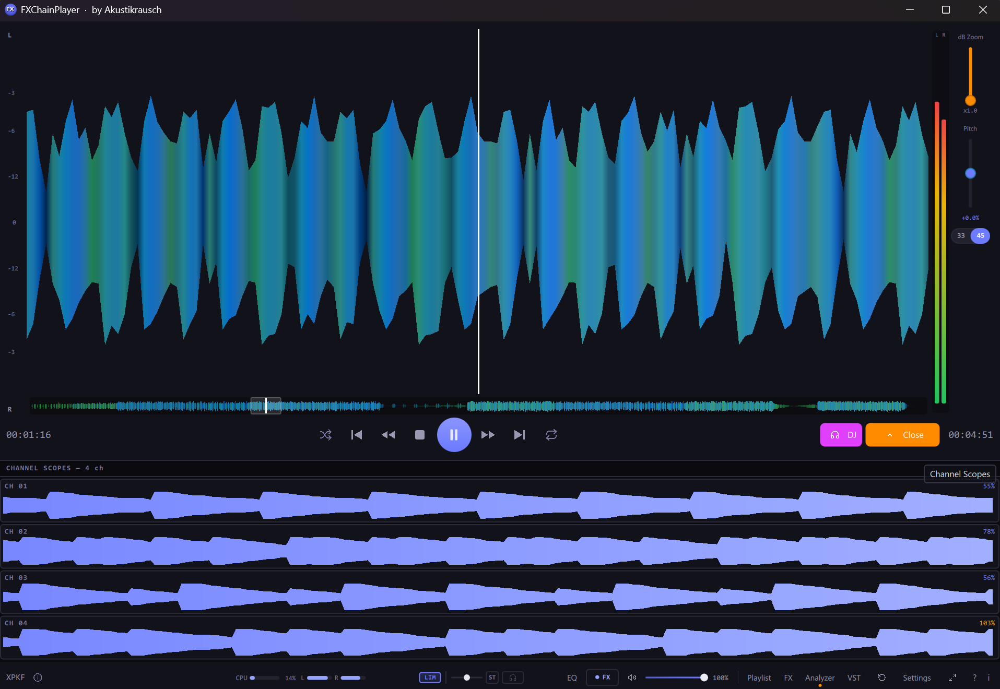
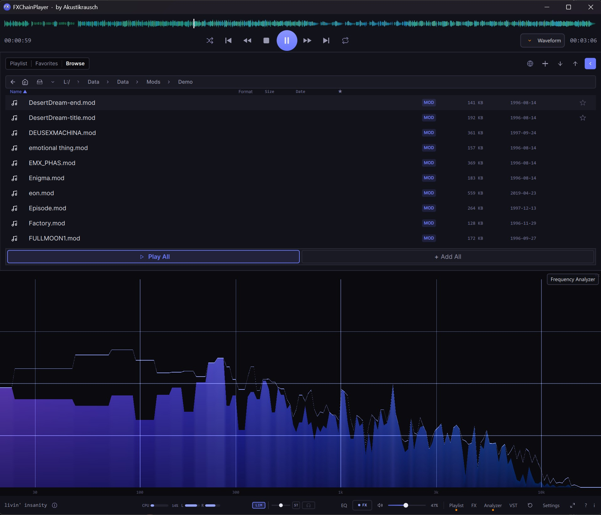

<h1 align="center">FXChainPlayer</h1>

<strong>A Windows desktop audio player with a full VST3 effect chain built into the playback engine.</strong>

  
  
  
  
  

<em>Load your favorite plugins — EQs, compressors, reverbs, spatial processors, headphone correction — directly into the signal path and hear them in real time while you listen to music. No DAW required.</em>

<a href="https://github.com/akustikrausch/FXChainPlayer-Releases/releases/download/v0.37.2/FXChainPlayer-Setup-0.37.2.exe"><strong>⬇ Download FXChainPlayer-Setup-0.37.2.exe</strong></a>

  

---

## Why VST3 in an audio player?

More reasons than you'd expect.

- **🎧 Headphone surround & spatial audio** — Run binauralizers like **dearVR MONITOR**, **Waves Nx**, or **Dolby Atmos Production Suite** to turn stereo into a full spatial soundstage on any pair of headphones. No system-wide wrapper, no virtual audio cable.
- **🎚️ Headphone calibration & correction** — Use frequency-response plugins like **Sonarworks SoundID Reference**, **Beyerdynamic Headphone Lab**, **Waves Nx Virtual Mix Room**, or **Morphit** to flatten your specific headphone model to a neutral reference.
- **📻 Internet radio & streaming cleanup** — Load a compressor, EQ, de-esser, or multiband processor on poorly-mastered streams or dynamic-range-compressed "loudness war" tracks to tame them while you listen.
- **🔌 Plugin auditioning** — Want to hear how that new reverb, saturator, or tape emulation sounds on real music? Drop it in. No DAW boot-up, no empty session, no audio import.
- **🔊 Loudness normalization & limiting** — Keep playback levels consistent across tracks from wildly different sources (old CDs vs. modern streaming).
- **🏠 Room correction** — Apply convolution IRs or parametric EQ profiles to compensate for your listening room and speaker setup.
- **🅰️🅱️ A/B plugin comparison** — Quickly toggle effects in and out on familiar reference tracks to hear exactly how they color the sound.
- **♿ Accessibility** — Hearing aid profiles, frequency boosting, dynamic range compression, or custom EQ curves for listeners who need tailored audio processing.
- **🎛️ Mix referencing** — Drop your mix in, compare A/B against a reference master, hear your monitor chain on someone else's material.
- **💾 Bake the effect chain into a file** — render any track or the whole playlist through the VST chain to WAV / MP3 / FLAC / OGG, faster than real-time. Take your processed audio anywhere. [Details below](#export-through-your-vst3-chain).

Up to **8 VST3 plugins in a serial chain**. Drag-and-drop reorder. Per-slot bypass and dry/wet. Smooth global chain mix. Native plugin GUIs. Everything runs at **64-bit double precision** end-to-end.

---

## Plays pretty much everything

FXChainPlayer is built for music listeners who don't want format juggling. Drop a folder with mixed FLAC, MP3, tracker files, C64 SIDs, Game Boy chiptunes, Apple Loops or Wii game-music dumps — it just plays. **800+ extensions across 14 categories** with a built-in searchable Format Library panel.

### Lossless & Hi-Res

**FLAC**, **WAV**, **WavPack** `.wv`, **ALAC** (Apple Lossless), **APE** (Monkey's Audio), **TTA** (True Audio), **AIFF**, **Opus**, **W64** (Sony Wave64), **DSD** `.dsf` / `.dff` (DSD64/128/256/512).

### Lossy

**MP3**, **AAC**, **M4A** / **MP4** audio, **OGG Vorbis**, **WMA**, **MPC** (Musepack SV8), **AC-3**.

### Tracker modules (50+ formats via libopenmpt 0.8.6)

Runtime-detected via `openmpt_is_extension_supported()` — new formats picked up by future libopenmpt patches just work, no source-code changes needed.

**MOD** (ProTracker), **XM** (FastTracker 2), **S3M** (ScreamTracker 3), **IT** (Impulse Tracker), **MPTM** (OpenMPT), **Digibooster Pro**, **Imago Orpheus**, **Graoumf Tracker**, **Liquid Tracker**, **Octalyser**, **PolyTracker**, **UltraTracker**, **Digitrakker**, **OctaMED**, **Farandole Composer**, **Epic MegaGames MASI**, **MadTracker 2**, **Galaxy Sound System**, **X-Tracker**, **Soundtracker Pro II**, **TCB Tracker**, **NoiseTracker**, **Ice Tracker**, **Composer 670**, **SoundFX 1/2**, **Davey Taylor's Tracker**, and many more.

### Console chiptunes (via libgme 0.6.4)

- **GBS** — Nintendo Game Boy
- **SPC** — Super Nintendo (SPC700)
- **VGM / VGZ** — Sega Megadrive · 32X · Master System · Game Gear · Mega CD · SG-1000 · SC-3000 · BBC Micro · ColecoVision
- **AY** — ZX Spectrum · Amstrad CPC (AY-3-8910)
- **NSF / NSFE** — Nintendo Entertainment System
- **KSS** — MSX
- **HES** — PC Engine / TurboGrafx-16
- **SAP** — Atari 8-bit
- **GYM** — Sega Genesis / Mega Drive

### Game music & Apple Loops (~700 formats via vgmstream r2083)

- **Apple `.caf`** — Logic Pro / GarageBand **Apple Loops** library
- **Nintendo** — BRSTM · BCSTM · BFSTM · BFWAV · DSP-ADPCM family · NUS3AUDIO · Switch Opus
- **Sony** — VAG · HPS · NUB · ATRAC3 / ATRAC9 (FFmpeg-build) · AT3 / AT9
- **Microsoft** — XMA · XWMA
- **CRI** — ADX · HCA · ACB / AWB containers
- **FMOD** — FSB (Multiple)
- **Square Enix** — SCD
- **Wwise** — WEM
- **Bink** — BIK audio
- vgmstream `.txtp` text-playlists with looping / mixing / effects

Core build is **ISC-licensed and FFmpeg-free**. An opt-in CMake flag (`-DFXCHAIN_ENABLE_VGMSTREAM_FFMPEG=ON`) adds ATRAC9 / FSB-CELT / ALAC-in-CAF / FSB-Vorbis at the cost of bundled FFmpeg DLLs (LGPL).

### Retro / specialty

- **SID** — Commodore 64 (cRSID emulator, HVSC Songlengths support — 60 000+ tune durations built-in)
- **IFF 8SVX** — Amiga samples
- **MIDI** / **RMI** — SoundFont 2 (SF2) rendering via TinySoundFont, with Windows Media Foundation fallback
- **CUE sheets** — multi-track audio with proper track split and gapless playback
- **Packed / crunched Amiga files** — StoneCracker, Imploder, Pack-Ice 1.x / 2.1 / 2.31+, ByteKiller + ANC / JEK clones, JAM Packer, PowerPlayer Music Compressor, CrunchMania, PowerPacker, XPK family, DMS, and ~20 more (via ancient 2.3.0)
- **ZIP / RAR / LHA / LZX archives** — audio extracted at add-time via libarchive

**800+ file extensions total.** Open the in-app **Formats Library** panel (*File Info → Open Formats Library*) for the full searchable catalogue with one card per format showing platform, era, decoder library and technical details.

  

### Web radio

The **globe icon** (or `Ctrl+U`) opens a Stream Directory modal with three tabs:

- **Open URL** — paste any direct Icecast / Shoutcast / `.mp3` / `.aac` / `.ogg` URL.
- **Favorites** — your saved stations, persisted separately from the playlist's Favorites tab.
- **Directory** — a curated catalogue (Demoscene · Electronic · Indie · Hip-Hop · Classical · Jazz · News). Click a station to play.

Stations expose their full ICY metadata in the *File Info* panel (station name, genre, description, server, sample rate, bitrate). Live "Now Playing" track titles appear in a card on the File Info panel and in the status-bar / SMTC label.

---

## Audio engine

### ASIO 2.3 + WASAPI Shared / Exclusive

**ASIO 2.3** is supported (Steinberg-licensed). Pick **ASIO** in *Settings → Audio → Audio Mode*. Round-trip latency depends on your audio interface and the buffer size the driver supports — see *Settings → Audio → Latency* for the driver's live in/out frame counts and total ms.

- **Output Pair routing** for multi-output interfaces — route the player's stereo to any pair (1-2, 3-4, …) up to the driver's reported total. Persisted across sessions.
- **Configure Driver button** opens the driver's hardware panel directly (e.g. RME TotalMix, MOTU CueMix, Apollo Console, ASIO4ALL settings).
- **Driver-reported latency readout** — in N / out N frames + total ms — refreshed live whenever the driver fires `kAsioLatenciesChanged`.
- **Output stage** — TPDF dither at canonical ±1 LSB peak (Lipshitz–Vanderkooy 1992) on every integer path, NaN/Inf guards, asymmetric clamps preserving the negative-rail code, full coverage of `ASIOSTInt16/24/32 LSB/MSB` and `Float64MSB`. Mixed-bit-width channel groups (e.g. Int32 on analog, Int24 on ADAT) route correctly.
- **SEH-safe driver panel calls** + clean reset / latency-change handling so a misbehaving panel can't take out the host.

**WASAPI** Shared and Exclusive modes remain fully supported. The player picks the device's native sample rate, no system-wide resampling. WASAPI Exclusive bypasses the Windows audio engine for the bit-for-bit path that doesn't need an ASIO driver.

### Turntable Pitch Slider (Technics-style)

A vertical pitch fader on the right edge of the expanded waveform view AND DJ-mode view. **±16 % range**, **0 % center detent** (snaps to neutral within ±0.3 %), and a **33 ⇄ 45 RPM toggle** below the slider — 45 plays the file at native rate, 33 plays it at 33⅓/45 = 0.7407× speed (literal Technics behaviour, both pitch and tempo drop together — no digital time-stretch artefacts).

Resampling is done with a **48-tap windowed-sinc kernel** (Kaiser window, β=8.6, ~−90 dB stop-band) and a 256-phase look-up table with linear blend between adjacent phases for sub-sample resolution. Two kernels are pre-computed: a full-bandwidth one for speed-down (where alias-folding is not a concern) and a reduced-bandwidth one (cutoff 1/1.16) for speed-up so out-of-band content doesn't fold back into the audible range. The pitch stage is **before** the VST3 chain, so plugins receive the pitched signal as if from a real turntable. **At 0 %, the slider's fast-path is bit-exact pass-through** — the resampler is bypassed entirely. Auto-resets to neutral on every track change.

  

### 64-bit double-precision signal path

Internal audio path is `double` end-to-end. Sample-rate conversion (when needed) uses **r8brain-free-src** (linear-phase, the manufacturer reports 260 dB SNR on the floating-point path).

### Format Library — every supported format, in-app

A collapsible **Format Info** card in *File Info* (origin, era, codec, decoder library) for every track, and a full **Formats Library** modal panel with a per-category sidebar, search across name / extensions / platform / developer / decoder, and click-to-expand cards with the complete catalogue entry.

The redesigned **Settings → File Associations** uses the same source-of-truth — collapsible categories with `enabled/total` badges, search box, "Recommended" preset.

### 3-Band EQ (built-in modal dialog)

Low Shelf / Mid Bell / High Shelf with two draggable crossover-frequency handles on a live FFT spectrum and three Low/Mid/High gain knobs — classic hi-fi sweep from 7:30 through 12 o'clock (top, 0 dB) to 4:30. RBJ-cookbook biquads with 5-ms coefficient ramping (no clicks on knob moves). Soft 0 dB detent on bipolar knobs (snaps within ±0.3 dB). Toggle with `Q`.

### Six real-time visualization modes

- **FFT Spectrum** — log-scale frequency analyzer with Hz axis labels (30 / 100 / 300 / 1k / 3k / 10k) and a 1-px peak-hold trail
- **Spectrogram** — scrolling waterfall
- **Stereo Phase Scope** — Lissajous / goniometer with amplitude-brightening
- **VU Meter** — classic PPM L/R
- **LED HiFi** — 32-band segmented display
- **Frequency Landscape** — 3D waterfall with cubic depth fog and amplitude-driven brightness

Plus dedicated **Channel Scopes** (per-channel oscilloscopes for trackers, L/R for stereo), a live **ProTracker-style Pattern View** for `.mod` / `.xm` / `.s3m` / `.it` playback, and the **SID Voices** view for Commodore 64 tunes. Synthesised formats (SID / MIDI / libgme chiptunes) show a live scrolling oscilloscope just like URL streams.

### Studio Compare (A/B)

Dual-decoder synchronized A/B playback — load two files and switch between them sample-accurately with a 64-sample crossfade. Compare masters, codecs, headphones, plugin chains.

### Built-in Bauer-style crossfeed

Smooth your stereo on headphones without a plugin slot. Continuous blend slider, proper gain + delay + lowpass filtering.

### Gapless playback

Next track is pre-loaded and swapped in sample-accurately across the decoder families that allow it (FLAC→MP3, MOD→XM, cross-format — all work). Mixed-format playlists play back cleanly end-to-end.

### Integrated file browser & smart-scan

Point it at your music library. Background SQLite cache for VBR durations, bitrates, cover art. Instant playlist building across folders. Breadcrumb navigation, library roots, "Play / Add All" context actions, Favorites tab for quick pinning.

  

### Export through your VST3 chain

Route **any file or whole playlist** through your VST3 effect chain and render the result to disk. Faster-than-real-time, offline, sample-accurate. Right-click a track in the playlist → **Export to format…** for a single file, or **Ctrl+E** for the full batch dialog.

Output formats:

- **WAV** — 16-bit, 24-bit PCM, 32-bit float
- **MP3** — 128 / 192 / 320 kbps CBR
- **FLAC** — 16-bit and 24-bit lossless (libFLAC, compression level 5)
- **OGG Vorbis** — q3 / q5 / q7 (≈ 112 / 160 / 224 kbps VBR via libvorbis)

Multi-tune containers (NSF / NSFE / SAP, multi-tune SIDs from HVSC, multi-subsong vgmstream archives like `.acb` / `.scd` / `.nub` / `.nus3audio`) can optionally expand into one file per subsong via the **Export all subsongs** checkbox.

Export is included in every build — no separate "Pro" tier, no time-limited trial on the export path.

### Plugin crash protection

SEH-wrapped plugin process calls, automatic crash journaling, safe-mode after repeated failures, per-`(path, classID)` blacklist so a single crashing plugin in a multi-class shell (e.g. Waves WaveShell with 600+ effects) doesn't take out the rest. Auto-restart watchdog subprocess.

### Full keyboard accessibility

Every audio control reachable via Tab + Space / Enter / arrow keys. Output-pair, mode chips, device list all wired as standard radio groups. Settings panel, TransportBar, FileBrowser, FxChain bypass, Playlist tabs all wired. Hard CI gate (`qml_a11y_lint`) prevents regressions.

### Performance

Native C++20, lock-free audio thread, GPU-accelerated rendering throughout (no QML Canvas anywhere). Idle RAM ~50 MB, cold startup under 2 s on typical hardware.

---

## What's new in v0.37.2

First public update of the v0.37 cycle. Consolidates everything from v0.37.0 → v0.37.2 (three internal builds) into one public release.

### Web radio — Stream Directory and live metadata

- **Stream Directory modal** behind the globe icon (and `Ctrl+U`). Three tabs: **Open URL**, **Favorites**, **Directory**. The Directory tab carries a curated catalogue split into seven categories: **Demoscene** at the top (Nectarine 128k + 196k OGG + 192k MP3), **Electronic & Ambient** (SomaFM Groove Salad, Drone Zone, Mission Control, DEF CON, Radio Paradise), **Indie · Pop · Rock** (BBC Radio 6, Radio Paradise Mellow Mix, …), **Hip-Hop · R&B · Soul** (BBC 1Xtra, KCRW Eclectic24), **Classical** (Linn Classical, Klassik Radio, BBC R3), **Jazz · Soul** (Linn Jazz, SomaFM Sonic Universe, The Trip), **News & Talk** (Deutschlandfunk + DLF Kultur + DLF Nova, BBC World Service). Star a station to pin it to your Favorites.
- **Stream metadata in File Info.** URL streams now show a **STREAM** section with station name, genre, description, server software, sample rate, bitrate, content-type and a clickable Homepage link. A **Live / Loading / Offline** status pill reflects the current state.
- **Live "Now Playing" track titles.** In-stream `StreamTitle` blocks appear both in a NOW PLAYING card at the top of the STREAM section AND in the status-bar / SMTC label. The label reads *"Nectarine — Demoscene Radio — Artist - Track"* instead of just the URL filename.
- **Failed-stream load** shows a URL-aware error: *"Stream unavailable: host — server offline, URL changed, or no network. Check your connection or try a different station."* — instead of the previous misleading "file corrupt".

### Export — two new output formats and multi-tune handling

- **FLAC** (16 / 24-bit lossless via libFLAC, compression level 5) and **OGG Vorbis** (q3 / q5 / q7 ≈ 112 / 160 / 224 kbps VBR via libvorbis) added to the renderer's output dropdown. Both encoders run through the same plugin chain, the same TPDF dither, and the same brick-wall limiter as the WAV / MP3 paths.
- **Export all subsongs.** New checkbox in the render dialog. When on, multi-tune containers (NSF / NSFE / SAP / GBS / HES via libgme, multi-tune SIDs from HVSC, multi-subsong vgmstream archives) expand into one file per subsong: `Title - 01.flac`, `Title - 02.flac`, … Single-subsong files are unaffected.
- **Export-format dropdown** in the render dialog now auto-flips above the button and scrolls when it would otherwise crop offscreen.

### Turntable pitch — windowed-sinc resampler

The pitch slider's resampler was rewritten. The previous build used a linear interpolator; the new build uses a **48-tap Kaiser-windowed sinc** kernel (β=8.6, ~−90 dB stop-band) with a 256-phase look-up table. Two kernels are pre-computed — a full-bandwidth one for speed-down and a reduced-bandwidth one (cutoff 1/1.16) for speed-up to suppress out-of-band aliasing. The 0 % center fast-path remains bit-exact (the resampler is bypassed entirely at neutral), and the LUT init is warmed on the GUI thread at engine construction so the first slider drag does not carry the one-time `sin()` / Bessel cost into the audio callback.

A CTest gate (`test_sinc_resampler`) verifies the null-test at integer positions, DC-bias = 0, and ≥ 80 dB alias suppression on a +16 % pitched test signal in the reduced-bandwidth kernel.

### Spectrum analyzer polish

- **FFT mode** — peak-hold trail rebuilt as a 1-px symmetric line in bright accent indigo, replacing the previous wider gradient. Hz-axis grid (30 / 100 / 300 / 1k / 3k / 10k) plus three horizontal amplitude lines (0.25 / 0.5 / 0.75) so frequencies can actually be read off.
- **Frequency Landscape** — saturation reduced from 1.0 to 0.62 (was hard on the eyes); brightness is now amplitude-driven (`0.18 + 0.78 × amp`) so quiet bands sit dark and loud peaks pop; the bottom vertex is forced to pure black so the silhouette stays legible against the panel; depth fog is cubic instead of linear (`30 + 200 × t³`), giving better separation between near and far bins.
- **Channel Scopes** — when playback pauses, the scopes draw a flat baseline instead of freezing on the last live frame. The 60 Hz redraw timer is gated on play state so paused playback does not burn CPU.

### Stability

- **Web radio + File Info no longer hangs the app.** The persistent stream-title poll could re-enter the Qt event loop on certain ICY sources and deadlock the GUI thread. Polling has been replaced by stale-callback guards on the existing ICY-header reply.
- **Stream Directory: dead URLs swept.** Some directory entries had gone offline (404 or DNS gone) and the player would silently fail to load them. The catalogue is now 25 verified-live streams across the seven categories listed above; failed loads now show the URL-aware error message described above.
- **Reactive Favorites star.** The star icon in the Directory tab now updates immediately when a station is removed from the Favorites tab.
- **Web radio click-to-play.** Clicking a station in the Stream Directory modal now starts playback immediately (the previous build would only append the entry to the playlist; pressing Play in the transport bar after that did nothing).
- **Format-info card.** `.mod` and other tracker formats now show their FORMAT INFO card correctly.
- **Honest ASIO ↔ WASAPI positioning** in Help / Settings / release notes — ASIO is the SDK Steinberg licenses for low-latency interfaces; WASAPI Exclusive bypasses the Windows audio engine for the bit-for-bit path that doesn't need an ASIO driver.

See the [v0.37.2 release notes](https://github.com/akustikrausch/FXChainPlayer-Releases/releases/tag/v0.37.2) for the consolidated detail.

---

## What's new in v0.36.7

First public update of the v0.36 cycle. Consolidates everything from v0.36.0 → v0.36.7 (eight internal builds) into one public release. Three headline additions, a redesigned audio path, hundreds of small fixes.

- **ASIO 2.3.** Steinberg-licensed, enabled by default. Output Pair routing for multi-output interfaces. Configure Driver button. Driver-reported latency readout. Output stage with TPDF dither and asymmetric clamps across every integer path.
- **Game music + Apple Loops via vgmstream r2083.** ~700 formats — Apple CAF (Logic Pro / GarageBand Apple Loops library), CRI ADX/HCA, Nintendo BRSTM/BCSTM/BFSTM/DSP family, FMOD FSB, Square Enix SCD, Wwise WEM, Xbox XMA, Sony VAG/HPS/NUB. ISC-licensed, no FFmpeg in the default build.
- **50+ tracker formats — runtime-detected** via libopenmpt 0.8.6 (no hardcoded list). The ancient depacker upgraded to v2.3.0 — Pack-Ice 1.x / 2.1 / 2.31+, ByteKiller + ANC / JEK clones, JAM Packer, PowerPlayer Music Compressor, Vice / Vic2 Huffman.
- **Format Library — every supported format, in-app.** New collapsible Format Info card in *File Info* and a full Formats Library modal panel reachable from *File Info → Open Formats Library*. Settings → File Associations redesigned with collapsible categories, search, "Recommended" preset.
- **Turntable Pitch Slider (Technics-style).** ±16 % range, 0 % center detent, 33 ⇄ 45 RPM toggle. (v0.37.0 replaced the linear interpolator with a 48-tap windowed-sinc kernel — see *What's new in v0.37.2* above.)
- **Output Device picker redesign.** Backed by a long-lived COM `IMMNotificationClient` listener — devices come and go, the list updates; Windows changes its default render endpoint, the system-default row tracks it. Green LIVE pill marks the row currently producing sound.
- **EQ refinements.** Reset actually moves the knobs back to 12 o'clock (was broken after first interaction). Soft 0 dB detent on bipolar knobs.
- **Test-locked correctness.** Three CTest gates run on every CI push — `test_asio_dither` (55 assertions), `test_audio_backend_types` (21 assertions), `qml_a11y_lint`. The previously-undetected DC-bias bug (≈ -0.5 LSB) would now fail the dither test by 50× the tolerance margin.
- **Qt 6.8.3 LTS upgrade.** Qt floor bumped from 6.5 to 6.8 (LTS until October 2027).
- **Many smaller fixes** — vgmstream sample-count bug, live waveform for synthesised formats, ASIO + MOD playback crash, vgmstream `.iff` regression, vgmstream race fix on mono sources, `.bnk`/`.txtp` rejection messages, output-device-picker click-drop, decoder short-read percentage in toast, plugin chain restoration ordering, UI scale immediate apply, TFMX gating, SmartScan dedup, log rotation.

See the [v0.36.7 release notes](https://github.com/akustikrausch/FXChainPlayer-Releases/releases/tag/v0.36.7) for the consolidated detail.

---

## What's new in v0.35.12

Three fixes.

- **Bulk folder drop into the playlist no longer runs the decoder twice per file.** Adding a folder of uncached mixed-format tracks (chiptunes + trackers + MP3s) used to open every file with two full decoder lifecycles back-to-back on the UI thread. With twenty-plus files and heavy codecs (libgme, libopenmpt, MF MIDI fallback) that added up to forty-plus open/close cycles per second. One decoder open per file now.
- **3-Band EQ knobs: 0 dB sits at 12 o'clock on all three knobs.** Classic hi-fi knob sweep from 7:30 through 12 o'clock (top, 0 dB) to 4:30.
- **"Clear Playlist" → "Clear All" in the confirmation dialog actually clears the playlist.** The button was wired through the playlist's filter proxy and proxies don't expose `clear()`. Now routes through a dedicated signal to the source model and stops playback too.

Docs, help panel and third-party license list were updated in the same pass to match the current 3-Band EQ.

---

## What's new in v0.35.11

Big round of UX polish — fifteen fixes, one feature rewrite.

- **3-Band EQ, rewritten from scratch as a modal dialog.** Low Shelf / Mid Bell / High Shelf with two draggable crossover-frequency handles on a live FFT spectrum, and three Low/Mid/High gain knobs. Opens with `Q` or from the status-bar EQ button. RBJ-cookbook biquads with 5-ms coefficient ramping.
- **Waveform-expand gets a flexible sub-panel strip below.** When the transport is expanded, press `P`, `E` or `A` to bring Playlist, FX Chain or Analyzer back in as a horizontal bar under the waveform.
- **UI-scale change auto-restarts the app** (Qt 6.7 has no runtime scale API).
- **Playlist column headers no longer vanish at full width.**
- **File Info dialog polish.** Auto-refreshes when the playlist advances. Long ID3 Copyright / Encoder / Composer tags cap at 260 px.
- **Reset-View persists to settings.** Pressing the status-bar reset button (or `Ctrl+Shift+R`) now writes "Default" into the layout-preset file too.
- **Transport-position-aware waveform chevron.**
- **Plugin loading / unloading spinner renders clean status text.**
- **Inter-font-weight fallback hardening.**
- **Smaller fixes.** Playlist tabs always show separator lines. Status-bar info-icon hides when no file is loaded. Sidebar drag clamps against window width. Single waveform-expand entry point. Gapless MOD→MOD tracker transitions don't blank the pattern view anymore. Right-click anywhere in the analyzer / pattern view opens the mode menu.

See the [v0.35.11 release notes](https://github.com/akustikrausch/FXChainPlayer-Releases/releases/tag/v0.35.11) for the consolidated list.

---

## What's new in v0.35.10

Consolidated release notes for the whole v0.35 cycle up to v0.35.10.

### Playlist & library

- **Multi-select.** Click to select, `Ctrl+Click` to toggle, `Shift+Click` for a range, `Ctrl+A` selects everything. `Del` removes the whole selection.
- **Favorites tab (★).** Click the star in any playlist row or browser entry to mark a favourite.
- **Playlist search.** `Ctrl+F` focuses an inline search field.
- **Full-width playlist with split view.** `Shift+P` (or the chevron in the playlist header) expands the playlist to full window width.
- **Auto-fill width when no right-side panel is visible.**
- **Extended columns (Year / BPM / Key)** appear on windows ≥ 1400 px wide.
- **Sort by track index (folder grouping).**
- **★ sort column.** Click the star header to float favourites to the top.
- **Drag-out to Explorer / Desktop.**
- **Delete File… (Recycle Bin).** Sends the file to the Windows Recycle Bin.
- **Arrow-key navigation** across playlist and file browser.
- **Detail-text brightness slider.**
- **Sortable file browser** (Name / Format / Size / Date).

### Layout & recovery

- **Named layout presets** in *Settings → Display*: Default, DJ Mode, Studio Mode, Playlist Mode. Save your own tweaks as *Custom*.
- **Reset-View button in the status bar** plus `Ctrl+Shift+R` shortcut.
- **Transport Bar position (Top / Bottom).**

### Format support

- **ZIP / RAR / LHA / LZX archives at add-time** via libarchive.
- **Amiga retro-packers** (StoneCracker, Imploder, PackIce, CrunchMania and ~20 more).
- **30+ retro tracker formats** via libopenmpt 0.8.6.
- **SID song lengths (HVSC).**
- **MIDI SoundFont auto-pick.**

### Tracker & SID pattern views

- **Live ProTracker-style pattern view** for MOD / XM / S3M / IT.
- **Channel Scopes.** Per-channel oscilloscopes for trackers up to four channels.
- **Instrument → Channel split view.**
- **Channel mute.** Click any channel header in the pattern view to mute it.
- **Pattern navigation with no lag** (~20 ms).
- **SID Voices:** per-voice mute, chip-model toggle (6581 / 8580 / auto), filter bypass.

### File Info panel

- **AUDIO + TRACKER MODULE / DSD STREAM / SID TUNE sections render first**, above the song-info tag card.
- **Floating ✕ close button in the top-right corner.**

### Reliability

- **Gapless tracker→tracker crash fixed.**
- **Plugin crash isolation per `(path, classID)`** — a single crashing plugin in a multi-class shell like Waves WaveShell (600+ effects) doesn't take out the rest. Automatic safe mode after repeated failures.
- **Crash guard for file scanning.**
- **Playlist auto-recovery** on failed track load.
- **Session restoration** on relaunch (crash or normal).
- **Restart-from-app.** *About → Quick Access → Restart Application*.
- **Firewall-friendly first-run update prompt.**

---

## Download

**[⬇ Latest installer on GitHub](https://github.com/akustikrausch/FXChainPlayer-Releases/releases/latest)**

One installer, one click: `FXChainPlayer-Setup-X.Y.Z.exe` (Inno Setup). Full install with file associations, Start menu entries, uninstaller. All required Qt DLLs and the VST3 host process are included.

### Auto-update

FXChainPlayer checks GitHub Releases for new versions and offers one-click install with SHA-256 verification. Toggle in *Settings → Updates*.

---

## System Requirements

- **Windows 10** or **Windows 11**, 64-bit
- ~100 MB disk space
- An audio output device (WASAPI — any built-in sound, USB DAC, or HDMI audio works; ASIO 2.3 supported on any compliant interface)
- Optionally: a VST3 plugin folder with your favorite effects

---

## Supported plugins

FXChainPlayer is a **VST3 host** (not VST2). Any 64-bit VST3 effect plugin should work. Tested heavily with:

- **FabFilter** (Pro-Q 3/4, Pro-C 2, Pro-L 2, Saturn 2, …)
- **Waves** WaveShell (including multi-class shells)
- **iZotope** Ozone, RX, Nectar
- **Sonarworks** SoundID Reference
- **Tokyo Dawn Labs** (Nova GE, Kotelnikov, Proximity)
- **Valhalla DSP** (VintageVerb, Room, Supermassive)
- **Acon Digital**, **Softube**, **Kirchhoff-EQ**, **Pro-MB**, **Dear Reality dearVR**, **Beyerdynamic Headphone Lab**, and many others.

Instruments (VSTi) are filtered out automatically — FXChainPlayer is a playback tool, not a DAW.

---

## License

FXChainPlayer is proprietary software by **Andreas Wendorf (Akustikrausch)**.

The binaries use and statically/dynamically link the following open-source components (with full LGPL / BSD / MIT attribution in the About dialog inside the app): Qt 6, VST3 SDK, dr_libs, stb_vorbis, libopenmpt, libgme (Game Music Emu), cRSID, TinySoundFont, WavPack, Monkey's Audio SDK, libmpcdec, libtta++, r8brain-free-src, TagLib, SQLite, pugixml, MurmurHash3, nlohmann/json, spdlog, libarchive, ancient, vgmstream (ISC), libFLAC, libvorbis, libogg, zlib.

ASIO is a trademark and software of Steinberg Media Technologies GmbH. FXChainPlayer uses the Steinberg ASIO Interface Technology under license. The Steinberg ASIO SDK source code is NOT redistributed with this product.

---

## Community

Join the FXChainPlayer Discord for questions, feedback, plugin recommendations, and bug reports: **<https://discord.gg/sfHBZFhG>**

## Links

- **Latest release:** https://github.com/akustikrausch/FXChainPlayer-Releases/releases/latest
- **Discord:** https://discord.gg/sfHBZFhG
- **Author:** [Andreas Wendorf / Akustikrausch](https://github.com/akustikrausch)

---

<em>Tools disappear. Music remains.</em>

