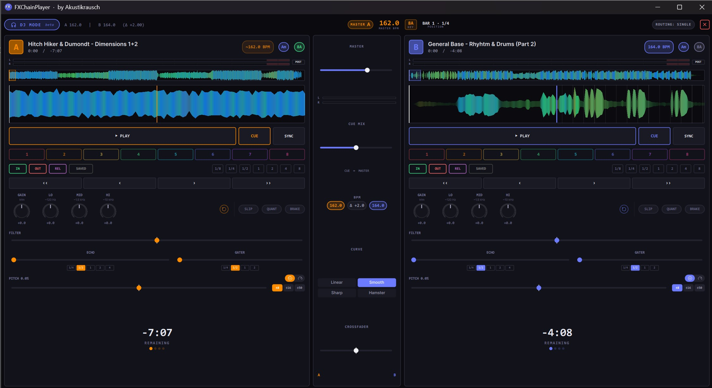

<h1 align="center">FXChainPlayer</h1>

<strong>A Windows desktop audio player with a full VST3 effect chain built into the playback engine — and a complete dual-deck DJ Mode.</strong>

  
  
  
  
  
  
  

<em>Load your favorite plugins — EQs, compressors, reverbs, spatial processors, headphone correction — directly into the signal path and hear them in real time while you listen to music. Pitch records like vinyl. Mix tracks across two decks with sync, hot cues, loops and Pioneer-DJM-style filter. No DAW required.</em>

<a href="https://github.com/akustikrausch/FXChainPlayer-Releases/releases/download/v0.47.6/FXChainPlayer-Setup-0.47.6.exe"><strong>⬇ Download FXChainPlayer-Setup-0.47.6.exe</strong></a>

  

---

## Why VST3 in an audio player?

More reasons than you would expect.

- **🎧 Headphone surround & spatial audio** — Run binauralizers like **dearVR MONITOR**, **Waves Nx**, or **Dolby Atmos Production Suite** to turn stereo into a full spatial soundstage on any pair of headphones. No system-wide wrapper, no virtual audio cable.
- **🎚️ Headphone calibration & correction** — Use frequency-response plugins like **Sonarworks SoundID Reference**, **Beyerdynamic Headphone Lab**, **Waves Nx Virtual Mix Room**, or **Morphit** to flatten your specific headphone model to a neutral reference.
- **📻 Internet radio & streaming cleanup** — Load a compressor, EQ, de-esser, or multiband processor on poorly-mastered streams or dynamic-range-compressed "loudness war" tracks to tame them while you listen.
- **🔌 Plugin auditioning** — Want to hear how that new reverb, saturator, or tape emulation sounds on real music? Drop it in. No DAW boot-up, no empty session, no audio import.
- **🔊 Loudness normalization & limiting** — Keep playback levels consistent across tracks from wildly different sources (old CDs vs. modern streaming).
- **🏠 Room correction** — Apply convolution IRs or parametric EQ profiles to compensate for your listening room and speaker setup.
- **🅰️🅱️ A/B plugin comparison** — Quickly toggle effects in and out on familiar reference tracks to hear exactly how they color the sound.
- **♿ Accessibility** — Hearing aid profiles, frequency boosting, dynamic range compression, or custom EQ curves for listeners who need tailored audio processing.
- **🎛️ Mix referencing** — Drop your mix in, compare A/B against a reference master, hear your monitor chain on someone else's material.
- **🎚️ Per-channel chains for trackers, SIDs, multi-channel chiptunes** — Each channel of a `.mod` / `.xm` / `.it` / SID / NSF file gets its OWN VST3 chain. Reverb only on channel 1, LP filter only on the bass channel, distortion only on the lead. Configure once per file (auto-loaded on track-change), bake into the export.
- **💾 Bake the effect chain into a file** — render any track or the whole playlist through the VST chain to WAV / MP3 / FLAC / OGG, faster than real-time. Take your processed audio anywhere. [Details below](#export-through-your-vst3-chain).

Up to **16 VST3 plugins in a serial chain**. Drag-and-drop reorder. Per-slot bypass and dry/wet. Smooth global chain mix. Native plugin GUIs. Everything runs at **64-bit double precision** end-to-end.

---

## Plays pretty much everything

FXChainPlayer is built for music listeners who do not want format juggling. Drop a folder with mixed FLAC, MP3, tracker files, C64 SIDs, Game Boy chiptunes, Apple Loops or Wii game-music dumps — it just plays. **1500+ extensions across 17 categories** with a built-in searchable Format Library panel.

### Lossless & Hi-Res

**FLAC**, **WAV**, **WavPack** `.wv`, **ALAC** (Apple Lossless), **APE** (Monkey's Audio), **TTA** (True Audio), **AIFF**, **Opus**, **W64** (Sony Wave64), **DSD** `.dsf` / `.dff` (DSD64/128/256/512 — including DST-compressed `.dff`).

### Lossy

**MP3**, **AAC**, **M4A** / **MP4** audio, **OGG Vorbis**, **WMA**, **MPC** (Musepack SV8), **AC-3**.

### Tracker modules (50+ formats)

**MOD** (ProTracker), **XM** (FastTracker 2), **S3M** (ScreamTracker 3), **IT** (Impulse Tracker), **MPTM** (OpenMPT), **Digibooster Pro**, **Imago Orpheus**, **Graoumf Tracker**, **Liquid Tracker**, **Octalyser**, **PolyTracker**, **UltraTracker**, **Digitrakker**, **OctaMED**, **Farandole Composer**, **Epic MegaGames MASI**, **MadTracker 2**, **Galaxy Sound System**, **X-Tracker**, **NoiseTracker**, **Ice Tracker**, **Composer 670** + 667, **SoundFX 1/2**, **Davey Taylor's Tracker**, **DSMI/Asylum AMF**, plus fallbacks for Funktracker (`.fnk`), Liquid Tracker (`.liq`), Magnetic Fields Packer (`.mfp`), AMOS Banks (`.abk`), Soundtracker 2.6 (`.st26`), Ice Tracker (`.ice`) and many more.

### Console chiptunes

- **GBS** — Nintendo Game Boy
- **SPC** — Super Nintendo (SPC700)
- **VGM / VGZ** — Sega Megadrive · 32X · Master System · Game Gear · Mega CD · SG-1000 · SC-3000 · BBC Micro · ColecoVision
- **AY** — ZX Spectrum · Amstrad CPC (AY-3-8910)
- **NSF / NSFE** — Nintendo Entertainment System
- **KSS** — MSX
- **HES** — PC Engine / TurboGrafx-16
- **SAP** — Atari 8-bit
- **GYM** — Sega Genesis / Mega Drive

### Atari ST native (`.sndh` / `.ym3-6`)

Native YM2149 chip emulation with built-in 68k support. Plays the entire ~25,000-file sndh.atari.org archive — no external tools required.

### PSF1 family (PlayStation OST)

PSF1 audio playback via a built-in MIPS R3000A + PS1 SPU-1 emulator.

### Amiga composer-named players (12 formats)

**Hippel COSO** (`.hip` `.coso`), **Hippel-7V**, **Ben Daglish** (Last Ninja / Trap / Deflektor / Speedball), **David Whittaker** (Speedball / Lazy Jones / Glider Rider), **Fred Editor** (Frank Bros), **Ron Klaren / SoundFX-RK**, **Symphonie Pro 32-voice**, **Quartet Microdeal** (Atari ST 4-voice PCM), **SoundFactory**, **Mark II**, **Audio Sculpture**, **Digital Mugician 7-voice** (Pete Cooke). Plus **AMOS Music Bank** (every AMOS BASIC game 1990-95), **DeltaMusic 1+2**, **Art Of Noise**, **JamCracker**, **SoundFX v1+v2** (Saint Cinemaware), **BP SoundMon v2+v3** (Brian Postma), **Sidmon 1+2** (Tim Wright / Jeroen Tel), **Sonic Arranger** (Tower of Souls / Ambermoon / Albion), **MaxTrax** (LucasArts Indy/Monkey-Island), **TFMX** (Hülsbeck — Turrican / Apidya / Monkey Island Amiga), **RJP** (Bitmap Brothers — Chaos Engine / Cannon Fodder / Speedball 2 / Gods).

### Demoscene + retro synths

**AHX / HVL** (Hively Tracker), **`.v2m`** (Farbrausch V2 — `.kkrieger` / `.fr-08`), **TIATracker** (Atari 2600), **Organya** (Cave Story), **GoatTracker** (C64), **SAP** (Atari 8-bit), **ZxTracker** (Vortex Tracker II / Pro Tracker 3 / Sound Tracker), **MED Advanced** (OctaMED MMD0/1/2/3), **FutureComposer** (`.fc` / `.fc13` / `.fc14`), **MDX** (Sharp X68000 — YM2151 OPM + MSM6258 ADPCM), **Euphony** (FM-TOWNS — YM2612 OPN2).

### MIDI / SoundFont

`.mid` / `.midi` / `.rmi` via TinySoundFont. Configurable SoundFont (drop a `.sf2` file in *Settings → Audio → MIDI SoundFont*; live `.sf2` audition by dragging the file onto the player).

### TFMX / RJP / TFE / PMD / FMP

**TFMX** — full Hülsbeck macro-engine support (4-voice MDAT/SMPL pairs).
**RJP** — Bitmap Brothers RDAT/RSMP pairs.
**TFE** (TFM Music Maker) — dual YM2203 OPN-FM playback.
**PMD / FMP** — PC-98 (Touhou-pre-Windows / Falcom / Compile).
**MSX** `.kss`.
**SMS / PC-Engine / RGBDS Game Boy** `.sgc` / `.nsd` / `.gbr`.

### DOS Adlib

`.imf` / `.hsc` / `.rad` / `.d00` / `.dro` / `.rix` / `.rol` / `.mus` and ~50 more DOS / Sound Blaster / Adlib / OPL2/3 formats.

### Apple CAF + Sample-pack formats

**Apple CAF** dedicated decoder (PCM 8/16/24/32-bit BE/LE int/float, IMA4, AAC + ALAC, FLAC). Surfaces Logic-Pro Apple-Loops BPM tags.
**REX / RX2 / RCY** sliced-loop sample-pack format (requires user-side Reason Studios REX SDK).

### Game music & sample-pack (~700 formats)

- **Apple `.caf`** — Logic Pro / GarageBand **Apple Loops** library
- **Nintendo** — BRSTM · BCSTM · BFSTM · BFWAV · DSP-ADPCM family · NUS3AUDIO · Switch Opus
- **Sony** — VAG · HPS · NUB · ATRAC3 / ATRAC9 · AT3 / AT9
- **Microsoft** — XMA · XWMA
- **CRI** — ADX · HCA · ACB / AWB containers
- **FMOD** — FSB (Multiple, including Vorbis + CELT)
- **Square Enix** — SCD
- **Wwise** — WEM
- **`.txtp`** text-playlists with effects
- **Multi-subsong navigation** for game-OST archives

### Furnace + IFF SMUS

**Furnace `.fur` / `.dmf`** multi-chip tracker.
**IFF SMUS** Amiga MIDI-style score with INS1 + 8SVX sample resolution.

---

## DJ Mode

  

Press `D` (or click the DJ button in the status bar) to switch to a **dual-deck DJ console** built into the player. Drop tracks on Deck A and Deck B, mix with a real crossfader, and use everything you would expect from a DJ rig.

- **Two decks side by side**, each with: per-deck waveform (overview + 10-second close-up), title / artist / BPM / Key / Camelot, 8 hot cues (numbered, persisted across sessions, set / clear / colour-coded), Loop In/Out + Reloop, auto-loop chips (1/8 1/4 1/2 1 2 4 8 beats), beat-jump (`<<` `<` `>` `>>`), 3-band EQ (LO / MID / HI knobs, ±12 dB), gain knob, Play / Cue / Sync, SLIP / QUANT / BRAKE, and a **Pioneer-DJM-style filter knob** (sweep LP from 20 kHz down to 70 Hz on the left half, sweep HP from 20 Hz up to 17 kHz on the right half, magnetic dead-zone at the centre).
- **Crossfader** — four industry-standard curves (Linear / Smooth / Sharp / Hamster), per-sample smoothing (no zipper noise), right-click snaps to centre.
- **Sync engine — Mixxx-style phase-lock.** Single-click SYNC = match BPM AND beat phase to master. Right-click SYNC = make THIS deck master. Octave-fold so 175 BPM follower against 87 BPM leader stays at perceived-equal speed.
- **Vinyl scratch on the waveform.** Click + drag the close-up OR overview waveform like a Pioneer-CDJ jog wheel. Newtonian-physics platter integrator with viscous + Coulomb friction. Forward + reverse. Release lets the slipmat catch the platter back to slider rate. Works in single-track mode AND DJ mode with the same physics.
- **Vinyl-spin while paused.** Even when audio is paused or stopped, dragging the waveform spins the platter in the dragged direction. Friction decays the platter back to 0. Like spinning a turntable when the motor is off.
- **Per-deck Pitch ⇄ Stretch toggle.** Disc icon = Pitch (vinyl turntable, pitch + tempo move together). Gauge icon = Stretch (phase-vocoder, pitch stays constant while tempo varies).
- **Per-deck Echo + Gater FX.** Tempo-locked beat-rate chips (1/4, 1/2, 1, 2, 4 beats). Auto-syncs to deck BPM × pitch ratio in real time.
- **Saved Loops + Smart Cueing.** Per-track named loop slots persisted across sessions. First-time-load auto-creates hot-cue 1 at the detected first downbeat. Quantize-seek snaps hot-cue jumps to the nearest beat.
- **Camelot wheel + harmonic-mix hint (experimental).** Per-deck Camelot key chip derived from a background key-detection pass or the file's existing key tag, with a colour-coded cross-deck compatibility hint (Match / Relative / Adjacent / EnergyLift / Discord). Treat the suggestions as a starting point — real-world key detection is imperfect across genres. Trust your ears.
- **Dual audio output.** Three modes: single device (DJ Mode runs without cue), dual WASAPI device (Main + Cue on independent endpoints — works with any USB DAC + Bluetooth combo), or ASIO channel-pair (Main on 1+2, Cue on 3+4 of the same multi-out interface). Pre-listen cue mix balance knob.
- **Tracker DJing — unique to FXChainPlayer.** Drop a `.mod` onto Deck A, an MP3 onto Deck B, hit SYNC. The tracker-tempo engine + offline beat-detector consensus matches Protracker / Fasttracker / Impulse Tracker / 50+ tracker formats against modern dance productions accurately enough to mix demoscene tracks alongside MP3s on the same crossfader. **No other DJ tool can do this.**
- **MIDI controller support.** Hardware-detected mappings for Pioneer DDJ-FLX series, KORG nanoKONTROL2, Akai LPD8, Behringer X-Touch Mini, Mackie-Control, General MIDI. Ableton-style Learn Mode (`Ctrl+Shift+M`) for any other controller. Pitch / EQ / hot-cues / scratch jog-wheel / play / cue / sync / filter all mappable.

> **Beta status.** DJ Mode is feature-complete and stable for production use. A few rough edges are still being polished — per-channel VST chain audio routing has a small delay before plugins become audible (~5–30 sec depending on track length), and some scratch-ergonomics edge cases are still being refined. The DJ MODE pill in the header carries a small "beta" marker so you can calibrate expectations vs the rock-solid single-track player.

---

## Audio engine

### WASAPI Shared / Exclusive + ASIO 2.3

**WASAPI** Shared and Exclusive modes are the default Audio Mode. The player picks the device's native sample rate — no system-wide resampling. **WASAPI Exclusive** bypasses the Windows audio engine for the bit-for-bit path; works on any USB DAC, built-in sound, or HDMI output, no ASIO driver required.

**ASIO 2.3** is also supported (Steinberg-licensed) for users with a compliant audio interface. Pick **ASIO** in *Settings → Audio → Audio Mode*. Round-trip latency depends on your audio interface and the buffer size the driver supports — see *Settings → Audio → Latency* for the driver's live in/out frame counts and total ms.

- **Output Pair routing** for multi-output interfaces — route the player's stereo to any pair (1-2, 3-4, …) up to the driver's reported total. Persisted across sessions.
- **Configure Driver button** opens the driver's hardware panel directly (e.g. RME TotalMix, MOTU CueMix, Apollo Console, ASIO4ALL settings).
- **Driver-reported latency readout** — in N / out N frames + total ms — refreshed live.
- **Sample-accurate visual playhead** — the waveform playhead accounts for the audio backend's queued frames so what you see is what you hear, not what was written to the buffer 10–42 ms ago.
- **Output stage** — TPDF dither on every integer path, full coverage of common ASIO sample formats.
- **Safe driver panel calls** — a misbehaving control panel cannot take out the host.

### Per-Channel VST Chains

For every multi-channel format (tracker `.mod` / `.xm` / `.it` / `.s3m`, SID, NSF, SPC, GBS, every chip-emulator format), each separable channel can carry its **own dedicated VST3 chain** of up to 16 plugins.

- **Channel-tab navigation** — pick which channel you are editing
- **Per-channel chain editor** — full slot grid with plugin name, vendor, bypass, mix slider, edit (open VST3 GUI), move-left / move-right, remove
- **Auto-load presets** — chain configurations auto-load on track-change for matching files
- **Manual save / load** — save the per-channel chain layout as a named preset
- **Real-time playback** — pre-renders per-channel audio into a memory-budgeted cache, then routes through the per-channel chains live (cache build takes ~5–30 sec on first plugin add)
- **Export-path integration** — multi-track export renders each channel through its own chain to a separate file (filename template `<title> - <channelName>.<ext>`; e.g. `MyTrack - Voice 1.wav`)
- **4 FX modes for export** — Master chain only / Per-channel chains only / Per-channel → master cascade / No FX

### Vinyl Scratch — Newtonian platter physics

Click + drag the waveform like a Pioneer-CDJ jog wheel. The mouse becomes your *fingertip* and applies torque proportional to slip; the platter has **real inertia** (calibrated to feel like a Technics SL-1200GR with felt slipmat) and accelerates / decelerates accordingly.

- **Fully bidirectional** — forward drag = audio plays at drag velocity; backward drag = audio plays in reverse at drag velocity (up to 8 s into the past via a rolling output-history buffer)
- **All techniques emerge from real physics** — baby / forward / chirp / tear / spinback
- **Inertia-aware release ramp** — calibrated against the SL-1200's 0→33⅓ RPM spin-up
- **Spin while paused** — flick the waveform on a paused track; the platter spins in the dragged direction and friction decays back to 0 (like spinning a turntable with the motor off)
- **Same physics in single-track AND DJ mode** for both the close-up scrolling waveform and the full-song overview strip

### Turntable Pitch Slider (Technics-style)

A vertical pitch fader on the right edge of the expanded waveform AND DJ-mode view. Selectable range (**±8 % / ±16 % / ±50 %**), **0 % center detent** (snaps to neutral within ±0.3 %), **33 ⇄ 45 RPM toggle**, and a per-deck **Pitch ⇄ Stretch toggle** (disc icon = vinyl-style pitch+tempo move together; gauge icon = phase-vocoder time-stretch with constant pitch).

**At 0 % the slider is bit-exact pass-through** — the resampler is bypassed entirely. Auto-resets to neutral on every track change.

### 64-bit double-precision signal path

Internal audio path is `double` end-to-end. Sample-rate conversion (when needed) uses a linear-phase resampler with ~260 dB SNR.

### BPM consensus + Camelot key detection

A multi-source BPM aggregator ranks candidates from up to eight signals (manual tap-to-confirm, embedded MIDI/CAF tempo, tracker-engine static tempo, ID3v2/Vorbis/APEv2/MP4 tag, CUE `REM BPM`, offline beat-detector, filename regex) with octave-fold corroboration and a contradiction cap. The badge tier reflects confidence — high confidence shows the value directly, lower confidence dims to `~XXX`, and uncertain results stay hidden so you never see a guess shown as if verified. Click the BPM pill to verify by tap-along.

**Key detection** runs in the background scan thread for every file. Results are persisted so they do not need to be recomputed. Every analysed file gets a Camelot wheel chip in the deck header AND in the playlist's Key column.

### MIDI controller input

Industry-standard MIDI input with Mackie-Control + General-MIDI defaults, plus built-in profiles for **KORG nanoKONTROL2**, **Akai LPD8**, **Behringer X-Touch Mini**, **Pioneer DDJ-FLX series**. Hot-plug auto-config matches known controller name fragments. Ableton-style Learn Mode (`Ctrl+Shift+M`) for any other controller. Mappings persist across sessions.

50+ DJ-specific trigger targets mappable: pause / stop / toggle / exitLoop / unsync / tempoLock / pitchRange × 2 decks, hot-cue Set 1-8 × 2 decks, hot-cue Clear 1-8 × 2 decks, scratch start/end + scratch velocity × 2 decks (jog-wheel rotation), filter, echo/gater amount + beats, autoloop halve/double.

### Format Library — every supported format, in-app

A collapsible **Format Info** card in *File Info* (origin, era, codec, decoder library) for every track, and a full **Formats Library** modal panel with a per-category sidebar, search across name / extensions / platform / developer / decoder, and click-to-expand cards with the complete catalogue entry. The redesigned **Settings → File Associations** uses the same source-of-truth.

### 3-Band EQ (built-in modal dialog)

Low Shelf / Mid Bell / High Shelf with two draggable crossover-frequency handles on a live FFT spectrum and three Low/Mid/High gain knobs. Smooth coefficient ramping. Soft 0 dB detent on bipolar knobs. Toggle with `Q`.

### Real-time visualization (9 modes)

- **FFT Spectrum** — log-scale frequency analyzer with Hz axis labels and a peak-hold trail
- **Spectrogram** — scrolling waterfall
- **Stereo Phase Scope** — Lissajous / goniometer with amplitude-brightening
- **VU Meter** — classic PPM L/R
- **LED HiFi** — 32-band segmented display
- **Frequency Landscape** — 3D waterfall with cubic depth fog
- **Pulse Thread** (default) — multi-octave audio-warped spine with audio-reactive starfield (GPU shader)
- **Chroma Drift** — 6 ribbons at parallax depths riding FBM flow fields with audio-driven domain warp (GPU shader)
- **Studio LED** — smooth HSV-interpolated 3-zone gradient with per-LED diffuser/die rendering (GPU shader)

Plus dedicated **Channel Scopes** (per-channel oscilloscopes for trackers up to 4 channels), a live **ProTracker-style Pattern View** for `.mod` / `.xm` / `.s3m` / `.it`, and the **SID Voices** view for Commodore 64 tunes.

### Studio Compare (A/B)

Dual-decoder synchronized A/B playback — load two files and switch between them sample-accurately with a short crossfade. Compare masters, codecs, headphones, plugin chains.

### Built-in Bauer-style crossfeed

Smooth your stereo on headphones without a plugin slot. Continuous blend slider, proper gain + delay + lowpass filtering.

### Gapless playback

Next track is pre-loaded and swapped in sample-accurately across formats that allow it (FLAC→MP3, MOD→XM, cross-format — all work).

### Integrated file browser & smart-scan

Point it at your music library. Background cache for VBR durations, bitrates, cover art, **BPM, Key, Camelot**. Instant playlist building. Breadcrumb navigation, library roots, "Play / Add All" context actions, Favorites tab.

### Export through your VST3 chain

Route **any file or whole playlist** through your VST3 effect chain and render the result to disk. Faster-than-real-time, offline, sample-accurate. Right-click a track in the playlist → **Export to format…** for a single file, or **Ctrl+E** for the full batch dialog.

Output formats:

- **WAV** — 16-bit, 24-bit PCM, 32-bit float
- **MP3** — 128 / 192 / 320 kbps CBR
- **FLAC** — 16-bit and 24-bit lossless (compression level 5)
- **OGG Vorbis** — q3 / q5 / q7 (≈ 112 / 160 / 224 kbps VBR)

Multi-tune containers (NSF / NSFE / SAP, multi-tune SIDs from HVSC, multi-subsong game-OST archives) can optionally expand into one file per subsong via the **Export all subsongs** checkbox. **Multi-selection** support — Shift-click a range, Ctrl-click individual rows, then export only the selected subset. **Per-row subsong picker** for choosing exactly which tune from a multi-tune file. **4-mode FX-chain selector** — Master / Per-channel / Both (cascade) / None.

Export is included in every build — no separate "Pro" tier.

### Plugin crash protection

Plugin process calls are wrapped to contain crashes, with automatic crash journaling, safe-mode after repeated failures, and per-`(path, classID)` blacklist so a single crashing plugin in a multi-class shell (e.g. Waves WaveShell with 600+ effects) does not take out the rest. An auto-restart watchdog subprocess recovers the host if something goes seriously wrong.

### Code-signed installer + DLLs

Every release is signed via Azure Trusted Signing — both the installer AND every shipped DLL (Qt, audio decoders, codec libraries, …) carry a counter-signature. Windows SmartScreen reputation builds quickly, and enterprise WDAC + AppLocker DLL rules allow the player without exception.

### Full keyboard accessibility

Every audio control reachable via Tab + Space / Enter / arrow keys. Output-pair, mode chips, device list all wired as standard radio groups. Settings panel, transport bar, file browser, FX-chain bypass, and playlist tabs all wired for keyboard navigation.

### Performance

Native C++20, lock-free audio thread, GPU-accelerated rendering throughout. Idle RAM ~50 MB, cold startup under 2 s on typical hardware.

---

## What's new in v0.47.6

A focused polish + stability pass over the DJ Mode and per-channel VST chain feature set.

- **DJ pitch-down crash closed.** Aggressive pitch-slider use (especially at ±50 %) no longer destabilises the deck.
- **Reverse-scratch cold-start fix.** Reverse-scratch on a freshly-loaded deck is now audible from the first sample — no more brief silence before the audio comes through.
- **DJ Mode font auto-scale on wide windows.** Deck readability on 4K and large 2K screens is much better; the layout is untouched at design size, fonts scale up to 1.5× on wider windows.
- **UI scale safety net.** If a stored UI scale would leave the window unable to fit on screen at next launch, the app auto-recovers to a fitting scale and shows an amber banner explaining what happened. Two new Start-Menu recovery shortcuts (*Reset UI Scale* and *Safe Mode*) handle the corner cases. The Settings → Display scale picker also refreshes live when monitors are added or removed.
- **DJ MIDI controller hot-plug** no longer freezes the UI when a controller is connected or disconnected.
- **WASAPI device-lost recovery is DJ-Mode-aware** — both decks resume their playing state after the device recovers.
- **`Ctrl+,` opens Settings** (the universal Preferences keystroke).
- **Searchable F1 Help** — 8-category chip strip + autosuggest search field finds any section instantly.
- **Audio-device-apply errors** now surface as a clear red banner instead of silently reverting.
- **Idempotent audio settings** — re-applying the same audio config no longer causes an audible gap.
- Library updates: libgme 0.6.5 (cleaner NES + YM2413 emulation, HES ADPCM), SQLite 3.53.1 (cache reliability), libarchive 3.8.7 (drag-drop archive security patches).

---

## Highlights since v0.37.2

A condensed summary of the bigger user-facing additions across the v0.38 → v0.46 cycle:

- **DJ Mode** (v0.39) — Dual-deck console, crossfader, sync engine, hot cues, loops, beat-jump, per-deck 3-band EQ, dual audio output, MIDI controller support, **tracker DJing** unique to FXChainPlayer.
- **Per-Channel VST Chains** (v0.45) — Each separable channel of trackers, SIDs, NSFs and other multi-channel formats carries its own dedicated VST3 chain up to 16 plugins. Real-time playback and export-path integration. VST3 chain limit lifted from 8 to 16 slots.
- **Format coverage** — Expanded from ~800 to **1500+ extensions**: Atari ST native (`.sndh`), PSF1 PlayStation OST, TFE TFM Music Maker, MDX Sharp X68000, Euphony FM-TOWNS, MSX `.kss`, 12 Amiga composer-named players (Hippel / Daglish / Whittaker / Symphonie / TFMX / RJP / many more), demoscene + retro synths (TIATracker / Organya / GoatTracker / SAP / ZxTracker / FutureComposer / Farbrausch V2), DOS Adlib (~50 formats), broader game-music coverage (ATRAC9 / XMA / FSB-Vorbis / Switch Opus), Apple CAF dedicated decoder, DST-compressed `.dff` DSD.
- **Vinyl Scratch — Newtonian physics** (v0.38) — Full platter physics for click-and-drag waveform scratching, forward + reverse, with Technics SL-1200 inertia and slipmat-friction restore. Works in single-track AND DJ mode. Even works while paused.
- **GPU shader visualisers** (v0.39) — Pulse Thread (new default), Chroma Drift, Studio LED.
- **BPM consensus + Camelot key detection** (v0.38 / v0.43) — Multi-source BPM aggregation with confidence tiers, offline key detection, Camelot wheel chips per track AND per deck, cross-deck harmonic-mix hint (experimental — treat as a starting point).
- **MIDI controller input** (v0.38) — Hardware-detected mappings, Learn Mode, 50+ DJ-specific trigger targets.
- **Sample-accurate visual playhead** — The waveform position matches what is being heard, not what was written to the buffer 10–42 ms ago.
- **Code-signed installer AND DLLs** — Every release is now signed end-to-end (relevant for enterprise WDAC / AppLocker deployments).
- Many stability improvements: mid-track playback recovery on transient decoder errors, concurrency hardening for bulk-add, gapless-transition fixes, DJ-Mode auto-recovery on tracker EOF, scratch-while-pitched safety, and dozens of smaller bug fixes across the v0.38 → v0.46 cycle.

For per-release detail, see the individual release pages on the GitHub Releases tab.

---

## Download

**[⬇ Latest installer on GitHub](https://github.com/akustikrausch/FXChainPlayer-Releases/releases/latest)**

One installer, one click: `FXChainPlayer-Setup-X.Y.Z.exe` (Inno Setup). Full install with file associations, Start menu entries, uninstaller. All required Qt DLLs and the VST3 host process are included. **Both the installer and every shipped DLL are signed via Azure Trusted Signing.**

### Auto-update

FXChainPlayer checks GitHub Releases for new versions and offers one-click install with SHA-256 verification. Toggle in *Settings → Updates*.

---

## System Requirements

- **Windows 10** or **Windows 11**, 64-bit
- ~100 MB disk space
- An audio output device (WASAPI — any built-in sound, USB DAC, or HDMI audio works; ASIO 2.3 supported on any compliant interface)
- Optionally: a VST3 plugin folder with your favorite effects

---

## Supported plugins

FXChainPlayer is a **VST3 host** (not VST2). Any 64-bit VST3 effect plugin should work.

There is no compatibility list, no certification, no allowlist. Any well-behaved 64-bit VST3 effect should load. Tested heavily with **FabFilter**, **Waves**, **iZotope**, **Sonarworks**, **Tokyo Dawn Labs**, **Valhalla DSP**, **Acon Digital**, **Softube**, **Kirchhoff-EQ**, **Pro-MB**, **Dear Reality dearVR**, **Beyerdynamic Headphone Lab** and many others. Multi-class plugin shells (e.g. Waves WaveShell with 600+ effects) are crash-isolated per `(path, classID)` so a single misbehaving effect cannot take out the rest.

Instruments (VSTi) are filtered out automatically — FXChainPlayer is a playback tool, not a DAW.

---

## License

FXChainPlayer is proprietary software by **Andreas Wendorf (Akustikrausch)**.

The binaries use and statically/dynamically link a number of open-source components — full LGPL / BSD / MIT attribution is shown in the About dialog inside the app.

ASIO is a trademark and software of Steinberg Media Technologies GmbH. FXChainPlayer uses the Steinberg ASIO Interface Technology under license. The Steinberg ASIO SDK source code is NOT redistributed with this product.

---

## Community

Join the FXChainPlayer Discord for questions, feedback, plugin recommendations, and bug reports: **<https://discord.gg/sfHBZFhG>**

## Links

- **Latest release:** https://github.com/akustikrausch/FXChainPlayer-Releases/releases/latest
- **Discord:** https://discord.gg/sfHBZFhG
- **Author:** [Andreas Wendorf / Akustikrausch](https://github.com/akustikrausch)

---

<em>Tools disappear. Music remains.</em>

