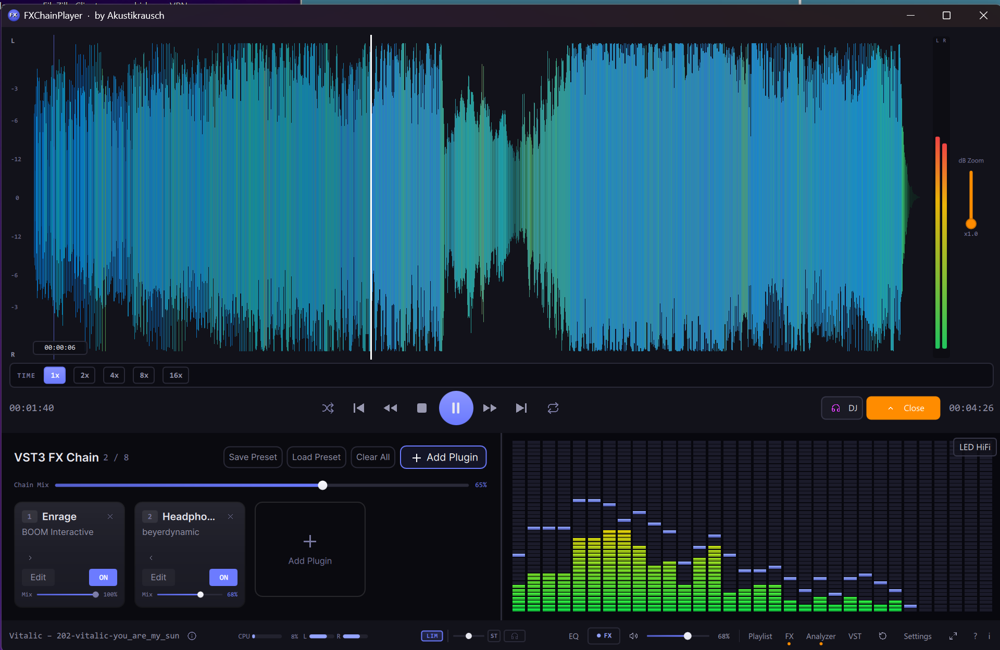
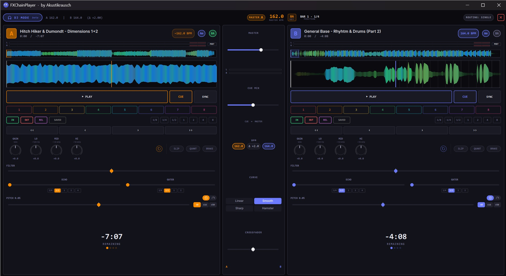
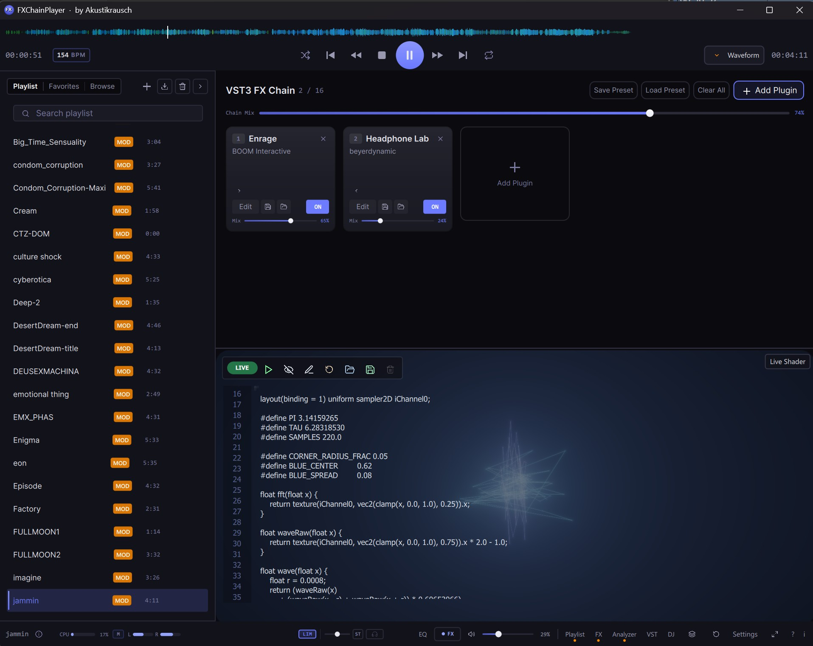
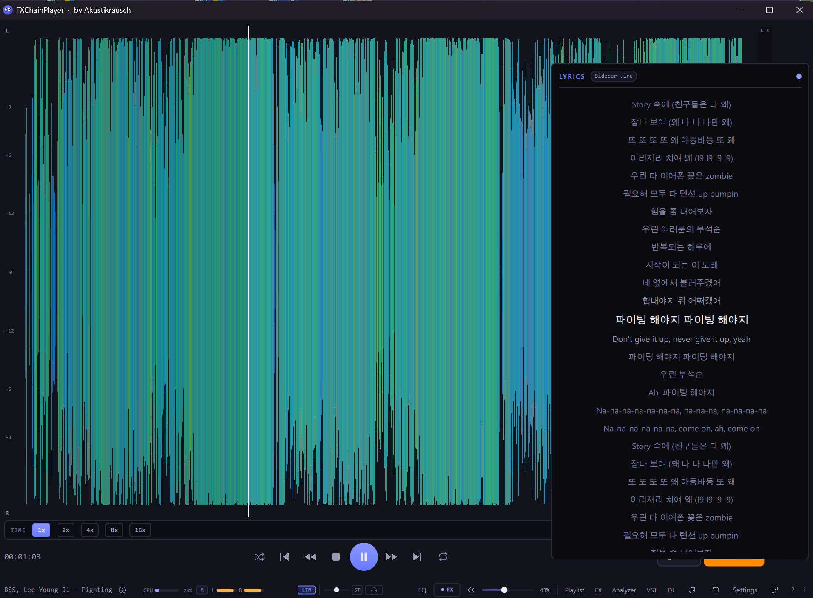

<h1 align="center">FXChainPlayer</h1>

<strong>A desktop audio player for Windows and macOS that plays nearly every audio format, with a full real-time effect chain built into the playback engine (VST3 on Windows, VST3 and Audio Units on macOS) and a complete dual deck DJ Mode.</strong>

  
  
  
  
  
  
  
  
  
  
  

<em>Load your favorite plugins, EQs, compressors, reverbs, spatial processors, headphone correction, directly into the signal path and hear them in real time while you listen to music. Pitch records like vinyl. Mix tracks across two decks with sync, hot cues, loops and Pioneer-DJM-style filter. No DAW required.</em>

<a href="https://github.com/akustikrausch/FXChainPlayer-Releases/releases/download/v1.4.2/FXChainPlayer-Setup-1.4.2.exe"><strong>⬇ Windows: FXChainPlayer-Setup-1.4.2.exe</strong></a> 
<a href="https://github.com/akustikrausch/FXChainPlayer-Releases/releases/download/v1.4.2/FXChainPlayer-1.4.2-macos.pkg"><strong>⬇ macOS (Apple Silicon): FXChainPlayer-1.4.2-macos.pkg</strong></a>

  

<a href="https://www.youtube.com/watch?v=a2XQ1KDnYSk"><strong>▶ Watch the demo on YouTube</strong></a>

  

---

## Why VST3 and Audio Unit effects in an audio player?

More reasons than you would expect.

- **🎧 Headphone surround & spatial audio**: Run binauralizers like **dearVR MONITOR**, **Waves Nx**, or **Dolby Atmos Production Suite** to turn stereo into a full spatial soundstage on any pair of headphones. No system-wide wrapper, no virtual audio cable.
- **🎚️ Headphone calibration & correction**: Use frequency-response plugins like **Sonarworks SoundID Reference**, **Beyerdynamic Headphone Lab**, **Waves Nx Virtual Mix Room**, or **Morphit** to flatten your specific headphone model to a neutral reference.
- **📻 Internet radio & streaming cleanup**: Load a compressor, EQ, de-esser, or multiband processor on poorly-mastered streams or dynamic-range-compressed "loudness war" tracks to tame them while you listen.
- **🔌 Plugin auditioning**: Want to hear how that new reverb, saturator, or tape emulation sounds on real music? Drop it in. No DAW boot-up, no empty session, no audio import.
- **🔊 Loudness normalization & limiting**: Keep playback levels consistent across tracks from wildly different sources (old CDs vs. modern streaming).
- **🏠 Room correction**: Apply convolution IRs or parametric EQ profiles to compensate for your listening room and speaker setup.
- **🅰️🅱️ A/B plugin comparison**: Quickly toggle effects in and out on familiar reference tracks to hear exactly how they color the sound.
- **♿ Accessibility**: Hearing aid profiles, frequency boosting, dynamic range compression, or custom EQ curves for listeners who need tailored audio processing.
- **🎛️ Mix referencing**: Drop your mix in, compare A/B against a reference master, hear your monitor chain on someone else's material.
- **🎚️ Per-channel chains for trackers, SIDs, multi-channel chiptunes**: Each channel of a `.mod` / `.xm` / `.it` / SID / NSF file gets its OWN VST3 chain. Reverb only on channel 1, LP filter only on the bass channel, distortion only on the lead. Configure once per file (auto-loaded on track-change), bake into the export.
- **💾 Bake the effect chain into a file**: render any track or the whole playlist through the VST chain to WAV / MP3 / FLAC / OGG, faster than real-time. Take your processed audio anywhere. [Details below](#export-through-your-vst3-chain).

Up to **16 VST3 plugins in a serial chain**. Drag-and-drop reorder. Per-slot bypass and dry/wet. Smooth global chain mix. Native plugin GUIs. Everything runs at **64-bit double precision** end-to-end.

On macOS the same chain also hosts **Audio Units** (AUv2 and AUv3) alongside VST3, so the effect plugins you already use in Logic Pro or GarageBand load right in.

---

## FXChainPlayer on macOS

The complete player now runs natively on Apple Silicon Macs (macOS 26 or newer). Same engine, same features, same design as the Windows version, plus the pieces a Mac player should have:

- **Audio Units and VST3 side by side**: the effect chain hosts AUv2 and AUv3 effects in addition to VST3, in the same browser, the same slots, and the same per-channel chains. Your Logic Pro and GarageBand plugins just work, each opening its own native editor window.
- **CoreAudio output**: Shared mode by default, Exclusive (hog) mode for the bit-perfect path, mirroring WASAPI Shared and Exclusive on Windows.
- **Native Apple decoders**: AAC, ALAC and Apple CAF Loops decode through AudioToolbox, and MIDI files play through the built-in Apple synth with no SoundFont needed.
- **A good Mac citizen**: media keys and Now Playing integration, a Dock menu with transport controls, Finder "Open With" for every supported format, and audio CD playback through the macOS mount.

---

## Plays pretty much everything

FXChainPlayer is built for music listeners who do not want format juggling. Drop a folder with mixed MP3, FLAC, DSD, tracker modules, C64 SIDs, Game Boy chiptunes, console-game dumps, it just plays. Searchable Format Library panel built in.

### Lossless & Hi-Res

**FLAC**, **WAV**, **WavPack** `.wv`, **ALAC** (Apple Lossless), **APE** (Monkey's Audio), **TTA** (True Audio), **AIFF**, **Opus**, **W64** (Sony Wave64), **DSD** `.dsf` / `.dff` (DSD64/128/256/512, including DST-compressed `.dff`).

### Lossy

**MP3**, **AAC**, **M4A** / **MP4** audio, **OGG Vorbis**, **WMA**, **MPC** (Musepack SV8), **AC-3**.

### Tracker modules

**MOD** (ProTracker), **XM** (FastTracker 2), **S3M** (ScreamTracker 3), **IT** (Impulse Tracker), **MPTM** (OpenMPT), **Digibooster Pro**, **Imago Orpheus**, **Graoumf Tracker**, **Liquid Tracker**, **Octalyser**, **PolyTracker**, **UltraTracker**, **Digitrakker**, **OctaMED**, **Farandole Composer**, **Epic MegaGames MASI**, **MadTracker 2**, **Galaxy Sound System**, **X-Tracker**, **NoiseTracker**, **Ice Tracker**, **Composer 670** + 667, **SoundFX 1/2**, **Davey Taylor's Tracker**, **DSMI/Asylum AMF**, plus fallbacks for Funktracker (`.fnk`), Liquid Tracker (`.liq`), Magnetic Fields Packer (`.mfp`), AMOS Banks (`.abk`), Soundtracker 2.6 (`.st26`), Ice Tracker (`.ice`) and many more.

### Console chiptunes

- **GBS**: Nintendo Game Boy
- **SPC**: Super Nintendo (SPC700)
- **VGM / VGZ**: Sega Megadrive · 32X · Master System · Game Gear · Mega CD · SG-1000 · SC-3000 · BBC Micro · ColecoVision
- **AY**: ZX Spectrum · Amstrad CPC (AY-3-8910)
- **NSF / NSFE**: Nintendo Entertainment System
- **KSS**: MSX
- **HES**: PC Engine / TurboGrafx-16
- **SAP**: Atari 8-bit
- **GYM**: Sega Genesis / Mega Drive

### Atari ST & YM2149 chiptunes (`.sndh` / `.snd` / `.ym`)

Native **YM2149** sound-chip emulation with full **Motorola 68000** support (Timer-C, DigiDrum, STE DMA samples), Atari ST and STE chiptunes (**SNDH** / **SND**) and standalone **YM** register-dump tunes (**`.ym`**, including the LHA- and ICE-packed files that fill the YM and modland archives) play **start to finish, out of the box, with no plugins and no setup.** Most players on Windows can't touch these without a separate add-on; here they just play, accurately, across the entire ~25,000-file sndh.atari.org archive.

And then they do what no chiptune add-on does: run a 1985 Atari demo tune **through your VST3 reverb, EQ or mastering chain in real time, and export it to WAV / MP3 / FLAC.** A piece of demoscene history, baked through modern studio effects into a file that plays anywhere.

### Amiga PreTracker (`.prt`), full support, including 1.5

**PreTracker** (**`.prt`**), the modern Amiga demoscene tracker by Pink / Abyss, heard in productions such as *Coda* and *Preschool*, plays **start to finish, out of the box, with no plugins**, and every song sounds exactly the way its author wrote it. That now includes the latest **PreTracker 1.5** productions from the current demoscene. Almost no player on Windows can open a `.prt` at all, here it just plays, and like every other format it runs **through your VST3 chain and exports to WAV / MP3 / FLAC.** (PreTracker 2.0 productions distributed as Amiga executables play too, see below.)

### Amiga executable music

A huge amount of Amiga **demoscene and game music ships as a raw Amiga program**, not a song file, and FXChainPlayer plays these executables **directly**. This includes the many that carry **no file extension at all** (the way the Amiga filesystem stores them): just drop them in and they play. It covers native exe-tunes, plus the path by which **PreTracker 2.0** productions play, and File Info identifies them on sight.

### PSF1 family (PlayStation OST)

PSF1 audio playback via a built-in MIPS R3000A + PS1 SPU-1 emulator.

### Amiga composer-named players

**Symphonie Pro** 32-voice, **Quartet Microdeal** (Atari ST 4-voice PCM), **SoundFactory**, **AMOS Music Bank** (every AMOS BASIC game 1990-95), **SoundFX v1+v2** (Cinemaware), **BP SoundMon v2+v3** (Brian Postma), **Sonic Arranger** (Tower of Souls / Ambermoon / Albion), **MaxTrax** (LucasArts Indy and Monkey Island), **TFMX** (Hülsbeck, Turrican / Apidya / Monkey Island Amiga), **RJP** (Bitmap Brothers, Chaos Engine / Cannon Fodder / Speedball 2 / Gods), **FutureComposer**.

Hippel, Ben Daglish, David Whittaker, Fred Editor, Ron Klaren, Mark II, Audio Sculpture, Digital Mugician, DeltaMusic, Art Of Noise, JamCracker and Sidmon are recognised and identified, but do not produce audio yet. The work on them is tracked in the open.

### Demoscene + retro synths

**MusicLine Editor** (`.ml`), **AHX / HVL / THX** (Hively Tracker, plus the Abyss THX precursor), **`.v2m`** (Farbrausch V2, `.kkrieger` / `.fr-08`), **TIATracker** (Atari 2600), **Organya** (Cave Story), **GoatTracker** (C64), **SAP** (Atari 8-bit), **ZxTracker** (Vortex Tracker II / Pro Tracker 3 / Sound Tracker), **MED Advanced** (OctaMED MMD0/1/2/3), **FutureComposer** (`.fc` / `.fc13` / `.fc14`), **MDX** (Sharp X68000, YM2151 OPM + MSM6258 ADPCM), **Euphony** (FM-TOWNS, YM2612 OPN2), **Yamaha SMAF** (`.mmf`, late-1990s/2000s feature-phone ringtones, MA-3/MA-5 FM synthesis).

### MIDI / SoundFont

`.mid` / `.midi` / `.rmi` via TinySoundFont. Configurable SoundFont (drop a `.sf2` file in *Settings → Audio → MIDI SoundFont*; live `.sf2` audition by dragging the file onto the player).

### TFMX / RJP / TFE / PMD / FMP

**TFMX**: full Hülsbeck macro-engine support (4-voice MDAT/SMPL pairs).
**RJP**: Bitmap Brothers RDAT/RSMP pairs.
**TFE** (TFM Music Maker), dual YM2203 OPN-FM playback.
**PMD / FMP**: PC-98 (Touhou-pre-Windows / Falcom / Compile).
**MSX** `.kss`.
**SMS / PC-Engine / RGBDS Game Boy** `.sgc` / `.nsd` / `.gbr`.

### DOS Adlib

`.imf` / `.hsc` / `.rad` / `.d00` / `.dro` / `.rix` / `.rol` / `.mus` and a broad catalogue of DOS / Sound Blaster / Adlib / OPL2/3 formats.

### Apple CAF + Sample-pack formats

**Apple CAF** dedicated decoder (PCM 8/16/24/32-bit BE/LE int/float, IMA4, AAC + ALAC, FLAC). Surfaces Logic-Pro Apple-Loops BPM tags.

### Game music and sample packs

- **Apple `.caf`**: Logic Pro / GarageBand **Apple Loops** library
- **Nintendo**: BRSTM · BCSTM · BFSTM · BFWAV · DSP-ADPCM family · NUS3AUDIO · Switch Opus
- **Sony**: VAG · HPS · NUB · ATRAC3 / ATRAC9 · AT3 / AT9
- **Microsoft**: XMA · XWMA
- **CRI**: ADX · HCA · ACB / AWB containers
- **FMOD**: FSB (Multiple, including Vorbis + CELT)
- **Square Enix**: SCD
- **Wwise**: WEM
- **`.txtp`** text-playlists with effects
- **Multi-subsong navigation** for game-OST archives

### DefleMask + IFF SMUS

**DefleMask `.dmf`** multi-chip tracker modules.
**IFF SMUS** Amiga MIDI-style score with INS1 + 8SVX sample resolution.

---

## DJ Mode

  

Press `D` (or click the DJ button in the status bar) to switch to a **dual-deck DJ console** built into the player. Drop tracks on Deck A and Deck B, mix with a real crossfader, and use everything you would expect from a DJ rig.

- **Two decks side by side**, each with: per-deck waveform (overview + 10-second close-up), title / artist / BPM / Key / Camelot, 8 hot cues (numbered, persisted across sessions, set / clear / colour-coded), click-free, sample-accurate gapless Loop In/Out + Reloop, auto-loop chips (1/8 1/4 1/2 1 2 4 8 beats) that snap to the beat grid, beat-jump (`<<` `<` `>` `>>`), 3-band EQ (LO / MID / HI knobs, ±12 dB), gain knob, Play / Cue / Sync, SLIP / QUANT / BRAKE, and a **Pioneer-DJM-style filter knob** (sweep LP from 20 kHz down to 70 Hz on the left half, sweep HP from 20 Hz up to 17 kHz on the right half, magnetic dead-zone at the centre).
- **Crossfader**: four industry-standard curves (Linear / Smooth / Sharp / Hamster), per-sample smoothing (no zipper noise), right-click snaps to centre.
- **Instant sync lock, Mixxx-style phase-lock.** Single-click SYNC snaps tempo immediately (no drifting into place) and holds beat phase to master with a bounded, click-free phase servo. Right-click SYNC = make THIS deck master. Octave-fold so 175 BPM follower against 87 BPM leader stays at perceived-equal speed.
- **Vinyl scratch on the waveform.** Click + drag the close-up OR overview waveform like a Pioneer-CDJ jog wheel. Newtonian-physics platter integrator with viscous + Coulomb friction. Forward + reverse. Release lets the slipmat catch the platter back to slider rate. Works in single-track mode AND DJ mode with the same physics.
- **Vinyl-spin while paused.** Even when audio is paused or stopped, dragging the waveform spins the platter in the dragged direction. Friction decays the platter back to 0. Like spinning a turntable when the motor is off.
- **Per-deck Pitch ⇄ Stretch toggle.** Disc icon = Pitch (vinyl turntable, pitch + tempo move together). Gauge icon = Stretch (phase-vocoder, pitch stays constant while tempo varies).
- **Per-deck Echo + Gater FX.** Tempo-locked beat-rate chips (1/4, 1/2, 1, 2, 4 beats). Auto-syncs to deck BPM × pitch ratio in real time.
- **Your own VST3 effects on the decks.** DJ Mode taps the same per-channel VST3 chains as the main player, drop your favourite filters, delays, reverbs or saturators straight onto a deck and make them part of your mix, not just the master out. The exact plugins you already use everywhere else in FXChainPlayer, now in the booth.
- **Saved Loops + Smart Cueing.** Per-track named loop slots persisted across sessions. First-time-load auto-creates hot-cue 1 at the detected first downbeat. Quantize-seek snaps hot-cue jumps to the nearest beat.
- **Camelot wheel + harmonic-mix hint (experimental).** Per-deck Camelot key chip derived from a background key-detection pass or the file's existing key tag, with a colour-coded cross-deck compatibility hint (Match / Relative / Adjacent / EnergyLift / Discord). Treat the suggestions as a starting point, real-world key detection is imperfect across genres. Trust your ears.
- **Dual audio output.** Three modes: single device (DJ Mode runs without cue), dual WASAPI device (Main + Cue on independent endpoints, works with any USB DAC + Bluetooth combo), or ASIO channel-pair (Main on 1+2, Cue on 3+4 of the same multi-out interface). Pre-listen cue mix balance knob.
- **Tracker DJing, unique to FXChainPlayer.** Drop a `.mod` onto Deck A, an MP3 onto Deck B, hit SYNC. The tracker-tempo engine + offline beat-detector consensus matches Protracker / Fasttracker / Impulse Tracker and other tracker formats against modern dance productions accurately enough to mix demoscene tracks alongside MP3s on the same crossfader. **No other DJ tool can do this.**
- **MIDI controller support.** Hardware-detected mappings for Pioneer DDJ-FLX series, KORG nanoKONTROL2, Akai LPD8, Behringer X-Touch Mini, Mackie-Control, General MIDI. Ableton-style Learn Mode (`Ctrl+Shift+M`) for any other controller. Pitch / EQ / hot-cues / scratch jog-wheel / play / cue / sync / filter all mappable.

> **Beta status.** DJ Mode is feature-complete and stable for production use. A few rough edges are still being polished, per-channel VST chain audio routing has a small delay before plugins become audible (~5-30 sec depending on track length), and some scratch-ergonomics edge cases are still being refined. The DJ MODE pill in the header carries a small "beta" marker so you can calibrate expectations vs the rock-solid single-track player.

---

## Audio engine

### WASAPI Shared / Exclusive + ASIO 2.3

**WASAPI** Shared and Exclusive modes are the default Audio Mode. The player picks the device's native sample rate, no system-wide resampling. **WASAPI Exclusive** bypasses the Windows audio engine for the bit-for-bit path; works on any USB DAC, built-in sound, or HDMI output, no ASIO driver required.

**On macOS** the same Audio Mode picker drives **CoreAudio**: Shared mode by default, and Exclusive mode takes the device over (hog mode) for the bit-perfect, lowest-latency path.

**ASIO 2.3** is also supported on Windows (Steinberg-licensed) for users with a compliant audio interface. Pick **ASIO** in *Settings → Audio → Audio Mode*. Round-trip latency depends on your audio interface and the buffer size the driver supports, see *Settings → Audio → Latency* for the driver's live in/out frame counts and total ms.

- **Output Pair routing** for multi-output interfaces, route the player's stereo to any pair (1-2, 3-4, …) up to the driver's reported total. Persisted across sessions.
- **Configure Driver button** opens the driver's hardware panel directly (e.g. RME TotalMix, MOTU CueMix, Apollo Console, ASIO4ALL settings).
- **Driver-reported latency readout**: in N / out N frames + total ms, refreshed live.
- **Sample-accurate visual playhead**: the waveform playhead accounts for the audio backend's queued frames so what you see is what you hear, not what was written to the buffer 10-42 ms ago.
- **Output stage**: TPDF dither on every integer path, full coverage of common ASIO sample formats.
- **Safe driver panel calls**: a misbehaving control panel cannot take out the host.

### Per-Channel VST Chains

For every multi-channel format (tracker `.mod` / `.xm` / `.it` / `.s3m`, SID, NSF, SPC, GBS, every chip-emulator format), each separable channel can carry its **own dedicated VST3 chain** of up to 16 plugins.

- **Channel-tab navigation**: pick which channel you are editing
- **Per-channel chain editor**: full slot grid with plugin name, vendor, bypass, mix slider, edit (open VST3 GUI), move-left / move-right, remove
- **Auto-load presets**: chain configurations auto-load on track-change for matching files
- **Manual save / load**: save the per-channel chain layout as a named preset
- **Real-time playback**: pre-renders per-channel audio into a memory-budgeted cache, then routes through the per-channel chains live (cache build takes ~5-30 sec on first plugin add)
- **Export-path integration**: multi-track export renders each channel through its own chain to a separate file (filename template `<title> - <channelName>.<ext>`; e.g. `MyTrack - Voice 1.wav`)
- **4 FX modes for export**: Master chain only / Per-channel chains only / Per-channel → master cascade / No FX

### Vinyl Scratch, Newtonian platter physics

Click + drag the waveform like a Pioneer-CDJ jog wheel. The mouse becomes your *fingertip* and applies torque proportional to slip; the platter has **real inertia** (calibrated to feel like a Technics SL-1200GR with felt slipmat) and accelerates / decelerates accordingly.

- **Fully bidirectional**: forward drag = audio plays at drag velocity; backward drag = audio plays in reverse at drag velocity (up to 8 s into the past via a rolling output-history buffer)
- **All techniques emerge from real physics**: baby / forward / chirp / tear / spinback
- **Inertia-aware release ramp**: calibrated against the SL-1200's 0→33⅓ RPM spin-up
- **Spin while paused**: flick the waveform on a paused track; the platter spins in the dragged direction and friction decays back to 0 (like spinning a turntable with the motor off)
- **Same physics in single-track AND DJ mode** for both the close-up scrolling waveform and the full-song overview strip

### Turntable Pitch Slider (Technics-style)

A vertical pitch fader on the right edge of the expanded waveform AND DJ-mode view. Selectable range (**±8 % / ±16 % / ±50 %**), **0 % center detent** (snaps to neutral within ±0.3 %), **33 ⇄ 45 RPM toggle**, and a per-deck **Pitch ⇄ Stretch toggle** (disc icon = vinyl-style pitch+tempo move together; gauge icon = phase-vocoder time-stretch with constant pitch).

**At 0 % the slider is bit-exact pass-through**: the resampler is bypassed entirely. Auto-resets to neutral on every track change.

### 64-bit double-precision signal path

Internal audio path is `double` end-to-end. Sample-rate conversion (when needed) uses a linear-phase resampler with ~260 dB SNR.

### BPM consensus + Camelot key detection

A multi-source BPM aggregator ranks candidates from up to eight signals (manual tap-to-confirm, embedded MIDI/CAF tempo, tracker-engine static tempo, ID3v2/Vorbis/APEv2/MP4 tag, CUE `REM BPM`, offline beat-detector, filename regex) with octave-fold corroboration and a contradiction cap. The badge tier reflects confidence, high confidence shows the value directly, lower confidence dims to `~XXX`, and uncertain results stay hidden so you never see a guess shown as if verified. Click the BPM pill to verify by tap-along.

**Key detection** runs in the background scan thread for every file, using profiles tuned for electronic dance music alongside the classical reference set for more reliable Camelot wheel matches. It is tuning-compensated and segment-voted, so an off-A440 rip or a track that modulates still resolves cleanly, in line with professional DJ software. Results are persisted so they do not need to be recomputed. Every analysed file gets a Camelot wheel chip in the deck header AND in the playlist's Key column.

### Studio loudness & quality metering

A live **EBU R128 / ITU-R BS.1770** loudness meter, one click from the status bar. Momentary and Short-term bars, the **Integrated LUFS** headline with streaming (−14) and broadcast (−23) targets, **loudness range (LRA)**, and a **True-Peak** readout that flags anything above −1 dBTP. It measures only while open, so it costs nothing when closed. In *File Info*, **Analyze** gives a per-track quality report: the **DR** dynamic-range value plus a spectrum check that warns when a file looks like a lossy transcode dressed up as lossless. Standards-verified against the EBU Tech 3341/3342 test vectors.

### MIDI controller input

Industry-standard MIDI input with Mackie-Control + General-MIDI defaults, plus built-in profiles for **KORG nanoKONTROL2**, **Akai LPD8**, **Behringer X-Touch Mini**, **Pioneer DDJ-FLX series**. Hot-plug auto-config matches known controller name fragments. Ableton-style Learn Mode (`Ctrl+Shift+M`) for any other controller. Mappings persist across sessions.

50+ DJ-specific trigger targets mappable: pause / stop / toggle / exitLoop / unsync / tempoLock / pitchRange × 2 decks, hot-cue Set 1-8 × 2 decks, hot-cue Clear 1-8 × 2 decks, scratch start/end + scratch velocity × 2 decks (jog-wheel rotation), filter, echo/gater amount + beats, autoloop halve/double.

### Format Library, every supported format, in-app

A collapsible **Format Info** card in *File Info* (origin, era, codec, decoder library) for every track, and a full **Formats Library** modal panel with a per-category sidebar, search across name / extensions / platform / developer / decoder, and click-to-expand cards with the complete catalogue entry. The redesigned **Settings → File Associations** uses the same source-of-truth.

### 3-Band EQ (built-in modal dialog)

Low Shelf / Mid Bell / High Shelf with two draggable crossover-frequency handles on a live FFT spectrum and three Low/Mid/High gain knobs. Smooth coefficient ramping. Soft 0 dB detent on bipolar knobs. Toggle with `Q`.

### Real-time visualization (9 modes)

- **FFT Spectrum**: log-scale frequency analyzer with Hz axis labels and a peak-hold trail
- **Spectrogram**: scrolling waterfall
- **Stereo Phase Scope**: Lissajous / goniometer with amplitude-brightening
- **VU Meter**: classic PPM L/R
- **LED HiFi**: 32-band segmented display
- **Frequency Landscape**: 3D waterfall with cubic depth fog
- **Pulse Thread** (default), multi-octave audio-warped spine with audio-reactive starfield (GPU shader)
- **Chroma Drift**: 6 ribbons at parallax depths riding FBM flow fields with audio-driven domain warp (GPU shader)
- **Studio LED**: smooth HSV-interpolated 3-zone gradient with per-LED diffuser/die rendering (GPU shader)

Plus dedicated **Channel Scopes** (per-channel oscilloscopes for trackers up to 4 channels) and one unified live **Pattern View** shared across tracker modules, Commodore 64 SID tunes and AY-3-8910 chiptunes (ZX Spectrum / Amstrad CPC / Atari ST), with a clickable order list, a Compact / Detailed density toggle, effect-command tooltips and a one-click Properties copy panel.

### 🎨 Live Shader Editor

Write your own audio-reactive visualisation directly inside the player. A GLSL fragment-shader editor sits next to a live preview, press **Ctrl+Enter** and your shader recompiles and hot-swaps in a fraction of a second, no app restart. Audio reaches the shader as a texture (FFT spectrum + raw waveform), alongside built-in `iTime` / `iResolution` uniforms. Ships with a template library, and your own templates save as portable plain-text `.glsl` files you can share or keep under version control. One compile runs on every graphics backend (D3D11 / D3D12 / Vulkan / Metal / OpenGL).

### Studio Compare (A/B)

Dual-decoder synchronized A/B playback, load two files and switch between them sample-accurately with a short crossfade. Compare masters, codecs, headphones, plugin chains.

### Built-in Bauer-style crossfeed

Smooth your stereo on headphones without a plugin slot. Continuous blend slider, proper gain + delay + lowpass filtering.

### Gapless playback

Next track is pre-loaded and swapped in sample-accurately across formats that allow it (FLAC→MP3, MOD→XM, cross-format, all work).

### Integrated file browser & smart-scan

Point it at your music library, a local folder **or a NAS / network share** by UNC path (`\\server\share`) or a mapped drive, pinned in the browser with its own server icon. Background cache for VBR durations, bitrates, cover art, **BPM, Key, Camelot**, and (when a track has no embedded art) a `cover.jpg` / `folder.jpg` / `front.*` from the album folder. Scanning runs in the background so even a huge share never freezes the player, and an offline share no longer hangs startup. Instant playlist building. Breadcrumb navigation, library roots, "Play / Add All" context actions, Favorites tab.

### Export through your VST3 chain

Route **any file or whole playlist** through your VST3 effect chain and render the result to disk. Faster-than-real-time, offline, sample-accurate. Right-click a track in the playlist → **Export to format…** for a single file, or **Ctrl+E** for the full batch dialog.

Output formats:

- **WAV**: 16-bit, 24-bit PCM, 32-bit float
- **MP3**: 128 / 192 / 320 kbps CBR
- **FLAC**: 16-bit and 24-bit lossless (compression level 5)
- **OGG Vorbis**: q3 / q5 / q7 (≈ 112 / 160 / 224 kbps VBR)

Multi-tune containers (NSF / NSFE / SAP, multi-tune SIDs from HVSC, multi-subsong game-OST archives) can optionally expand into one file per subsong via the **Export all subsongs** checkbox. **Multi-selection** support, Shift-click a range, Ctrl-click individual rows, then export only the selected subset. **Per-row subsong picker** for choosing exactly which tune from a multi-tune file. **4-mode FX-chain selector**: Master / Per-channel / Both (cascade) / None.

**Turn a C64 SID into an editable tracker project.** Pick the *Tracker* format family and rip a Commodore-64 SID tune into a **GoatTracker 2** `.sng`, a **SID-Wizard** `.swm`, a **MIDI** transcription, or per-instrument files. The MIDI transcription is musical, not a note-per-frame dump: notes come from the real gate edges, vibrato and slides become pitch-bend, arpeggios fold back into chords, noise hits go to drums, and the true tempo is detected. FXChainPlayer also plays GoatTracker `.sng` tunes directly and recognises SID-Wizard `.swm`.

Export is included in every build, no separate "Pro" tier.

### Plugin crash protection

Plugin process calls are wrapped to contain crashes, with automatic crash journaling, safe-mode after repeated failures, and per-`(path, classID)` blacklist so a single crashing plugin in a multi-class shell (e.g. Waves WaveShell with 600+ effects) does not take out the rest. An auto-restart watchdog subprocess recovers the host if something goes seriously wrong.

### Code-signed installer + DLLs

Every Windows release is signed via Azure Trusted Signing, both the installer AND every shipped DLL (Qt, audio decoders, codec libraries, …) carry a counter-signature. Windows SmartScreen reputation builds quickly, and enterprise WDAC + AppLocker DLL rules allow the player without exception.

On macOS every release ships as a Developer ID signed, Apple-notarized and stapled .pkg, with every embedded framework and helper signed under the Hardened Runtime.

### Full keyboard accessibility

Every audio control reachable via Tab + Space / Enter / arrow keys. Output-pair, mode chips, device list all wired as standard radio groups. Settings panel, transport bar, file browser, FX-chain bypass, and playlist tabs all wired for keyboard navigation.

### Synced lyrics

Open the lyrics panel with **`Ctrl+L`** and the currently-playing track's lyrics scroll in time with the music, active line bold + centred, surrounding lines faded out, smooth auto-scroll on every line change.

Three sources, tried in priority order:

- **Sidecar `.lrc`** next to the audio file (community-distributed synced lyrics from lrclib.net etc.)
- **Embedded `SYLT`**: ID3v2 synchronized-lyrics frame
- **Embedded `USLT`**: ID3v2 unsynchronized-lyrics frame; the player still re-parses the payload for LRC-format timestamps because many taggers store synced lyrics in the USLT slot

A small badge at the top of the panel tells you which source was used. UTF-8 throughout, Asian scripts, Cyrillic, RTL text all render correctly. When a track has no lyrics from any source, the *Lyrics* entry in the status bar hides itself so the bar stays compact.

### Performance

Native C++20, lock-free audio thread, GPU-accelerated rendering throughout. Idle RAM ~50 MB, cold startup under 2 s on typical hardware.

---

## Edit, record and compare, inside the player

**A wave editor, built in.** Trim, cut and save audio without leaving the player and without installing anything else. Right-click a playlist entry to open it, or drag a region straight out of the big waveform while holding Alt. Click anywhere to audition from that spot, select a region and the preview plays exactly that, and save in any format the player exports, with a switch that bakes your effect chain into the saved file. Files that hold several tunes let you pick which one you are editing.

**Record what your computer is playing.** Capture whatever is coming out of your speakers into a file, straight from the player. Pause and resume without leaving a gap, listen back before you commit, then send the take to the wave editor or straight to the playlist. Optional silence trimming starts on the first sound and stops by itself.

**A/B and a real blind test.** Drop a second track onto the Set as B zone to line it up against what is playing, switch instantly, and when you want to know whether you can actually hear the difference, run the ABX blind test and let the statistics answer.

**Turn a C64 SID into an editable project.** Export a SID as a GoatTracker `.sng`, a SID-Wizard `.swm`, or a musical MIDI transcription. An opt-in SID chip inspector shows the C64 sound chip live: register table, per-voice activity, voice-routing timeline and a patch card on hover.

---

## Radio, languages and the small things

**Demoscene radio, preset.** SceneSat, SLAY Radio (Commodore 64 SID remixes) and VGM Radio (game music) are built in, and the Nectarine stream points at a relay that actually stays up. Internet radio runs through your effect chain like everything else, so a badly mastered stream can be fixed while you listen.

**Seven languages.** English, German, Spanish, French, Italian, Polish and Japanese. A fresh install picks your system language automatically when it is one of them.

**Configurable playlist columns.** Choose which columns the expanded playlist shows, including play count and a five-star rating, with the data kept locally on your machine.

**Right-click Convert to format in Explorer**, a settings search that finds any option across every tab, ReplayGain scanning, and an interface that scales cleanly from a 1080p laptop to a native 4K monitor.

---

## What's new in v1.4.2

A big update on top of v1.3.6. Everything below is new since then.

### ✂️ A wave editor, built in

Trim, cut and save audio without leaving the player and without installing
anything else.

- **Open any track in the editor.** Right-click a playlist entry and choose
  the editor, or drag a region straight out of the big waveform while holding
  Alt. There is also a button in the expanded waveform's control column that
  opens the whole track at once.
- **Click anywhere to audition from there.** Set the play cursor with a click
  and the preview starts at that spot instead of jumping back to the
  beginning every time. Select a region and the preview plays exactly that.
- **Save in any format the player exports.** WAV, MP3, FLAC, OGG, AAC, AIFF,
  WavPack, Opus and Apple Lossless, with a switch to bake your VST3 effect
  chain into the saved file.
- **Step through subsongs.** Files that hold several tunes (SID, NSF, TFMX,
  game-music containers) let you pick which one you are editing.
- **A live playhead** that tracks the preview, and a resume that continues
  where you paused instead of starting over.

### ⏺️ Record what your computer is playing

- **System audio recording.** Capture whatever is coming out of your speakers
  into a file, straight from the player.
- **Pause and resume a running recording.** A paused recording costs no CPU
  and leaves no gap in the file: the paused time is simply never recorded.
- **Listen back before you commit.** Preview the take right in the recorder,
  then send it to the Wave Editor, add it to the playlist, save it or discard
  it.
- **Trim silence automatically.** Start on the first sound, and stop by itself
  after a stretch of silence, both clearly labelled and optional.

### 🎵 Real length and real waveforms for chiptunes

Formats like Commodore 64 SID tunes and many Amiga and tracker replayers carry
no length at all: the music is a program, not a recording. Until now that meant
a placeholder time and no waveform.

- **The player measures them.** In the background, faster than real time, it
  renders the tune to find out how long it actually is and what it looks like,
  then shows the real duration and the full waveform.
- **The live view stretches into the finished waveform** with a smooth pull
  back over the whole tune, instead of cutting abruptly.
- **You can click into the waveform to seek**, even on replayers that
  fundamentally cannot seek.
- **Subsong changes re-measure.** Switch to another tune inside the file and it
  measures that one too.
- **Repeat plays are instant.** A measured tune is remembered, so playing it
  again or switching back to a subsong does not measure it a second time.

### 🎛️ Interface polish

- **A rotating tip card** in the empty player and in the waveform strip,
  surfacing features that are easy to miss, each one clickable straight to the
  matching help page.
- **A close button in the panel headers** for the Analyzer and the FX Chain,
  so you are not left hunting for how to shut a panel again.
- **A cleaner overflow menu** in the status bar: shortcuts sit in their own
  column instead of running into the labels, and entries are grouped.
- **The waveform expand handle can move** into the toolbar under the waveform
  if you prefer it there.
- **The LIM indicator opens the limiter settings** directly instead of
  wherever the settings were last left.
- **An optional clock** in the status bar.
- **The window title keeps the app name** and adds the playing track behind
  it, instead of replacing it.
- **Tag lookup works on untagged files.** "Search online" in the tag editor
  used to need a title or artist before it would look anything up. It now
  falls back to the filename, which is the whole point on a file that has no
  tags yet, and it tells you when a lookup failed instead of claiming there
  was no match.
- **Privacy Policy and Imprint links** in the About panel.
- Panels, dialogs and the recorder lay out correctly at 1080p and at high
  display scaling, where some controls used to overlap or spill past an edge.
- Faders respond to the left mouse button everywhere, and a right-click resets
  a fader to its centre.

### 📻 More music, out of the box

- **Demoscene radio stations included.** SceneSat, SLAY Radio (Commodore 64
  SID remixes) and VGM Radio (game music) are preset, and the Nectarine stream
  points at a relay that actually stays up.

### 🖥️ macOS

FXChainPlayer runs on Apple Silicon Macs with Audio Unit plugin hosting
alongside VST3, CoreAudio output and a native installer.

---

## What's new in v1.3.6

A big update on top of 1.2: DJ Mode's sync and loop engine rebuilt from the ground up, one unified Pattern view across every tracker and chip format, deeper Commodore 64 SID support, and a brand new playable format.

### 🎚️ DJ Mode: sync and loops rebuilt from the ground up

The biggest DJ Mode update yet, built from a close study of how Traktor, Serato, Rekordbox and Pioneer CDJ hardware handle sync and loops.

- **Instant beat sync.** Press SYNC and the tempo locks immediately, matching professional DJ hardware, instead of drifting into place over a couple of seconds. Once two tracks lock, they stay locked.
- **Click-free, gapless loops.** Loops wrap sample-accurately with no audible gap or click, and they hold their exact musical length no matter how far you push the pitch fader.
- **Sharper beat matching.** Auto-loops, beat-jump and quantized hot-cues land precisely on the beat, even on tracks recorded at a different sample rate than your audio device.
- **More accurate BPM and beat grids.** The tempo detector resolves conflicting readings with one confident decision instead of guessing, and the beat grid locks onto the track's actual downbeat.
- **Better key detection for harmonic mixing.** Musical key analysis now uses profiles tuned for electronic dance music, giving more reliable Camelot wheel matches.

### 🎹 One Pattern view for every format

Tracker modules, Commodore 64 SID tunes and AY-3-8910 chiptunes (ZX Spectrum, Amstrad CPC, Atari ST) now share a single live Pattern view instead of several separate, differently shaped ones.

- **A clickable order list** for tracker files, so you can jump straight to any position in the song instead of stepping through it one pattern at a time.
- **A Compact / Detailed toggle.** Detailed view shows the note, instrument, volume and effect columns side by side, with a hover tooltip that explains what each effect command does.
- **A Properties panel** with a one-click copy button for the song title, format, channel count and the full instrument list, so you can paste everything straight into a forum post or a notes file.
- AY-3-8910 chiptunes (ZX Spectrum / Amstrad CPC / Atari ST) now scroll through their note history the same way SID and tracker files always did.
- A SID tune written for two or three SID chips shows a Pattern View column for every voice the tune actually uses, six columns for a 2-SID tune, nine for a 3-SID tune, instead of always showing three; each column is labelled by chip and voice.

### 🔬 Deeper Commodore 64 SID support

- **Digi sample detection.** The SID chip view now flags when a tune is playing sampled drums or speech through the sound chip's volume register, a trick many C64 musicians used to squeeze extra sounds out of the hardware.
- **Multi-SID stereo.** Tunes written for two or three SID chips now show the chip count and play with a genuine stereo spread instead of collapsing everything onto a single voice.
- **SID-Wizard modules play.** `.swm` files used to be recognised with metadata only. They now convert on the fly and play through the same engine as GoatTracker tunes, no extra step needed.

### 📱 New format: Yamaha SMAF mobile ringtones

Old-school Japanese feature-phone ringtones (`.mmf`, Yamaha MA-3 / MA-5 sound chips) now play through an in-house FM synthesis engine built from scratch, the polyphonic ringtones that shipped on Yamaha-powered Samsung, LG, Sharp, Panasonic and Motorola handsets in the late 1990s and 2000s.

### 🌍 Setup

- **Language auto-detect.** A fresh install now picks your Windows display language automatically if it's one of the app's supported languages, falling back to English otherwise, instead of always starting in English.

---

## Download

**[⬇ Latest installer on GitHub](https://github.com/akustikrausch/FXChainPlayer-Releases/releases/latest)**

One installer, one click: `FXChainPlayer-Setup-X.Y.Z.exe` (Inno Setup). Full install with file associations, Start menu entries, uninstaller. All required Qt DLLs and the VST3 host process are included. **Both the installer and every shipped DLL are signed via Azure Trusted Signing.**

### Auto-update

FXChainPlayer checks GitHub Releases for new versions and offers one-click install with SHA-256 verification. Toggle in *Settings → Updates*.

---

## System Requirements

- **Windows 10** or **Windows 11**, 64-bit
- ~100 MB disk space
- An audio output device (WASAPI, any built-in sound, USB DAC, or HDMI audio works; ASIO 2.3 supported on any compliant interface)
- Optionally: a VST3 plugin folder with your favorite effects

---

## Supported plugins

FXChainPlayer is a **VST3 host** (not VST2). Any 64-bit VST3 effect plugin should work.

There is no compatibility list, no certification, no allowlist. Any well-behaved 64-bit VST3 effect should load. Tested heavily with **FabFilter**, **Waves**, **iZotope**, **Sonarworks**, **Tokyo Dawn Labs**, **Valhalla DSP**, **Acon Digital**, **Softube**, **Kirchhoff-EQ**, **Pro-MB**, **Dear Reality dearVR**, **Beyerdynamic Headphone Lab** and many others. Multi-class plugin shells (e.g. Waves WaveShell with 600+ effects) are crash-isolated per `(path, classID)` so a single misbehaving effect cannot take out the rest.

Instruments (VSTi) are filtered out automatically, FXChainPlayer is a playback tool, not a DAW.

---

## License

FXChainPlayer is proprietary software by **Andreas Wendorf (Akustikrausch)**.

The binaries use and statically/dynamically link a number of open-source components, full LGPL / BSD / MIT attribution is shown in the About dialog inside the app.

ASIO is a trademark and software of Steinberg Media Technologies GmbH. FXChainPlayer uses the Steinberg ASIO Interface Technology under license. The Steinberg ASIO SDK source code is NOT redistributed with this product.

---

## Community

Join the FXChainPlayer Discord for questions, feedback, plugin recommendations, and bug reports: **<https://discord.gg/sfHBZFhG>**

## Links

- **Latest release:** https://github.com/akustikrausch/FXChainPlayer-Releases/releases/latest
- **Discord:** https://discord.gg/sfHBZFhG
- **Author:** [Andreas Wendorf / Akustikrausch](https://github.com/akustikrausch)

---

<em>Tools disappear. Music remains.</em>

---

## Complete format reference

Everything below plays out of the box: no plugins, no codec packs, no setup.
Each one runs through your VST3 chain and exports to WAV, MP3, FLAC, OGG, AAC,
AIFF, WavPack, Opus or Apple Lossless like any other track. The same list is
searchable inside the player under **Format Library**.

### Everyday audio

**WAV** `.wav` · **FLAC** `.flac` · **ALAC** Apple Lossless `.alac` `.m4a` ·
**AIFF** `.aiff` `.aif` · **Sony Wave64** `.w64` · **WavPack** `.wv` ·
**Monkey's Audio** `.ape` · **True Audio** `.tta` · **MP3** `.mp3` ·
**OGG Vorbis** `.ogg` `.oga` · **AAC** `.aac` · **MPEG-4 audio** `.m4a` `.mp4` ·
**Windows Media Audio** `.wma` · **Opus** `.opus` · **AC-3** `.ac3` ·
**Musepack** `.mpc` `.mp+` `.mpp` · **Apple Core Audio Format** `.caf`

**DSD**: `.dsf` `.dff` at DSD64, DSD128, DSD256 and DSD512, including
DST-compressed `.dff`.

### Tracker modules

**ProTracker / Soundtracker** `.mod` `.nst` `.m15` `.stk` `.pt36` ·
**FastTracker 2** `.xm` · **ScreamTracker 3** `.s3m` · **ScreamTracker 2** `.stm` ·
**Impulse Tracker** `.it` · **OpenMPT** `.mptm` · **Composer 669** `.669` ·
**MultiTracker** `.mtm` · **Velvet Studio** `.ams` · **DSMI / Asylum** `.amf` ·
**X-Tracker** `.dmf` `.xtr` · **DSIK** `.dsm` · **DigiTrakker** `.dtm` `.mdl` ·
**Farandole Composer** `.far` · **General DigiMusic** `.gdm` ·
**Graoumf Tracker** `.gtk` `.gt2` · **Imago Orpheus** `.imf` ·
**Galaxy Sound System** `.j2b` · **Liquid Tracker** `.liq` · **MO3** `.mo3` ·
**MadTracker 2** `.mt2` · **Disorder Tracker 2** `.plm` ·
**ProTracker Studio** `.psm` · **PolyTracker** `.ptm` · **Sample Tracker** `.stx` ·
**TCB Tracker** `.tcb` · **UltraTracker** `.ult` · **Unreal Music** `.umx` ·
**DigiBooster Pro** `.dbm` · **DigiBooster** `.digi` ·
**OctaMED** `.med` `.mmd0` `.mmd1` `.mmd2` `.mmd3` · **Oktalyzer** `.okt` `.okta` ·
**SoundFX** `.sfx` `.sfx2` · **Soundtracker Pro II** `.stp` ·
**Soundtracker 2.6** `.st26` `.st` · **Ice Tracker** `.ice` ·
**Composer 670** `.c67` `.667` · **Digital Symphony** `.dsym` ·
**Funktracker** `.fnk` · **Magnetic Fields Packer** `.mfp` · **Grave** `.wow` ·
**Imperium Galactica** `.xmf` · **Octalyser** `.oct`

**Packed and crunched ProTracker modules** play directly, no unpacking step:
The Player 4.0 to 6.1 `.p40` `.p41` `.p4x` `.p50` `.p50a` `.p60` `.p60a` `.p61`
`.p61a`, Promizer `.pru` `.pru1` `.pru2`, NoisePacker `.np1` `.np2` `.np3`,
NoiseRunner `.nru`, NoiseTracker Pak `.ntp`, ProPacker `.pm0` `.pm1` `.pm2`
`.pm4`, ProRunner `.prom`, Tracker Packer `.tp1` `.tp2` `.tp3`, PowerPacker
`.pp10` `.pp21` `.pp30`, Heatseeker `.heat`, Kefrens Sound Machine `.ksm`,
UNIC Tracker `.unic`, Zen Packer `.zen`

### Commodore 64

**SID** `.sid` `.psid` `.rsid` with cycle-accurate 6581 and 8580 emulation,
2SID and 3SID stereo tunes, per-voice muting, a live pattern view and per-voice
stem export. HVSC song lengths and subtune navigation included.
**GoatTracker** `.gt2` `.sng` · **SID-Wizard** `.swm`

### Amiga

**PreTracker** `.prt` including PreTracker 1.5 · **MusicLine Editor** `.ml` `.mle` ·
**TFMX** Chris Hülsbeck, `MDAT.` / `SMPL.` pairs · **Richard Joseph Player**
`RDAT.` / `RSMP.` pairs · **StarTrekker** `.mod` `.nt` · **GMC** `.gmc` `.mus` ·
**GlueMon** `.glue` · **Face The Music** `.ftm` · **Puma Tracker** `.puma` ·
**BP SoundMon** `.bp` `.bp2` `.bp3` · **Sonic Arranger** `.sa` `.sonic` ·
**MED Advanced** `.med` · **FutureComposer** `.fc` `.fc13` `.fc14` ·
**Symphonie Pro** `.symmod` `.sym` · **SoundFactory** `.sfc` ·
**AHX** `.ahx` · **THX** `.thx` · **HVL** Hively Tracker `.hvl` ·
**IFF 8SVX** `.8svx` `.iff` · **IFF SMUS** `.smus` · **AMOS Music Bank** `.abk`

**Amiga executable music** plays directly, including files with no extension at
all, the way the Amiga filesystem stored them. This is also how PreTracker 2.0
productions play.

**Archives and crunchers** unpack transparently: PowerPacker `.pp`, Imploder
`.imp`, StoneCracker `.s404`, CrunchMania `.crm` `.crm2`, XPK `.xpk` `.impl`
`.sqsh`, Pack-Ice, DiskMasher `.dms`, Unix compress `.z`, Freeze, Compact,
ByteKiller `.bk` `.bky` and others.

### Atari, ZX Spectrum, Amstrad, MSX

**SNDH** `.sndh` `.snd` and **YM register dumps** `.ym` `.ym2` `.ym3` `.ym5`
`.ym6` with full YM2149 and Motorola 68000 emulation, Timer-C, DigiDrum and STE
DMA samples, including the LHA- and ICE-packed files that fill the YM and
Modland archives.
**TIATracker** Atari 2600 `.tia` `.ttt` · **SAP** Atari 8-bit `.sap` ·
**Quartet** `.qtr` · **KSS** MSX `.kss` · **AY** ZX Spectrum and Amstrad `.ay` ·
**VTX** `.vtx` · **Pro Tracker 2 and 3** `.pt2` `.pt3` · **Sound Tracker** `.stc`
`.stp`

### Console chiptunes

**Game Boy** `.gbs` · **SNES SPC700** `.spc` · **Sega VGM** `.vgm` `.vgz` for
Mega Drive, 32X, Master System, Game Gear, Mega CD, SG-1000, SC-3000, BBC Micro
and ColecoVision · **NES** `.nsf` `.nsfe` · **PC Engine / TurboGrafx-16** `.hes` ·
**Sega Genesis** `.gym` · **Master System** `.sgc` · **NSD** `.nsd` ·
**Game Boy RGBDS** `.gbr` · **DefleMask** `.dmf`

**PlayStation and the PSF family** `.psf` `.minipsf` `.psf2` `.ssf` `.dsf`
`.usf` `.gsf` `.qsf` `.2sf` `.snsf` with a built-in MIPS R3000A and SPU-1
emulator for PSF1.

### DOS and PC-98

**AdLib and OPL2/OPL3** via AdPlug: id Software IMF `.imf`, HSC `.hsc`,
Reality ADlib Tracker `.rad`, EdLib `.d00`, DOSBox raw `.dro`, Softstar RIX
`.rix`, AdLib Visual Composer `.rol`, MUS `.mus` and a long tail of further DOS
and Sound Blaster formats.

**PC-98** Professional Music Driver `.m` `.m2` and FMP `.opi` `.zun`, the
formats behind the pre-Windows Touhou, Falcom and Compile soundtracks.
**Sharp X68000 MDX** `.mdx` · **FM-TOWNS Euphony** `.eup` ·
**TFM Music Maker** `.tfe`

### Game-music containers

**Nintendo** BRSTM `.brstm`, BCSTM `.bcstm`, BFSTM `.bfstm`, BFWAV `.bfwav`,
DSP-ADPCM `.dsp`, NUS3AUDIO `.nus3audio`, Switch Opus ·
**Sony** VAG `.vag`, HPS `.hps`, NUB `.nub`, ATRAC3 and ATRAC9 `.at3` `.at9`
`.aa3` `.oma` · **Microsoft** XMA `.xma`, xWMA `.xwma` ·
**CRI** ADX `.adx`, HCA `.hca`, ACB and AWB containers ·
**FMOD** FSB `.fsb` `.fsb5` including Vorbis and CELT ·
**Square Enix** SCD `.scd` · **Wwise** WEM `.wem` ·
**Genesis / Wii** `.genh` `.txth` · **text playlists** `.txtp`

Multi-subsong containers expand into one entry per tune, and export can render
each subsong to its own file.

### MIDI, ringtones, playlists, archives

**MIDI** `.mid` `.midi` `.rmi` through TinySoundFont with a configurable
SoundFont: drop a `.sf2` into Settings, or drag one onto the player to audition
it live. **Yamaha SMAF** `.mmf` mobile ringtones with an in-house FM engine.
**Playlists** `.m3u` `.m3u8` `.pls` `.xspf` and **cue sheets** `.cue` with
per-track splitting. **Archives** `.zip` `.rar` `.7z` `.lha` play without
unpacking.

### Recognised, not yet playing

Honesty matters more than a long list. These are detected and identified, and
the work to make them play is tracked in the open, but they do not produce
audio yet:

Amiga composer players Hippel `.hip` `.coso`, David Whittaker `.dw`, Ben
Daglish `.bd`, Digital Mugician `.dmu`, JamCracker `.jam`, Mark II `.mk2`,
Ron Klaren `.rk`, Audio Sculpture, Sidmon; DeltaMusic `.dm` `.dm2`; Art of
Noise `.aon`; Furnace `.fur`; ASC Sound Master `.asc`; ATRAC1 `.aea`.
