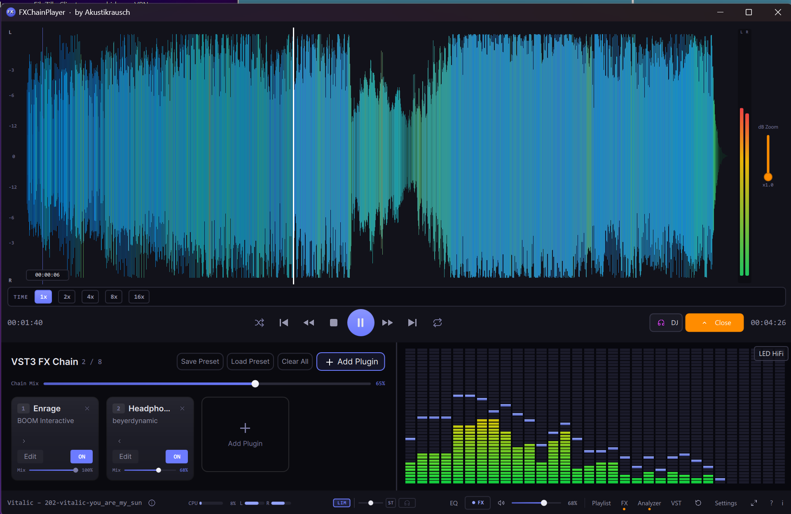
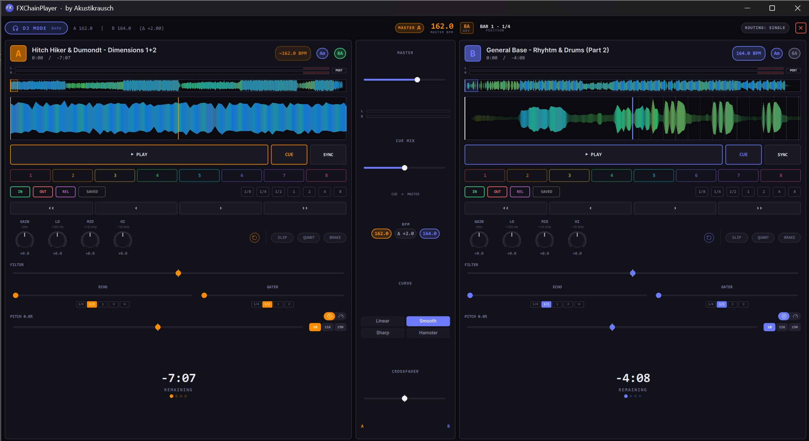
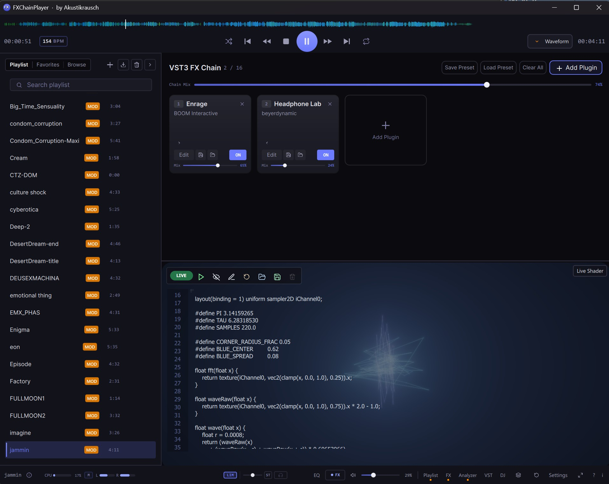
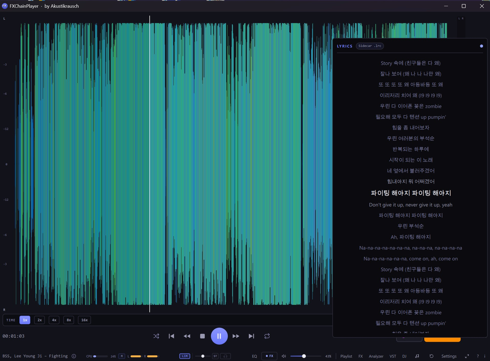

<h1 align="center">FXChainPlayer</h1>

<strong>A desktop audio player for Windows and macOS that plays nearly every audio format, with a full real-time effect chain built into the playback engine (VST3 on Windows, VST3 and Audio Units on macOS), a complete dual deck DJ Mode, and a ripper that gets the music back out of games, demos and disk images.</strong>

  
  
  
  
  
  
  
  
  
  
  

<em>Load your favorite plugins, EQs, compressors, reverbs, spatial processors, headphone correction, directly into the signal path and hear them in real time while you listen to music. Pitch records like vinyl. Mix tracks across two decks with sync, hot cues, loops and Pioneer-DJM-style filter. No DAW required.</em>

<a href="https://github.com/akustikrausch/FXChainPlayer-Releases/releases/download/v1.6.1/FXChainPlayer-Setup-1.6.1.exe"><strong>Windows: FXChainPlayer-Setup-1.6.1.exe</strong></a> 
<a href="https://github.com/akustikrausch/FXChainPlayer-Releases/releases/download/v1.6.1/FXChainPlayer-1.6.1-macos.pkg"><strong>macOS (Apple Silicon): FXChainPlayer-1.6.1-macos.pkg</strong></a>

  

<a href="https://www.youtube.com/watch?v=a2XQ1KDnYSk"><strong>Watch the demo on YouTube</strong></a>

  

---

## Contents

- [Highlights of 1.6](#highlights-of-16)
- [Why effects in an audio player?](#why-vst3-and-audio-unit-effects-in-an-audio-player)
- [The Ripper](#the-ripper)
- [FXChain Stems](#fxchain-stems-a-trackers-voices-inside-your-daw)
- [Plays pretty much everything](#plays-pretty-much-everything)
- [Heartbeat Soundtracker](#heartbeat-soundtracker-songs-from-the-commodore-64-ultimate)
- [Disc audio](#disc-audio-audio-cd-dts-sacd-and-blu-ray)
- [Archives, playlists and opening files](#archives-playlists-and-opening-files)
- [Real length and waveform](#real-length-and-waveform-for-music-that-carries-no-length)
- [DJ Mode](#dj-mode)
- [Audio engine](#audio-engine)
- [Export](#export-through-your-vst3-chain)
- [Edit, record and compare](#edit-record-and-compare-inside-the-player)
- [Interface](#interface)
- [macOS](#fxchainplayer-on-macos)
- [Download](#download)
- [Complete format reference](#complete-format-reference)

---

## Highlights of 1.6

### 1. Heartbeat Soundtracker: songs from the Commodore 64 Ultimate

Songs written in Aleksi Eeben's music workstation for the C64 Ultimate play
straight from the tracker's own files, with **all eight SIDs and all seven
sample channels**, following the tracker's own player tick for tick. The
Pattern view shows every column, the DJ decks take them, and export writes each
voice to its own file. [More below](#heartbeat-soundtracker-songs-from-the-commodore-64-ultimate).

### 2. Disc audio: Blu-ray, DTS and more disc formats

**DTS audio CDs** play and rip as stereo, a **hybrid SACD** offers its CD layer,
and on Windows **concert and Pure Audio Blu-rays** play their titles and
chapters through your effect chain. Loose **DTS, DTS-HD, Dolby TrueHD, MLP and
EAC3** files and the audio of **M2TS** videos play as well.
[More below](#disc-audio-audio-cd-dts-sacd-and-blu-ray).

### 3. A ripper that starts the game

Most game disks carry no music file at all: the music only exists while the
game runs. The File Ripper **starts Amiga, Commodore 64, ZX Spectrum and Atari
ST disks and programs in machines built into the player** and saves their music,
the cracktro's tune and the game's, together with every file a song needs.
[More below](#the-ripper).

---

## Why VST3 and Audio Unit effects in an audio player?

More reasons than you would expect.

- **Headphone surround & spatial audio**: Run binauralizers like **dearVR MONITOR**, **Waves Nx**, or **Dolby Atmos Production Suite** to turn stereo into a full spatial soundstage on any pair of headphones. No system-wide wrapper, no virtual audio cable.
- **Headphone calibration & correction**: Use frequency-response plugins like **Sonarworks SoundID Reference**, **Beyerdynamic Headphone Lab**, **Waves Nx Virtual Mix Room**, or **Morphit** to flatten your specific headphone model to a neutral reference.
- **Internet radio & streaming cleanup**: Load a compressor, EQ, de-esser, or multiband processor on poorly-mastered streams or dynamic-range-compressed "loudness war" tracks to tame them while you listen.
- **Plugin auditioning**: Want to hear how that new reverb, saturator, or tape emulation sounds on real music? Drop it in. No DAW boot-up, no empty session, no audio import.
- **Loudness normalization & limiting**: Keep playback levels consistent across tracks from wildly different sources (old CDs vs. modern streaming).
- **Room correction**: Apply convolution IRs or parametric EQ profiles to compensate for your listening room and speaker setup.
- **A/B plugin comparison**: Quickly toggle effects in and out on familiar reference tracks to hear exactly how they color the sound.
- **Accessibility**: Hearing aid profiles, frequency boosting, dynamic range compression, or custom EQ curves for listeners who need tailored audio processing.
- **Mix referencing**: Drop your mix in, compare A/B against a reference master, hear your monitor chain on someone else's material.
- **Per-channel chains for trackers, SIDs, multi-channel chiptunes**: Each channel of a `.mod` / `.xm` / `.it` / SID / NSF file gets its OWN VST3 chain. Reverb only on channel 1, LP filter only on the bass channel, distortion only on the lead. Configure once per file (auto-loaded on track-change), bake into the export.
- **Bake the effect chain into a file**: render any track or the whole playlist through the VST chain to WAV / MP3 / FLAC / OGG, faster than real-time. Take your processed audio anywhere. [Details below](#export-through-your-vst3-chain).

Up to **16 VST3 plugins in a serial chain**. Drag-and-drop reorder. Per-slot bypass and dry/wet. Smooth global chain mix. Native plugin GUIs. Everything runs at **64-bit double precision** end-to-end.

On macOS the same chain also hosts **Audio Units** (AUv2 and AUv3) alongside VST3, so the effect plugins you already use in Logic Pro or GarageBand load right in.

---

## The Ripper

Old games, demos and intros carry their music where no file manager will ever
find it: inside a running program, packed into a disk image, or as code that
only becomes music while it runs. The Ripper gets it back as real files you can
save and play. Open it with the **RIP** button in the status bar, next to
Record. It is its own window, so the demo you are ripping can have one half of
the screen and the ripper the other.

### The Memory Ripper: music out of a running program

Pick a running program, scan it, and the music living in its memory comes back
as files.

- **It reads formats by their own structure.** Tracker modules, C64 tunes,
  console music from SNES, NES, Game Boy, Sega and MSX, Atari SAP, standard
  MIDI, whole audio containers such as WAV, AIFF, OGG and FLAC, MP3 streams,
  raw sound buffers from intro softsynths, and packed Amiga modules that are
  unpacked on the way out. Lengths come from each format's own header, so what
  you save is a working file rather than a guess.
- **A scan of a large program is quick.** Reading and recognising run on several
  processor cores at once, and one bar names the target, shows how far it is and
  about how long remains.
- **Scan again keeps what you have.** A second pass skips memory that has not
  changed and adds only what is new, which is what demos that load their music
  a few seconds in are for.
- **See where a find sits while the scan runs.** The memory map fills as it
  goes, each find lands as a block on the same axis, and clicking one jumps to
  its row.
- **When the program is the instrument, you get the performance.** Some
  demoscene programs carry no music file at all: they build their sounds while
  they run. Scan one of those and you are handed what it played, recorded from
  the emulated machine and labelled as a recording.
- **Record one program, not the whole machine.** Send a program to the recorder
  and the recording holds that program and nothing else: not the player, not a
  notification, not a browser tab.
- **It only ever reads.** No writing into the other program, no code injection.
  Protected programs simply stay closed. On the Mac the list shows the programs
  macOS lets it read.

### The File Ripper: music out of files, archives, disk images and game packs

The same engine, pointed at your disk. Drop files or whole folders on it and it
works through them one after another, opening what it meets on the way. Nothing
is ever written back into a file.

- **It opens what the music is wrapped in.** Archives, crunched files and disk
  images, however deep the nesting: a crunched module inside an archive inside a
  disk image still comes out as a file you can play. Music parked behind the end
  of an installer or a cracktro is found there, and archives made on the Amiga
  itself open too.
- **It opens what today's games ship in.** Godot packs, GameMaker data files,
  Ren'Py archives, Valve packages, Adventure Game Studio voice and music, the
  resource bundles of desktop apps built on web technology, Unity asset bundles
  including brotli-compressed web builds, and the table-of-contents plus data
  file pair a current Unreal Engine title ships.
- **Game audio comes out playable.** Bink Audio, the Wwise formats current games
  use for music and voice, Bethesda's Skyrim and Fallout soundtracks, and
  Godot's container-less sound, which is handed back with its container put
  back on so it plays anywhere.
- **Music a browser already saved.** Point it at the profile folder of Chrome,
  Edge, Brave or Opera and it reads the cache entries the way the browser wrote
  them and names each find by the address it came from.
- **It knows far more music than a file manager does.** Atari ST chip tunes, the
  Amiga composer formats behind countless game soundtracks, Sharp X68000, the
  DOS AdLib and FM catalogue, Furnace, and the long tail of tracker variants,
  including older formats that carry no header at all: those are handed to the
  player's own decoder and kept only when the file really makes a sound.
- **A song is carved to its own end,** because each format's own tables and
  declared sizes decide where it stops.

### Programs and disks, started in machines built into the player

A game disk gives up its music only while the game runs. So the File Ripper
runs it, inside the player's own emulated machine and never on your computer.

- **An Amiga game disk.** Scan an ADF, or a whole folder of them, and each game
  boots in a small Amiga built into the player, no Kickstart needed. Its memory
  is searched while it runs, keys are pressed the way a person would to get past
  a title screen, and the next disk of a multi-disk game goes in when the game
  asks for it. Modules the game loaded come back as files; a game with music in
  a format of its own gives a recording of what it played, marked as an excerpt.
  Disks with a filesystem start from their startup-sequence or their icon.
- **A Commodore 64 game** (`.prg`, `.p00`, `.t64`, `.d64`). What the SID plays is
  recorded, and only when it is music: a held note or a single sound effect is
  never offered as a tune. A recording ends where the tune comes round again.
- **The game's music and the cracktro's.** A C64 release with a crack screen, a
  trainer menu or a group intro in front of the game gets past it one key at a
  time. Both tunes are finds: the intro's under its own name, and the game's.
- **A ZX Spectrum snapshot or tape** (`.sna`, `.z80`, `.tap`, `.tzx`). A tracker
  song comes back as the module it is, playable and editable; where there is
  none, what the game plays is recorded.
- **An Atari ST floppy** (`.st`, `.msa`, `.dim`), started the way the machine
  started one: boot sector, AUTO folder, then the program.
- **Every tune a program plays** is a find of its own, on all four machines: a
  title tune and the one after loading, every song of a music disk. Music disks
  that encrypt themselves give up their songs too.
- **One switch decides.** *Start programs* on the Files card is on unless you
  switch it off, and means the same for one file and for a whole folder. While
  a machine runs the status line names it, each find says which machine it came
  from, and Cancel stops a machine within a second.

### Songs that need a second file

Many formats keep the score in one file and the instruments in another. TFMX
and Richard Joseph soundtracks, a PlayStation miniPSF and its library, an AdLib
song and its bank, an MDX and its sample bank: the ripper finds the set,
previews it as a set and saves it together, ready to play. When a partner is
missing, the find names the file it needs.

### What you get back

Both routes end in the same result list. Every row carries its verdict as a
badge, and the surest finds sort to the top. Preview any of them in place with a
loudness coloured waveform, correct the sample rate of a raw buffer by ear, then
tick a selection and save it from one bar, optionally writing a playable copy
beside every rip in a format any player opens. *Add to playlist* puts the saved
finds straight into the player. A folder scan can be cancelled at any moment and
keeps the finds of every file already scanned.

### What stays out of reach

Honest limits: Amiga games that need more than a stock Amiga 500, C64 games
that need the BASIC ROM or bring their own disk drive code, and Spectrum games
with their own fast tape loader say so instead of producing a wrong result.
Music that is generated live and never stored whole can be recorded, not
extracted.

---

## FXChain Stems: a tracker's voices inside your DAW

Exporting stems writes files. **FXChain Stems** does it while you work: a
separate VST3 plug-in, installed with the player on Windows and macOS, that
plays a tracker module or a console chiptune inside your DAW and puts every
voice on its own stereo bus.

- **Load it on an instrument track**, click **Load Module** and pick a file.
  The voice list fills with the module's own channel names, each with gain,
  mute and solo, plus a master level. Everything automates from the host.
- **Output 1 is the complete mix**, audible before you route anything. Switch
  the plug-in's additional outputs on in your host and every voice arrives on
  its own channel of your mixer, ready for separate processing.
- **It follows your transport.** Start, stop and locate in the project and the
  module stays in step.
- **The panel fits any window** your DAW grants it, at any display scaling, and
  its About page lists the supported formats and how to activate the extra
  outputs, host by host.
- **Install it whenever you like.** The setup programs offer it, and
  *Settings > Advanced > Windows* or *Settings > Advanced > macOS* adds it
  later. On the Mac it goes into your own VST3 folder, no administrator rights
  needed.

---

## Plays pretty much everything

FXChainPlayer is built for music listeners who do not want format juggling. Drop a folder with mixed MP3, FLAC, DSD, tracker modules, C64 SIDs, Game Boy chiptunes, console-game dumps, it just plays. A searchable Format Library panel is built in, and the [complete format reference](#complete-format-reference) is at the end of this page.

### Lossless & Hi-Res

**FLAC**, **WAV**, **WavPack** `.wv`, **ALAC** (Apple Lossless), **APE** (Monkey's Audio), **TTA** (True Audio), **TAK** `.tak` (also as the audio file of a CUE album), **Shorten** `.shn`, **AIFF**, **W64** (Sony Wave64), **DSD** `.dsf` / `.dff` (DSD64/128/256/512), **DTS-HD Master Audio**, **Dolby TrueHD** and **MLP**.

### Lossy

**MP3**, **AAC**, **M4A** / **MP4** audio, **OGG Vorbis**, **Opus**, **WMA**, **MPC** (Musepack SV8), **AC-3**, **EAC3**, **DTS**.

### Tracker modules

**MOD** (ProTracker), **XM** (FastTracker 2), **S3M** (ScreamTracker 3), **IT** (Impulse Tracker), **MPTM** (OpenMPT), **Digibooster Pro**, **Imago Orpheus**, **Graoumf Tracker**, **Liquid Tracker**, **Octalyser**, **PolyTracker**, **UltraTracker**, **Digitrakker**, **OctaMED**, **Farandole Composer**, **Epic MegaGames MASI**, **MadTracker 2**, **Galaxy Sound System**, **X-Tracker**, **NoiseTracker**, **Ice Tracker**, **Composer 670** + 667, **SoundFX 1/2**, **Davey Taylor's Tracker**, **DSMI/Asylum AMF**, plus Funktracker (`.fnk`), Liquid Tracker (`.liq`), Magnetic Fields Packer (`.mfp`), AMOS Banks (`.abk`), Soundtracker 2.6 (`.st26`), Ice Tracker (`.ice`) and many more.

### Commodore 64

- **SID** with 6581 and 8580 emulation, 2SID and 3SID stereo tunes, per-voice switches, a live Pattern view and an opt-in chip inspector that shows the registers, per-voice activity and the patch behind every sound. HVSC song lengths, subtune navigation and the archive's own STIL notes in File Info.
- **GoatTracker** `.sng` songs play on a real SID emulation, filter included. A song picks its SID chip by itself, a setting under *Settings > Playback > Formats* decides for songs that do not say, and **GoatTracker Stereo** and **GTUltra** songs for two SIDs play in stereo. The playlist shows the real length.
- **DefleMask** `.dmf` songs written for the C64 play straight away, at their real length, with seeking. Right-click one to turn it into a GoatTracker song, a SID-Wizard song, MIDI, or a `.sid` that plays in any SID player; a short report says what the conversion did.
- **Heartbeat Soundtracker** songs from the C64 Ultimate: [see below](#heartbeat-soundtracker-songs-from-the-commodore-64-ultimate).

### Console chiptunes

- **GBS**: Nintendo Game Boy
- **SPC**: Super Nintendo (SPC700)
- **VGM / VGZ**: Sega Megadrive · 32X · Master System · Game Gear · Mega CD · SG-1000 · SC-3000 · BBC Micro · ColecoVision
- **AY**: ZX Spectrum · Amstrad CPC (AY-3-8910)
- **NSF / NSFE**: Nintendo Entertainment System
- **KSS**: MSX
- **HES**: PC Engine / TurboGrafx-16, starting with the music and following the rip's own `.m3u` track list
- **SAP**: Atari 8-bit
- **GYM**: Sega Genesis / Mega Drive

### Atari ST & YM2149 chiptunes (`.sndh` / `.snd` / `.ym` / `.sc68`)

Native **YM2149** sound-chip emulation with full **Motorola 68000** support (Timer-C, DigiDrum, STE DMA samples), Atari ST and STE chiptunes (**SNDH** / **SND**) and standalone **YM** register-dump tunes (**`.ym`**, including the packed files that fill the YM and Modland archives) play **start to finish, out of the box, with no plugins and no setup.** Most players can't touch these without a separate add-on; here they just play, accurately, across the entire sndh.atari.org archive. Tunes distributed as **`.sc68`** play too: most of the official collection's Atari ST side works out of the box, and they load on the DJ decks.

And then they do what no chiptune add-on does: run a 1985 Atari demo tune **through your VST3 reverb, EQ or mastering chain in real time, and export it to WAV / MP3 / FLAC.** A piece of demoscene history, baked through modern studio effects into a file that plays anywhere.

### Amiga: PreTracker (`.prt`), full support, including 1.5

**PreTracker** (**`.prt`**), the modern Amiga demoscene tracker by Pink / Abyss, heard in productions such as *Coda* and *Preschool*, plays **start to finish, out of the box, with no plugins**, and every song sounds exactly the way its author wrote it. That includes the latest **PreTracker 1.5** productions from the current demoscene. Almost no player can open a `.prt` at all, here it just plays, and like every other format it runs **through your VST3 chain and exports to WAV / MP3 / FLAC.** (PreTracker 2.0 productions distributed as Amiga executables play too, see below.)

### Amiga executable music

A huge amount of Amiga **demoscene and game music ships as a raw Amiga program**, not a song file, and FXChainPlayer plays these executables **directly**. This includes the many that carry **no file extension at all** (the way the Amiga filesystem stores them): just drop them in and they play. Files named the Modland way, with the format in front (`mod.techno`), open everywhere as well.

### Amiga with its original hardware character

Sample interpolation up to a band-limited Paula model and the Amiga's fixed output filter, as settings and as clickable chips in the Pattern view.

### Amiga composer-named players

**Symphonie Pro** 32-voice, **Quartet Microdeal** (Atari ST 4-voice PCM), **SoundFactory**, **AMOS Music Bank** (every AMOS BASIC game 1990-95), **SoundFX v1+v2** (Cinemaware), **BP SoundMon v2+v3** (Brian Postma), **Sonic Arranger** (Tower of Souls / Ambermoon / Albion), **Art of Noise** (four and eight voices), **TFMX** (Hülsbeck, Turrican / Apidya / Monkey Island Amiga), **RJP** (Bitmap Brothers, Chaos Engine / Cannon Fodder / Speedball 2 / Gods), **FutureComposer**. BP SoundMon and the Richard Joseph soundtracks play the way their original players shaped them.

Hippel, Ben Daglish, David Whittaker, Fred Editor, Ron Klaren, Mark II, Audio Sculpture, Digital Mugician, DeltaMusic, JamCracker and Sidmon are recognised and identified, but do not produce audio yet.

### PlayStation (PSF)

**PSF** and **miniPSF** files from the PS1 archive render audio on a built-in PlayStation: the console's processor, its timers and its sound chip are emulated, so a game's own music driver produces its soundtrack. A `.psflib` sound bank has its own entry in the Format Library and explains what it belongs to.

### Demoscene + retro synths

**MusicLine Editor** (`.ml`), **AHX / HVL / THX** (Hively Tracker, plus the Abyss THX precursor), **`.v2m` on Windows** (Farbrausch V2, `.kkrieger` / `.fr-08`, at every output rate), **TIATracker** (Atari 2600), **Organya** (Cave Story), **SAP** (Atari 8-bit), **ZxTracker** (Vortex Tracker II / Pro Tracker 3 / Sound Tracker), **Arkos Tracker**, **MED Advanced** (OctaMED MMD0/1/2/3), **FutureComposer** (`.fc` / `.fc13` / `.fc14`), **MDX** (Sharp X68000, at full level and its real length), **Euphony** (FM-TOWNS), **Furnace** modules for a single AY chip, **Yamaha SMAF** (`.mmf`, melodic FM ringtones).

### MIDI / SoundFont

`.mid` / `.midi` / `.rmi` with a configurable SoundFont (*Settings > MIDI*; audition a `.sf2` live by dragging it onto the player). A `.sf2` with the same name sitting next to a MIDI file loads automatically for exactly that file, and the pair stays together inside an archive.

### TFMX / RJP / PMD / FMP

**TFMX**: full Hülsbeck macro-engine support (4-voice MDAT/SMPL pairs).
**RJP**: Bitmap Brothers RDAT/RSMP pairs.
**PMD / FMP**: PC-98 (Touhou-pre-Windows / Falcom / Compile).
**MSX** `.kss`.
**SMS / PC-Engine / RGBDS Game Boy** `.sgc` / `.nsd` / `.gbr`.

### DOS Adlib

`.imf` / `.hsc` / `.rad` / `.d00` / `.dro` / `.rix` / `.rol` / `.mus` and a broad catalogue of DOS / Sound Blaster / Adlib / OPL2/3 formats.

### Game music and sample packs

- **Apple `.caf`**: Logic Pro / GarageBand **Apple Loops** library, with their BPM tags
- **Nintendo**: BRSTM · BCSTM · BFSTM · BFWAV · DSP-ADPCM family · NUS3AUDIO · Switch Opus
- **Sony**: VAG · HPS · NUB · ATRAC3 / ATRAC9 · AT3 / AT9
- **Microsoft**: XMA · XWMA
- **CRI**: ADX · HCA · ACB / AWB containers
- **FMOD**: FSB (including Vorbis + CELT)
- **Square Enix**: SCD
- **Wwise**: WEM
- **`.txtp`** text-playlists with effects
- **Multi-subsong navigation** for game-OST archives

---

## Heartbeat Soundtracker: songs from the Commodore 64 Ultimate

Heartbeat Soundtracker is Aleksi Eeben's music workstation for the C64
Ultimate: eight SID chips and seven sample channels in one tracker.
FXChainPlayer plays its songs.

- **Straight from the tracker's files.** A song is recognised by what the
  tracker writes at the start of the file, not by its name: it opens without an
  extension, the way the tracker saves it, renamed to `.reu`, or from inside a
  ZIP. A `.reu` that is not a Heartbeat song stays out of the playlist.
- **All of it plays.** All eight SIDs, 24 voices, and all seven Ultimate Audio
  sample channels. Playback follows the tracker's own player routine, which its
  author shared for FXChainPlayer.
- **The song's own mixer.** A C64 Ultimate configuration file (`.cfg`) beside
  the song sets the levels and stereo places of the SIDs and the sampler, and
  NTSC speed if it says so. It is found under the song's own name, else as the
  one such file in the folder, else as `Heartbeat.cfg`, and it comes along out
  of a ZIP. Without one, the tracker's own settings apply.
- **Follow every column.** The Pattern view shows all 32 columns of a song: the
  seven sample channels, the 24 SID voices and the command column, and the
  highlighted row is the one you hear.
- **File Info** shows title, author, the song's notepad, its samples and its
  instruments.
- **Mix it and take it apart.** On the DJ decks a Heartbeat song brings its own
  tempo for SYNC, two songs play side by side, and every voice has its own
  effect chain and its own file on export.

---

## Disc audio: Audio CD, DTS, SACD and Blu-ray

### Audio CD, DTS CD and hybrid SACD

- **Add a disc and play.** Its tracks come into view, the first one is selected,
  and they take their place in the current sort of the playlist. Ripping a whole
  disc runs in disc order, with names and cover art looked up online.
- **DTS audio CDs** play and rip as stereo, including a DTS soundtrack stored in
  a WAV rip. The player recognises the encoded track before playback, you can
  jump to any point at once, and export it to any format.
- **Hybrid SACDs** play their CD layer at 44.1 kHz / 16 bit.

### Blu-ray audio (Windows)

A Blu-ray audio chip sits beside the Audio CD control in the playlist. Choose a
concert or Pure Audio Blu-ray, pick a title and an audio track, and add its
chapters to the playlist: they play through the effect chain like any other
track.

- **Disc codecs:** LPCM, AC-3, EAC3, Dolby TrueHD, DTS and DTS-HD.
- **Chapters play one after another without a gap**, so a concert runs
  through the way it does on the disc.
- **Multichannel audio is mixed to stereo.** There is no object rendering for
  Atmos or DTS:X, no video and no disc menus.
- **Protected discs need a decryption component you provide.** The player ships
  none. A setup dialog, also under *Settings > Advanced > Blu-ray*, shows
  whether the component is found and can be loaded; finding it does not
  guarantee that every disc plays.

### Surround files on your disk

**DTS**, **DTS-HD** (`.dts`, `.dtshd`, `.dtsma`), **Dolby TrueHD** and **MLP**
(`.thd`, `.truehd`, `.mlp`), **EAC3** (`.eac3`, `.ec3`) and the audio of
**M2TS / MTS** video files play directly, mixed to stereo.

---

## Archives, playlists and opening files

- **Archives open like folders.** ZIP, RAR, LHA, LZH and Amiga LZX archives,
  and PowerPacker, Imploder and StoneCracker modules, open the same way from every
  place: a drop on the window, the file browser, the DJ decks, export, a
  playlist.
- **Password-protected archives.** A ZIP that needs a password asks for it, one
  archive at a time, and the password opens every other archive waiting with
  it. *Remember* keeps it encrypted by the operating system, and
  *Settings > Advanced > Maintenance* lists what is remembered and forgets it
  again. A RAR with a password says that it has to be unpacked first.
- **Files that belong together stay together.** A MIDI file and the SoundFont
  made for it, an MDX and its sample bank, a track and its lyric file: the
  player keeps the set, also when it comes out of an archive, so a song sounds
  the way its author made it.
- **Saved playlists open with a double click.** An `.m3u`, `.m3u8` or `.xspf`
  playlist opens from Explorer or the Finder, from the command line or by
  dropping it on the program, and starts at its first track. An archive listed
  in a playlist is unpacked on the way in.
- **Several files at once.** Select several files in Explorer or the Finder and
  open them together: they arrive as one list, in natural order, and the first
  one plays. A folder opens like a file.
- **The window stays responsive** while a large archive or folder is read, and a
  short notice says so when there was nothing to play in it.
- **Drag and drop as a copy.** Files dragged from the Finder or Explorer onto
  the playlist, the DJ decks or the ripper are taken as a copy; the original
  always stays where it was.

---

## Real length and waveform for music that carries no length

Chip tunes and replayer formats are programs, not recordings: nothing in the
file says how long a tune runs. That covers Commodore 64 SID tunes, MusicLine,
Farbrausch V2M, Hively and AHX, and the Amiga, Atari and AY replayer formats.

- **The player measures them.** Playback starts at once, and in the background
  the tune is rendered faster than real time. The real duration appears in the
  playlist while it plays, and the live view zooms out into the finished
  waveform.
- **Tunes end where the music ends**, and the next track follows without a
  silent gap. A tune that loops forever plays one pass and fades out, after
  eight minutes at the latest.
- **Click into the waveform to seek**, even on replayers that cannot seek by
  themselves.
- **Every subsong has its own measurement and its own waveform**, and so does
  every track of a gapless run.
- **Measured once.** A length is remembered, and saved playlists show the right
  lengths the next time they are opened.

---

## DJ Mode

  

Press `D` (or click the DJ button in the status bar) to switch to a **dual-deck DJ console** built into the player. Drop tracks on Deck A and Deck B, mix with a real crossfader, and use everything you would expect from a DJ rig.

- **Two decks side by side**, each with: per-deck waveform (overview + 10-second close-up), title / artist / BPM / Key / Camelot, 8 hot cues (numbered, persisted across sessions, set / clear / colour-coded), click-free, sample-accurate gapless Loop In/Out + Reloop, auto-loop chips (1/8 1/4 1/2 1 2 4 8 beats) that snap to the beat grid, beat-jump (`<<` `<` `>` `>>`), 3-band EQ (LO / MID / HI knobs, ±12 dB), gain knob, Play / Cue / Sync, SLIP / QUANT / BRAKE, and a **Pioneer-DJM-style filter knob** (sweep LP from 20 kHz down to 70 Hz on the left half, sweep HP from 20 Hz up to 17 kHz on the right half, magnetic dead-zone at the centre).
- **Crossfader**: four industry-standard curves (Linear / Smooth / Sharp / Hamster), per-sample smoothing (no zipper noise), right-click snaps to centre.
- **Instant sync lock with phase-lock.** Single-click SYNC snaps tempo immediately and holds beat phase to master with a click-free, kick-aware phase servo that lands kick on kick. Right-click SYNC = make THIS deck master. Octave-fold so a 175 BPM follower against an 87 BPM leader stays at perceived-equal speed. **SYNCED is a measurement, not a button state:** it lights when the beat phase is actually locked. Arm SYNC on a paused deck and it engages the moment playback starts; take the follower's pitch by hand and it hands the deck back to you.
- **Vinyl scratch on the waveform.** Click + drag the close-up OR overview waveform like a Pioneer-CDJ jog wheel. Forward + reverse. Release lets the slipmat catch the platter back to slider rate. Works in single-track mode AND DJ mode with the same physics.
- **Vinyl-spin while paused.** Even when audio is paused or stopped, dragging the waveform spins the platter in the dragged direction, like spinning a turntable when the motor is off.
- **Per-deck Pitch/Stretch toggle.** Disc icon = Pitch (vinyl turntable, pitch + tempo move together). Gauge icon = Stretch (pitch stays constant while tempo varies).
- **Per-deck Echo + Gater FX.** Tempo-locked beat-rate chips (1/4, 1/2, 1, 2, 4 beats). Auto-syncs to deck BPM × pitch ratio in real time.
- **Your own VST3 effects in the booth.** The chain you built for listening runs on the DJ mix too, with the same bypass, dry compare and wet/dry controls you use everywhere else. The cue output stays clean, so what you pre-listen to is the track itself and not the processing.
- **Saved Loops + Smart Cueing.** Per-track named loop slots persisted across sessions, and any loop opens in the built-in wave editor trimmed exactly to the loop region: polish it there, hear the seam in loop mode, and save it as a file in any export format, with the deck BPM already in the suggested name. First-time-load auto-creates hot-cue 1 at the detected first downbeat. Quantize-seek snaps hot-cue jumps to the nearest beat.
- **Load Cue.** Freshly loaded tracks stand ready at their first actual sound, leading silence skipped, club-CDJ style. Threshold selectable in eight steps, optional beat snap, and manually set cues always win.
- **Load from the keyboard.** `Shift+F1` and `Shift+F2` load the highlighted playlist row onto Deck A or B, also when the playlist is sorted or filtered.
- **Camelot wheel + harmonic-mix hint (experimental).** Per-deck Camelot key chip derived from a background key-detection pass or the file's existing key tag, with a colour-coded cross-deck compatibility hint (Match / Relative / Adjacent / EnergyLift / Discord). Treat the suggestions as a starting point. Trust your ears.
- **Dual audio output.** Three modes: single device (DJ Mode runs without cue), dual WASAPI device (Main + Cue on independent endpoints, works with any USB DAC + Bluetooth combo), or ASIO channel-pair (Main on 1+2, Cue on 3+4 of the same multi-out interface). Pre-listen cue mix balance knob.
- **Tracker and chiptune DJing, unique to FXChainPlayer.** Drop a `.mod` onto Deck A, an MP3 onto Deck B, hit SYNC. Tracker modules, Atari ST SNDH and YM tunes, C64 SIDs (two at once) and Heartbeat Soundtracker songs load onto the decks as finite, scrubbable audio and mix alongside modern productions on the same crossfader.
- **MIDI controller support.** Hardware-detected mappings for Pioneer DDJ-FLX series, KORG nanoKONTROL2, Akai LPD8, Behringer X-Touch Mini, Mackie-Control, General MIDI. Ableton-style Learn Mode (`Ctrl+Shift+M`) for any other controller. Pitch / EQ / hot-cues / scratch jog-wheel / play / cue / sync / filter all mappable.

---

## Audio engine

### WASAPI Shared / Exclusive + ASIO 2.3

**WASAPI** Shared and Exclusive modes are the default Audio Mode. The player picks the device's native sample rate, no system-wide resampling. **WASAPI Exclusive** bypasses the Windows audio engine for the bit-for-bit path; works on any USB DAC, built-in sound, or HDMI output, no ASIO driver required.

**On macOS** the same Audio Mode picker drives **CoreAudio**: Shared mode by default, and Exclusive mode takes the device over (hog mode) for the bit-perfect, lowest-latency path.

**ASIO 2.3** is also supported on Windows (Steinberg-licensed) for users with a compliant audio interface. Pick **ASIO** in *Settings > Audio > Output device*. Round-trip latency depends on your audio interface and the buffer size the driver supports; the same page shows the driver's live in/out frame counts and total ms.

- **Output Pair routing** for multi-output interfaces, route the player's stereo to any pair (1-2, 3-4, …) up to the driver's reported total. Persisted across sessions.
- **Configure Driver button** opens the driver's hardware panel directly (e.g. RME TotalMix, MOTU CueMix, Apollo Console, ASIO4ALL settings).
- **Driver-reported latency readout**: in N / out N frames + total ms, refreshed live.
- **Sample-accurate visual playhead**: the waveform playhead accounts for the audio backend's queued frames so what you see is what you hear.
- **Output stage**: TPDF dither on every integer path, full coverage of common ASIO sample formats.

### Per-Channel VST Chains

For every multi-channel format (tracker `.mod` / `.xm` / `.it` / `.s3m`, SID, NSF, SPC, GBS, every chip-emulator format), each separable channel can carry its **own dedicated VST3 chain** of up to 16 plugins.

- **Channel-tab navigation**: pick which channel you are editing
- **Per-channel chain editor**: full slot grid with plugin name, vendor, bypass, mix slider, edit (open VST3 GUI), move-left / move-right, remove
- **Auto-load presets**: chain configurations auto-load on track-change for matching files
- **Manual save / load**: save the per-channel chain layout as a named preset
- **Real-time playback**: each channel runs through its own chain live
- **Export-path integration**: multi-track export renders each channel through its own chain to a separate file (filename template `<title> - <channelName>.<ext>`; e.g. `MyTrack - Voice 1.wav`)
- **4 FX modes for export**: Master chain only / Per-channel chains only / Per-channel then master / No FX

### Vinyl Scratch, Newtonian platter physics

Click + drag the waveform like a Pioneer-CDJ jog wheel. The mouse becomes your *fingertip* and applies torque proportional to slip; the platter has **real inertia** (calibrated to feel like a Technics SL-1200GR with felt slipmat) and accelerates / decelerates accordingly.

- **Fully bidirectional**: forward drag = audio plays at drag velocity; backward drag = audio plays in reverse at drag velocity (up to 8 s into the past)
- **All techniques emerge from real physics**: baby / forward / chirp / tear / spinback
- **Inertia-aware release ramp**: calibrated against the SL-1200's spin-up to 33⅓ RPM
- **Spin while paused**: flick the waveform on a paused track; the platter spins in the dragged direction and friction decays back to 0
- **Same physics in single-track AND DJ mode** for both the close-up scrolling waveform and the full-song overview strip

### Turntable Pitch Slider (Technics-style)

A vertical pitch fader on the right edge of the expanded waveform AND DJ-mode view. Selectable range (**±8 % / ±16 % / ±50 %**), **0 % center detent** (snaps to neutral within ±0.3 %), **33/45 RPM toggle**, and a per-deck **Pitch/Stretch toggle** (disc icon = vinyl-style pitch+tempo move together; gauge icon = time-stretch with constant pitch).

**At 0 % the slider is bit-exact pass-through.** Auto-resets to neutral on every track change.

### 64-bit double-precision signal path

Internal audio path is `double` end-to-end. Sample-rate conversion (when needed) uses a linear-phase resampler with ~260 dB SNR.

### BPM + Camelot key detection

BPM comes from every source a track offers: a tempo you tapped yourself, the tempo embedded in a MIDI or Apple Loops file, a tracker module's own tempo, a BPM tag, a CUE sheet and the player's own beat detection, weighed against each other. High confidence shows the value directly, lower confidence dims to `~XXX`, and uncertain results stay hidden so you never see a guess shown as if verified. Click the BPM pill to verify by tap-along.

**Key detection** runs in the background for every file, tuned for electronic dance music alongside the classical reference set. It is tuning-compensated, so an off-A440 rip or a track that modulates still resolves cleanly. Every analysed file gets a Camelot wheel chip in the deck header AND in the playlist's Key column.

### Studio loudness & quality metering

A live **EBU R128 / ITU-R BS.1770** loudness meter, one click from the status bar. Momentary and Short-term bars, the **Integrated LUFS** headline with streaming (−14) and broadcast (−23) targets, **loudness range (LRA)**, and a **True-Peak** readout that flags anything above −1 dBTP. It measures only while open, so it costs nothing when closed. In *File Info*, **Analyze** gives a per-track quality report: the **DR** dynamic-range value plus a spectrum check that warns when a file looks like a lossy transcode dressed up as lossless. Verified against the EBU Tech 3341/3342 test vectors.

### MIDI controller input

Industry-standard MIDI input with Mackie-Control + General-MIDI defaults, plus built-in profiles for **KORG nanoKONTROL2**, **Akai LPD8**, **Behringer X-Touch Mini**, **Pioneer DDJ-FLX series**. Hot-plug auto-config matches known controller names. Ableton-style Learn Mode (`Ctrl+Shift+M`) for any other controller. Mappings persist across sessions.

DJ-specific trigger targets are mappable for both decks: pause / stop / exit loop / unsync / tempo lock / pitch range, hot-cue set and clear 1-8, scratch start/end and velocity (jog-wheel rotation), filter, echo/gater amount and beats, autoloop halve/double.

### Format Library, every supported format, in-app

A collapsible **Format Info** card in *File Info* (origin, era, codec) for every track, and a full **Formats Library** panel with a per-category sidebar, search across name / extensions / platform / developer, and click-to-expand cards with the complete catalogue entry. It distinguishes formats that play from formats that are only recognised.

### 3-Band EQ (built-in modal dialog)

Low Shelf / Mid Bell / High Shelf with two draggable crossover-frequency handles on a live FFT spectrum and three Low/Mid/High gain knobs. Soft 0 dB detent on bipolar knobs. Toggle with `Q`.

### Real-time visualization

- **FFT Spectrum**: log-scale frequency analyzer with Hz axis labels and a peak-hold trail
- **Spectrogram**: scrolling waterfall
- **Stereo Phase Scope**: Lissajous / goniometer with amplitude-brightening
- **VU Meter**: classic PPM L/R
- **LED HiFi**: 32-band segmented display
- **Frequency Landscape**: 3D waterfall with cubic depth fog
- **Pulse Thread** (default), multi-octave audio-warped spine with audio-reactive starfield
- **Chroma Drift**: 6 ribbons at parallax depths with audio-driven domain warp
- **Studio LED**: smooth 3-zone gradient with per-LED diffuser rendering

Plus dedicated **Channel Scopes** (per-channel oscilloscopes for trackers up to 4 channels) and one unified live **Pattern View** shared across tracker modules, Heartbeat Soundtracker songs, Commodore 64 SID tunes and AY-3-8910 chiptunes (ZX Spectrum / Amstrad CPC / Atari ST), with a clickable order list, a Compact / Detailed density toggle, effect-command tooltips and a one-click Properties copy panel. **The highlighted row is the row you hear**: the view follows the sound that reaches your speakers at that moment, and it follows you when you jump.

### Live Shader Editor

Write your own audio-reactive visualisation directly inside the player. A GLSL fragment-shader editor sits next to a live preview, press **Ctrl+Enter** and your shader recompiles and hot-swaps in a fraction of a second, no app restart. Audio reaches the shader as a texture (FFT spectrum + raw waveform), alongside built-in `iTime` / `iResolution` uniforms. Ships with a template library, and your own templates save as portable plain-text `.glsl` files you can share or keep under version control.

### Studio Compare (A/B)

Dual-decoder synchronized A/B playback, load two files and switch between them sample-accurately with a short crossfade. Compare masters, codecs, headphones, plugin chains.

### Built-in Bauer-style crossfeed

Smooth your stereo on headphones without a plugin slot. Continuous blend slider, proper gain + delay + lowpass filtering.

### Gapless playback

Next track is pre-loaded and swapped in sample-accurately across formats that allow it (FLAC to MP3, MOD to XM, cross-format, all work), and the waveform and time follow the change.

### Integrated file browser & smart-scan

Point it at your music library, a local folder **or a NAS / network share** by UNC path (`\\server\share`) or a mapped drive, pinned in the browser with its own server icon. Background cache for VBR durations, bitrates, cover art, **BPM, Key, Camelot**, and (when a track has no embedded art) a `cover.jpg` / `folder.jpg` / `front.*` from the album folder. Scanning runs in the background so even a huge share never freezes the player. Instant playlist building. Breadcrumb navigation, library roots, "Play / Add All" context actions, Favorites tab.

### Export through your VST3 chain

Route **any file or whole playlist** through your VST3 effect chain and render the result to disk. Faster-than-real-time, offline, sample-accurate. Right-click a track in the playlist > **Export to format…** for a single file, right-click a multi-selection to export exactly those tracks, or **Ctrl+E** for the full batch dialog. An optional switch writes a SHA-256 checksum sidecar next to every exported file.

Output formats:

- **WAV**: 16-bit, 24-bit PCM, 32-bit float
- **MP3**: 128 / 192 / 320 kbps CBR
- **FLAC**: 16-bit and 24-bit lossless
- **OGG Vorbis**: q3 / q5 / q7 (≈ 112 / 160 / 224 kbps VBR)
- **AAC** `.m4a`: 96 / 128 / 160 / 192 kbps
- **AIFF**: 16-bit and 24-bit
- **WavPack** `.wv`: 16-bit and 24-bit lossless
- **Opus**: 96 / 128 / 192 kbps
- **ALAC** (Apple Lossless `.m4a`): 16-bit and 24-bit

Multi-tune containers (NSF / NSFE / SAP, multi-tune SIDs from HVSC, multi-subsong game-OST archives) can optionally expand into one file per subsong via the **Export all subsongs** checkbox. **Multi-selection** support, Shift-click a range, Ctrl-click individual rows, then export only the selected subset. **Per-row subsong picker** for choosing exactly which tune from a multi-tune file. **4-mode FX-chain selector**: Master / Per-channel / Both / None. The batch window maximises, resizes from any edge and keeps the size you gave it.

**Turn a C64 SID or a DefleMask song into an editable tracker project.** Pick the *Tracker* format family and rip a Commodore-64 SID tune or a DefleMask C64 song into a **GoatTracker 2** `.sng`, a **SID-Wizard** `.swm`, a **MIDI** transcription, or per-instrument files; a DefleMask song also becomes a `.sid` for any SID player. It goes the other way too: export any SID as a runnable C64 **`.prg`** program or a **`.d64`** disk image ready for a real 1541 drive or any emulator. The MIDI transcription is musical, not a note-per-frame dump: notes come from the real gate edges, vibrato and slides become pitch-bend, arpeggios fold back into chords, noise hits go to drums, and the true tempo is detected. Exported files are named after the song.

Export is included in every build, no separate "Pro" tier.

### Plugin scanning and crash protection

VST3 plugins are checked in the background while you keep playing. A plugin that cannot complete the scan appears with the reason and a Retry button, and a plugin you have updated is checked again automatically. A plugin that crashes during playback is contained and skipped from then on, one effect of a multi-effect shell (e.g. Waves WaveShell) at a time, so a single misbehaving effect does not take out the rest, and the player restarts itself if something goes seriously wrong.

### Code-signed

Every Windows release is code-signed, both the installer and every shipped DLL. On macOS every release is Developer ID signed and Apple-notarized.

### Synced lyrics

Open the lyrics panel with **`Ctrl+L`** and the currently-playing track's lyrics scroll in time with the music, active line bold + centred, surrounding lines faded out, smooth auto-scroll on every line change.

Three sources, tried in priority order:

- **Sidecar `.lrc`** next to the audio file (community-distributed synced lyrics from lrclib.net etc.)
- **Embedded synchronized lyrics** in the file's tags
- **Embedded unsynchronized lyrics**; the player still looks for LRC-format timestamps in them, because many taggers store synced lyrics there

Lyrics in the tags of DSF, DFF, WAV and AIFF files are read as well. A small badge at the top of the panel tells you which source was used. UTF-8 throughout, Asian scripts, Cyrillic, RTL text all render correctly. When a track has no lyrics from any source, the *Lyrics* entry in the status bar hides itself so the bar stays compact.

### Performance

Native code, GPU-accelerated rendering throughout. The window is ready within moments of launching, your playlist is there immediately, and your plug-in chain loads right after the window is up: a track you start in the meantime begins as soon as the whole chain is in place, so it never plays without your effects.

---

## Edit, record and compare, inside the player

**A wave editor, built in.** Trim, cut and save audio without leaving the player and without installing anything else. Right-click a playlist entry to open it, or drag a region straight out of the big waveform while holding Alt. Click anywhere to audition from that spot, select a region and the preview plays exactly that, loop the selection to hear the seam, and save in any format the player exports, with a switch that bakes your effect chain into the saved file. Files that hold several tunes let you pick which one you are editing.

**Record what your computer is playing.** Capture whatever is coming out of your speakers into a file, straight from the player, or record one single program and nothing else. Pause and resume without leaving a gap, listen back before you commit, then send the take to the wave editor or straight to the playlist. Optional silence trimming starts on the first sound and stops by itself.

**A/B and a real blind test.** Drop a second track onto the Set as B zone to line it up against what is playing, switch instantly, and when you want to know whether you can actually hear the difference, run the ABX blind test and let the statistics answer.

**Tags.** A tag editor with online lookup that also works on a file that has no tags yet, by its file name.

---

## Interface

- **The four main views are always at hand.** Playlist, FX, Analyzer and DJ stay in the bottom bar however narrow you make the window, while the other entries move into the `...` menu one by one. DJ sits beside the other three as a highlighted button, filled while DJ Mode is on.
- **One look on every computer.** The player brings its own typefaces, so text, numbers and time displays look the same on every Windows PC and every Mac, and the interface scales cleanly from a 1080p laptop to a native 4K monitor.
- **Settings in pages, with a search.** Long settings areas are split into pages listed under their name in the sidebar, the *Playlist* area holds every playlist setting in one place, and the settings search finds any option and opens the page it lives on.
- **Every keyboard shortcut is yours.** Settings has a shortcut editor: click a shortcut, press the new keys, and it takes effect at once. A key can never belong to two actions, every row has its own reset, and the help page names the keys you actually have. The help page has a print view that turns your key map into a printable sheet, and `Ctrl+Shift+S` saves a screenshot of just the player window.
- **Full keyboard accessibility.** Every audio control is reachable via Tab + Space / Enter / arrow keys.
- **Seven languages.** English, German, Spanish, French, Italian, Polish and Japanese. A fresh install picks your system language automatically when it is one of them.
- **Configurable playlist columns.** Choose which columns the expanded playlist shows, including play count and a five-star rating, with the data kept locally on your machine.
- **Layout presets**, a transport bar at the top or bottom, an optional clock in the status bar, and rotating feature tips you can switch off.
- **Click a cover to really see it.** Embedded artwork opens in a zoomable viewer; save the original image or drag it out as a file.
- **Demoscene radio, preset.** SceneSat, SLAY Radio (Commodore 64 SID remixes), VGM Radio (game music) and Nectarine are built in. Internet radio runs through your effect chain like everything else.
- **On Windows:** right-click *Convert to format* in Explorer, colour-coded bitrate icons for your audio files that live side by side with another application's icons, and ReplayGain scanning.

---

## FXChainPlayer on macOS

The complete player runs natively on Apple Silicon Macs, from macOS 14.4. Same engine, same features, same design as the Windows version, plus the pieces a Mac player should have:

- **Audio Units and VST3 side by side**: the effect chain hosts AUv2 and AUv3 effects in addition to VST3, in the same browser, the same slots, and the same per-channel chains. Your Logic Pro and GarageBand plugins just work, each opening its own native editor window.
- **CoreAudio output**: Shared mode by default, Exclusive (hog) mode for the bit-perfect path, mirroring WASAPI Shared and Exclusive on Windows.
- **Native Apple decoders**: AAC, ALAC and Apple CAF Loops decode through the system, and MIDI files play through the built-in Apple synth with no SoundFont needed.
- **A good Mac citizen**: media keys and Now Playing integration, a Dock menu with transport controls, About and Settings in the FXChainPlayer menu with Settings on Command-comma, and audio CD playback.
- **Open With from the Finder** for the supported audio formats, for ZIP, RAR, LHA, LZH and LZX archives and for folders; a folder dropped on the Dock icon opens the same way.
- **Finder Quick Actions** that convert audio files with FXChainPlayer (MP3, FLAC, WAV, AAC, Apple Lossless, OGG Vorbis, Opus, AIFF), added from *Settings > Advanced > macOS*. The same page installs the FXChain Stems plug-in and tells how to make FXChainPlayer the default player for a file type.
- **Convert from the command line** without opening a window: `FXChainPlayer.app/Contents/MacOS/FXChainPlayer --convert --format mp3 <file>` writes the converted file next to the original.
- **The Ripper and FXChain Stems** are part of the Mac version.

Windows only: Blu-ray audio, WMA, Farbrausch V2M, ASIO, and the Explorer integration.

---

## Download

**[Latest release on GitHub](https://github.com/akustikrausch/FXChainPlayer-Releases/releases/latest)**

**Windows**

- `FXChainPlayer-Setup-1.6.1.exe`: the installer. Installs and updates as a standard user, without administrator rights, with file associations, Start menu entries and an uninstaller. The FXChain Stems plug-in is set up at the very end: Windows asks for administrator rights once, only when the shared VST3 folder requires them. Answering No keeps FXChainPlayer fully installed, and *Settings > Advanced > Windows* adds the plug-in whenever you like. Updating keeps your choices: what you opted out of stays opted out.
- `FXChainPlayer-v1.6.1.zip`: the same player as a portable folder, no installation.

**macOS (Apple Silicon)**

- `FXChainPlayer-1.6.1-macos.pkg`: the installer, signed and notarized, with the FXChain Stems plug-in as a selectable component.
- `FXChainPlayer-1.6.1-macos.zip`: the same notarized app on its own, to drag into Applications. *Settings > Advanced > macOS* adds the Stems plug-in and the Finder integration.

### Auto-update

FXChainPlayer checks GitHub Releases for new versions and offers one-click install with SHA-256 verification. Toggle in *Settings > Advanced > Maintenance*.

---

## System Requirements

- **Windows 10** or **Windows 11**, 64-bit, or **macOS 14.4+** on Apple Silicon
- ~100 MB disk space
- An audio output device (WASAPI, any built-in sound, USB DAC, or HDMI audio works; ASIO 2.3 supported on any compliant interface)
- Optionally: a VST3 plugin folder with your favorite effects
- For Blu-ray audio: Windows and a Blu-ray drive

---

## Supported plugins

FXChainPlayer is a **VST3 host** (not VST2), and on macOS also an **Audio Unit host**. Any 64-bit VST3 effect plugin should work.

There is no compatibility list, no certification, no allowlist. Tested heavily with **FabFilter**, **Waves**, **iZotope**, **Sonarworks**, **Tokyo Dawn Labs**, **Valhalla DSP**, **Acon Digital**, **Softube**, **Kirchhoff-EQ**, **Pro-MB**, **Dear Reality dearVR**, **Beyerdynamic Headphone Lab** and many others.

Instruments (VSTi) are filtered out automatically, FXChainPlayer is a playback tool, not a DAW.

---

## License

FXChainPlayer is proprietary software by **Andreas Wendorf (Akustikrausch)**.

The binaries use a number of open-source components, full LGPL / BSD / MIT attribution is shown in the About dialog inside the app.

ASIO is a trademark and software of Steinberg Media Technologies GmbH. FXChainPlayer uses the Steinberg ASIO Interface Technology under license. The Steinberg ASIO SDK source code is NOT redistributed with this product.

---

## Support and diagnostic log

Open the log from *About > Quick Access > Open Log File*. On Windows it is
`%APPDATA%\Akustikrausch\FXChainPlayer\fxchainplayer.log`. On macOS it is
`~/Library/Application Support/Akustikrausch/FXChainPlayer/fxchainplayer.log`.
Finder hides `~/Library`; choose *Go > Go to Folder* and paste the directory.

The crash folder holds real crashes only: a fault the player catches and
survives, in a decoder, a plug-in or the Ripper, leaves no dump behind.

---

## Community

Join the FXChainPlayer Discord for questions, feedback, plugin recommendations, and bug reports: **<https://discord.gg/sfHBZFhG>**

## Links

- **Latest release:** https://github.com/akustikrausch/FXChainPlayer-Releases/releases/latest
- **Discord:** https://discord.gg/sfHBZFhG
- **Author:** [Andreas Wendorf / Akustikrausch](https://github.com/akustikrausch)

---

<em>Tools disappear. Music remains.</em>

---

## Complete format reference

Everything below plays out of the box: no plugins, no codec packs, no setup.
Each one runs through your VST3 chain and exports to WAV, MP3, FLAC, OGG, AAC,
AIFF, WavPack, Opus or Apple Lossless like any other track. The same list is
searchable inside the player under **Format Library**.

### Everyday audio

**WAV** `.wav` · **FLAC** `.flac` · **ALAC** Apple Lossless `.alac` `.m4a` ·
**AIFF** `.aiff` `.aif` · **Sony Wave64** `.w64` · **WavPack** `.wv` ·
**Monkey's Audio** `.ape` · **True Audio** `.tta` · **TAK** `.tak` ·
**Shorten** `.shn` · **MP3** `.mp3` · **OGG Vorbis** `.ogg` `.oga` ·
**AAC** `.aac` · **MPEG-4 audio** `.m4a` `.mp4` · **Opus** `.opus` ·
**AC-3** `.ac3` · **Musepack** `.mpc` `.mp+` `.mpp` ·
**Apple Core Audio Format** `.caf`

**DSD**: `.dsf` `.dff` at DSD64, DSD128, DSD256 and DSD512.

### Disc audio and surround

**DTS** and **DTS-HD** `.dts` `.dtshd` `.dtsma` · **Dolby TrueHD** and **MLP**
`.thd` `.truehd` `.mlp` · **EAC3** `.eac3` `.ec3` · **M2TS / MTS** audio `.m2ts`
`.mts` · **Audio CD**, **DTS CD** and the CD layer of a **hybrid SACD** ·
**Blu-ray audio** on Windows. Multichannel audio is mixed to stereo.

### Tracker modules

**ProTracker / Soundtracker** `.mod` `.nst` `.m15` `.stk` `.pt36` ·
**FastTracker 2** `.xm` · **ScreamTracker 3** `.s3m` · **ScreamTracker 2** `.stm` ·
**Impulse Tracker** `.it` · **OpenMPT** `.mptm` · **Composer 669** `.669` ·
**MultiTracker** `.mtm` · **Velvet Studio** `.ams` · **DSMI / Asylum** `.amf` ·
**X-Tracker** `.dmf` `.xtr` · **DSIK** `.dsm` · **DigiTrakker** `.dtm` `.mdl` ·
**Farandole Composer** `.far` · **General DigiMusic** `.gdm` ·
**Graoumf Tracker** `.gtk` `.gt2` · **Imago Orpheus** `.imf` ·
**Galaxy Sound System** `.j2b` · **Liquid Tracker** `.liq` · **MO3** `.mo3` ·
**MadTracker 2** `.mt2` · **Disorder Tracker 2** `.plm` ·
**ProTracker Studio** `.psm` · **PolyTracker** `.ptm` · **Sample Tracker** `.stx` ·
**TCB Tracker** `.tcb` · **UltraTracker** `.ult` · **Unreal Music** `.umx` ·
**DigiBooster Pro** `.dbm` · **DigiBooster** `.digi` ·
**OctaMED** `.med` `.mmd0` `.mmd1` `.mmd2` `.mmd3` · **Oktalyzer** `.okt` `.okta` ·
**SoundFX** `.sfx` `.sfx2` · **Soundtracker Pro II** `.stp` ·
**Soundtracker 2.6** `.st26` `.st` · **Ice Tracker** `.ice` ·
**Composer 670** `.c67` `.667` · **Digital Symphony** `.dsym` ·
**Funktracker** `.fnk` · **Magnetic Fields Packer** `.mfp` · **Grave** `.wow` ·
**Imperium Galactica** `.xmf` · **Octalyser** `.oct`

### Commodore 64

**SID** `.sid` `.psid` `.rsid` with 6581 and 8580 emulation, 2SID and 3SID
stereo tunes, per-voice muting, a live pattern view and per-voice stem export.
HVSC song lengths and subtune navigation included.
**GoatTracker** `.sng`, also GoatTracker Stereo and GTUltra for two SIDs ·
**DefleMask** `.dmf` songs written for the C64 · **SID-Wizard** `.swm` ·
**Heartbeat Soundtracker** songs from the C64 Ultimate, saved without an
extension or as `.reu`

### Amiga

**PreTracker** `.prt` including PreTracker 1.5 · **MusicLine Editor** `.ml` `.mle` ·
**TFMX** Chris Hülsbeck, `MDAT.` / `SMPL.` pairs · **Richard Joseph Player**
`RDAT.` / `RSMP.` pairs · **GMC** `.gmc` `.mus` ·
**GlueMon** `.glue` · **Face The Music** `.ftm` · **Puma Tracker** `.puma` ·
**BP SoundMon** `.bp` `.bp2` `.bp3` · **Sonic Arranger** `.sa` `.sonic` ·
**Art of Noise** `.aon` · **MED Advanced** `.med` ·
**FutureComposer** `.fc` `.fc13` `.fc14` ·
**Symphonie Pro** `.symmod` `.sym` · **SoundFactory** `.sfc` ·
**AHX** `.ahx` · **THX** `.thx` · **HVL** Hively Tracker `.hvl` ·
**IFF 8SVX** `.8svx` `.iff` · **AMOS Music Bank** `.abk`

**Amiga executable music** plays directly, including files with no extension at
all, the way the Amiga filesystem stored them. This is also how PreTracker 2.0
productions play.

**Classic Amiga crunchers** with verified playback unpack transparently:
PowerPacker `.pp`, Imploder `.imp` and StoneCracker `.s404`.

### Atari, ZX Spectrum, Amstrad, MSX

**SNDH** `.sndh` `.snd`, **sc68** `.sc68` and **YM register dumps** `.ym`
`.ym2` `.ym3` `.ym5` `.ym6` with full YM2149 and Motorola 68000 emulation,
Timer-C, DigiDrum and STE DMA samples, including the packed files that fill the
YM and Modland archives.
**TIATracker** Atari 2600 `.tia` `.ttt` · **SAP** Atari 8-bit `.sap` ·
**Quartet** `.qtr` · **KSS** MSX `.kss` · **AY** ZX Spectrum and Amstrad `.ay` ·
**VTX** `.vtx` · **Pro Tracker 2 and 3** `.pt2` `.pt3` · **Sound Tracker** `.stc`
`.stp` · **Arkos Tracker** `.aks`

### Console chiptunes

**Game Boy** `.gbs` · **SNES SPC700** `.spc` · **Sega VGM** `.vgm` `.vgz` for
Mega Drive, 32X, Master System, Game Gear, Mega CD, SG-1000, SC-3000, BBC Micro
and ColecoVision · **NES** `.nsf` `.nsfe` · **PC Engine / TurboGrafx-16** `.hes` ·
**Sega Genesis** `.gym` · **Master System** `.sgc` · **NSD** `.nsd` ·
**Game Boy RGBDS** `.gbr`

**PlayStation** `.psf` `.minipsf` on a built-in PlayStation, with the `.psflib`
sound bank a miniPSF needs.

### DOS, PC-98, X68000

**AdLib and OPL2/OPL3**: id Software IMF `.imf`, HSC `.hsc`,
Reality ADlib Tracker `.rad`, EdLib `.d00`, DOSBox raw `.dro`, Softstar RIX
`.rix`, AdLib Visual Composer `.rol`, MUS `.mus` and a long tail of further DOS
and Sound Blaster formats.

**PC-98** Professional Music Driver `.m` `.m2` and FMP `.opi` `.zun`, the
formats behind the pre-Windows Touhou, Falcom and Compile soundtracks.
**Sharp X68000 MDX** `.mdx` with its `.pdx` sample bank ·
**FM-TOWNS Euphony** `.eup` · **Organya** `.org` ·
**Farbrausch V2** `.v2m` `.v2mz`, Windows only

### Game-music containers

**Nintendo** BRSTM `.brstm`, BCSTM `.bcstm`, BFSTM `.bfstm`, BFWAV `.bfwav`,
DSP-ADPCM `.dsp`, NUS3AUDIO `.nus3audio`, Switch Opus ·
**Sony** VAG `.vag`, HPS `.hps`, NUB `.nub`, ATRAC3 and ATRAC9 `.at3` `.at9`
`.aa3` `.oma` · **Microsoft** XMA `.xma`, xWMA `.xwma` ·
**CRI** ADX `.adx`, HCA `.hca`, ACB and AWB containers ·
**FMOD** FSB `.fsb` `.fsb5` including Vorbis and CELT ·
**Square Enix** SCD `.scd` · **Wwise** WEM `.wem` ·
**Genesis / Wii** `.genh` `.txth` · **text playlists** `.txtp`

Multi-subsong containers expand into one entry per tune, and export can render
each subsong to its own file.

### MIDI, ringtones, playlists, archives

**MIDI** `.mid` `.midi` `.rmi` with a configurable SoundFont: pick one in
Settings, or drag one onto the player to audition it live.
**Yamaha SMAF** `.mmf` melodic FM ringtones.
**Playlists** `.m3u` `.m3u8` `.pls` `.xspf` and **cue sheets** `.cue` with
per-track splitting. **Archives** `.zip` `.rar` `.lha` `.lzh` `.lzx` open like folders,
a ZIP also with a password.

### Windows only

**Windows Media Audio** `.wma` · **Farbrausch V2** `.v2m` · **Blu-ray audio** ·
**ASIO** output.

### Recognised, not yet playing

Honesty matters more than a long list. These are detected and identified, but
they do not produce audio yet:

Amiga composer players MaxTrax `.mxtx`, Hippel `.hip` `.coso`, David Whittaker `.dw`, Ben
Daglish `.bd`, Digital Mugician `.dmu`, JamCracker `.jam`, Mark II `.mk2`,
Ron Klaren `.rk`, Audio Sculpture, Sidmon; DeltaMusic `.dm` `.dm2`; Furnace
`.fur` modules for chips other than a single AY; DefleMask `.dmf` songs for
systems other than the C64; ASC Sound Master `.asc`; TFM Music Maker `.tfe`;
ATRAC1 `.aea`; the PlayStation 2, Saturn, Dreamcast, Nintendo 64, Game Boy
Advance, Nintendo DS and Super Nintendo members of the PSF family (`.psf2`
`.ssf` `.dsf` as a Dreamcast rip, `.usf` `.gsf` `.2sf` `.snsf` `.qsf`). Direct
playback of ProWizard-packed modules is not promised: the File Ripper
recognises and reconstructs many of those families instead. StarTrekker AM,
IFF SMUS and DMS images remain off the playback list; the File Ripper reads
DMS images.
